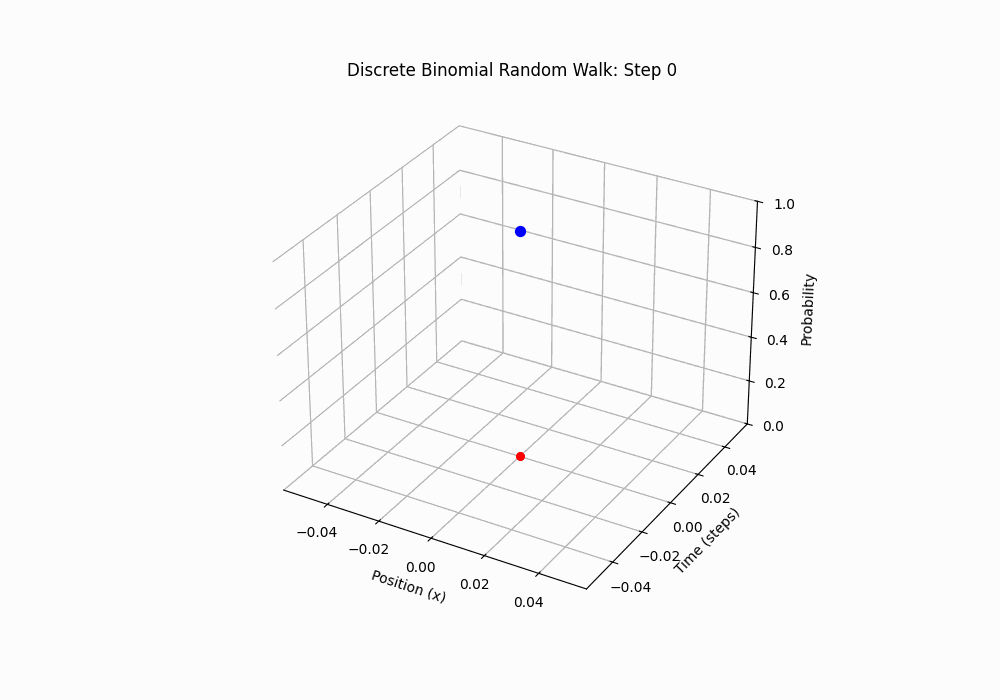
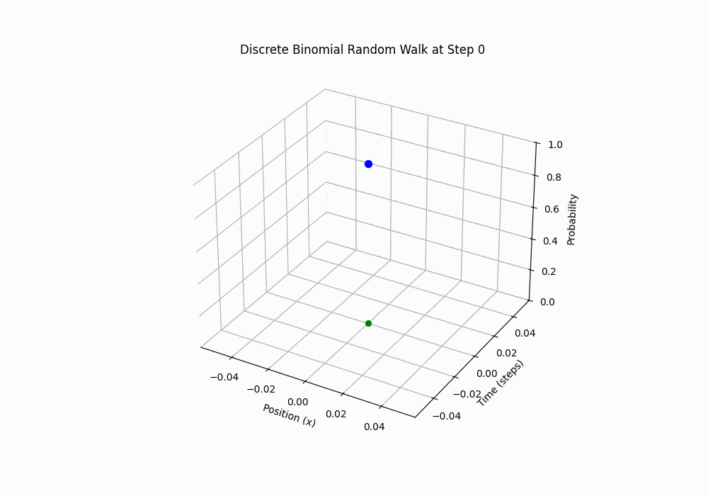
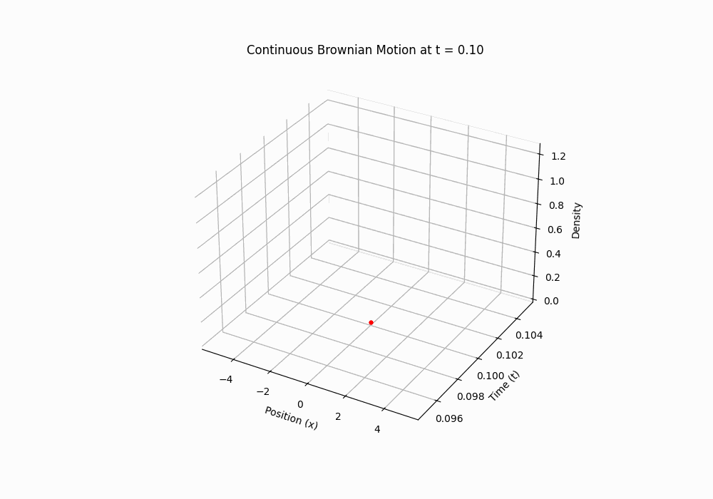
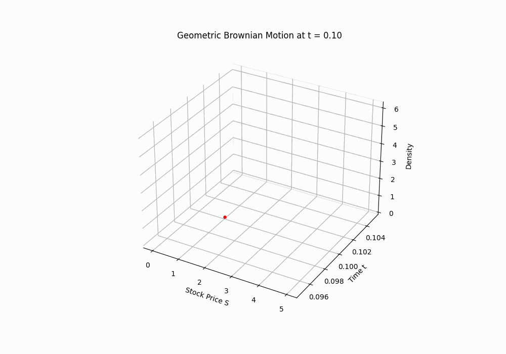

# **Introduction to Stochastic Calculus**

Notation is presented in the [Appendix](#a1-notation).

### **0. Introduction**

This document is a brief introduction to stochastic calculus. Like, an actual introduction. Not the textbook "introductions" which immediately blast you with graduate-level probability theory axioms and definitions.

The goal of this blog post is more to focus on the physical intuition and derivation of Brownian motion, which is the foundation of stochastic calculus. I will avoid very technical formalisms such as probability spaces, measure theory, filtrations, etc. in favor of a more informal approach by considering only well-behaved cases. I also try to avoid introducing too many new concepts and vocabulary.

I hope that a wider audience can feel inspired as to how stochastic calculus emerges naturally from the physical world. Then, hopefully, more people can appreciate the beauty and meaning of the mathematics behind it, and decide to dig deeper into the subject.

#### Applications

Brownian motion and Itô calculus aren’t just math tricks—they model the real world. Stock prices jiggle like $$W(t)$$, molecules bounce in fluids, and noise messes with signals. Stochastic calculus gives us tools to predict, optimize, and understand these messy systems.

- **Physics**: Einstein used Brownian motion to prove atoms exist—its jittering matched molecular collisions.
- **Finance**: Option pricing (e.g., Black-Scholes) relies on stochastic differential equations like $$dS = \mu S dt + \sigma S dW$$.
- **Biology**: Random walks model how species spread or neurons fire.

This is just the tip of the iceberg. More and more applications are emerging, notably in machine learning, as [Song et al. (2021)](https://arxiv.org/abs/2011.13456) have shown in their great paper "Score-Based Generative Modeling through Stochastic Differential Equations".

They precisely use a stochastic differential equation using Itô calculus to model the evolution of noise over time, which they can then reverse in time to generate new samples. This framework generalizes previous ones and improves performance, allowing for new paths of innovation to be explored.

### **1. Motivation**

Pascal’s triangle gives the number of paths that go either left or right at each step, up to a certain point:

$$
\begin{array}{cccccc}
 & & & 1 & & & \\
 & & 1 & & 1 & & \\
 & 1 & & 2 & & 1 & \\
1 & & 3 & & 3 & & 1
\end{array}
$$

Using 0-indexing, the number of ways to reach the $$k$$-th spot in the $$n$$-th row is $$\binom{n}{k} = \frac{n!}{k!(n-k)!}$$. For example, in row 3, there are $$\binom{3}{2} = 3$$ ways to hit position 2.

Why care? This setup powers the binomial distribution, which models repeated trials with two outcomes—win or lose, heads or tails. Think of:
- A basketball player shooting free throws with probability $$p$$ of success and $$q = 1 - p$$ of failure.
- A gambler betting on dice rolls.

Pascal’s triangle tells us there are $$\binom{n}{k}$$ ways to get $$k$$ wins in $$n$$ trials. If the trials are **independent**, we can use the multiplication rule for probabilities:

> Note that the independence assumption is **strong**. Real life isn’t always so clean—winning streaks in games often tie to mentality or momentum, not just chance. Keep in mind that this model can and will be inaccurate, especially visibile for very long streaks in phenomena like stock prices or sports. However, in more common scenarios, it usually approximates reality well.

$$
P(A \text{ and } B \text{ and } C \dots) = P(A) P(B) P(C) \dots
$$

For one sequence with $$k$$ wins (probability $$p$$ each) and $$n - k$$ losses (probability $$q$$ each), the probability is $$p^k q^{n-k}$$. Multiply by the number of ways to arrange those wins, and we get:

$$
P(k \text{ wins in } n \text{ trials}) = \binom{n}{k} p^k q^{n-k}
$$

This is the binomial distribution—great for discrete setups. Now, let’s zoom out. The real world often involves **continuous** processes, like:
- The motion of a falling object,
- Gas diffusing through a room,
- Stock prices jumping around,
- Molecules colliding in a liquid.

For these, the binomial model gets messy as trials pile up. Calculus, with its focus on continuous change, feels more natural. In the continuous case:

> Points and sums (discrete tools) lead to infinities. We need **intervals** and **integrals** instead.


### **2. From Discrete Steps to Continuous Limits**

It’s actually known what happens to the binomial distribution as it becomes continuous. But what does that conversion mean mathematically? Let’s dig in with examples and then formalize it.

In calculus, going from discrete to continuous means shrinking step sizes and cranking up the number of steps. For an interval $$[a, b]$$, we:
1. Split it into $$n$$ chunks of size $$h = \frac{b - a}{n}$$,
2. Sum up contributions (like a Riemann sum),
3. Let $$n \to \infty$$ and $$h \to 0$$, landing on an integral.

Can we adapt this to the binomial distribution? Let’s try.

Picture the $$n$$-th row of Pascal’s triangle as a random walk: at each of $$n$$ steps, we move $$+1$$ (a win) or $$-1$$ (a loss).

We'll set $$p = 0.5$$ as a first example since it's symmetric, making each direction equally likely and simpler to work with.

The number of ways to get $$k$$ wins (and $$n - k$$ losses) is $$\binom{n}{k}$$. Let's try to plot this for a different values $$n$$ over $$k$$. (The code can be found in the [Appendix](#b1-python-code-for-binomial-plots).)


_[Code](#b1-python-code-for-binomial-plots) 2D image: Binomial distribution plots for n=5,10,25,50,100_

That looks awfully familiar, doesn't it? It's a bell curve, so naturally, we might guess that the limit is a **normal distribution** (aka Gaussian distribution).

Where does such a normal distribution arise from? The answer lies in the **Central Limit Theorem**, which states that the sum of a large number of independent random variables will be approximately normally distributed. So where's the sum happening here? Let's proceed to formalizing our intuition.

To accomplish this, let's define a random variable for a single step as:

$$
X(t) = \begin{cases}
    1 & \text{with probability } \frac{1}{2} \\
    -1 & \text{with probability } \frac{1}{2} \\
\end{cases}
$$

Here, $$X(t)$$ will encode our displacement at the $$t$$-th step where $$t \in \{1,\dots,n\}$$ is an indexing parameter. As before, we assume that $$X(t_1)$$ is independent of $$X(t_2)$$ for $$t_1 \ne t_2 $$. Hence, $$X(t)$$ has mean $$0$$ and variance $$1$$.

Then, the overall displacement $$S(n)$$ is:

$$
S(n) = X(1) + X(2) + \dots + X(n) = \sum_{t=1}^n X(t)
$$

So there it is! The central limit theorem states more precisely that given $$n$$ independent and identically distributed random variables $$X_1$$, $$X_2$$, \dots, $$X_n$$ with mean $$\mu$$ and variance $$\sigma^2$$, we have:

$$
X_1 + \dots + X_n \sim N(n\mu, n\sigma^2) \text{ as } n \to \infty
$$

This is precisely what need. As we take $$n \to \infty$$, we have that

$$
S(n) \sim N(0, n)
$$

such that

$$
\lim_{n \to \infty} \frac{1}{\sqrt{n}} \cdot S(n) = N(0, 1)
$$

which is our desired limit. We have shown that a "continuous binomial distribution" is in fact a normal distribution.

Here are some very nice 3D animations of sample paths with the distribution evolving over the number of steps:


_15 steps [Code](#c1-3d-plot-of-discrete-random-walks) 3D animation: Discrete Random Walk,_


_[Code](#c1-3d-plot-of-discrete-random-walks) Discrete Random Walk, 100 steps over 5 seconds_

### **3. Defining Brownian motion (Wiener process)**

Let's consider a scenario faced by Scottish botanist **Robert Brown** in the 1820s. Imagine a small particle, like dust or pollen, floating on a body of water.

Brown realized that its movement was surprisingly erratic. It seemed like the small-scale nature of the setup resulted in such sensitivity to fluctuations, so much is that the real movement from external forces would completely overtake the previous one. Hence, in a simplified mathematical model we scale consider the events at different times as *independent*.

In addition, there is positional symmetry: the average position of the particle at time $$t$$ seemed float approximately around the origin.

Motivated by these observations as well as our previous intuition on continuous random walks, let's first think about a simplified model for 1-dimensional discrete case. We'll list some properties that a continuous random walk should have.

1. **Starting Point**: As a mathematical convenience, we position our coordinate system to set the starting point of the walk to be zero.
2. **Positional Symmetry**: The walk has no directional bias. For each step, the expected displacement is zero, such that the overall expected displacement is also zero.
3. **Independence**: Steps at different times are independent. The displacement between two different intervals of time is independent.
4. **Continuity**: The walk is continuous, with no jumps or gaps.
5. **Normality**: As we established by taking discrete random walks in the continuous limit, the distribution of positions at any given time should be normal.

So let's write this mathematically. Such a random variable is usually denoted either by $$B_t$$ for "Bronian motion", which is the physical phenomenon, or $$W_t$$ for "Wiener process", in honor of the mathematician **Norbert Wiener** who developed a lot of its early theory.

I will use $$W(t)$$ to emphasize its dependence on $$t$$. (I will no longer use the vertical bars for better readability and ease of writing, but keep in mind that it's still a random variable.)

Let $$W(t)$$ be the position of the Brownian motion at time $$t$$, and let $$\Delta W(t_1,t_2)$$ be the displacement of the Brownian motion from time $$t_1$$ to time $$t_2$$.

> Note that, unlike the discrete case, we cannot consider a single increment and have a single index $$t$$ for displacements as we did with $$X(t)$$. As mentioned, the continuous case requires considering intervals instead of single steps.

Then, we write some properties of Brownian motion:

1. $$W(0)=0$$ almost surely
2. $$W(t)\sim N(0,t)$$
    - With the first condition, this is often written equivalently as $$\Delta W(s,t)\sim N(0,t-s)$$ for all $$s \ne t$$
3. $$\Delta W(t_1,t_2)$$ is independent of $$\Delta W(t_2,t_3)$$ for arbitrary distinct $$t_1 < t_2 \le t_3$$

We can straightforwardly use these conditions are enough to find

1. $$E[W(t)]=0$$ for all $$t$$
2. $$Var(W(t))=t$$ for all $$t$$

This is analogous to the discrete case.

But it also turns out that these conditions are sufficient to prove continuity, although it's more involved:

1. The sample path $$t \mapsto W(t) $$ is almost surely uniformly Hölder continuous for each exponent $$\gamma < \frac{1}{2}$$, but is nowhere Hölder continuous for $$\gamma >= \frac{1}{2}$$. [p.30,33 of source](https://math.nyu.edu/~bourgade/SA2010/StochasticAnalysis.pdf#page30)
    - In particular, a sample path $$t \mapsto W(t)$$ is almost surely nowhere differentiable.

So, $$W(t)$$ is our mathematical model for Brownian motion: a continuous, random, zero-mean process with variance proportional to time. It’s wild—it’s globally somewhat predictable yet locally completely unpredictable. A plot of 
W(t) looks like a jagged mess, but it’s got structure under the hood. (You can generate one yourself with the code in [Appendix](#b2-python-code-for-brownian-motion-plot).)


_[Code](#b2-python-code-for-brownian-motion-plot) 2D image: Sample Brownian motion path_


_[Code](#c2-3d-animation-of-brownian-motion) 3D animation: Brownian motion with evolving distribution_


Now, let’s take this beast and do something useful with it.

---

### **4. Itô Calculus**

Brownian motion $$W(t)$$ is continuous but so irregular that it’s nowhere differentiable. To see why, consider the rate of change over a small interval $$dt$$:

$$
\lim_{dt \to 0} \frac{W(t + dt) - W(t)}{dt} = \lim_{dt \to 0} \frac{\Delta W(t, t + dt)}{dt}
$$

Since $$\Delta W(t, t + dt) \sim N(0, dt) = \sqrt{dt} \, N(0, 1)$$:

$$
\frac{\Delta W(t, t + dt)}{dt} = \frac{\sqrt{dt} \, N(0, 1)}{dt} = \frac{1}{\sqrt{dt}} N(0, 1)
$$

As $$dt \to 0$$, $$\frac{1}{\sqrt{dt}}$$ grows without bound, and the expression becomes dominated by random fluctuations—it doesn’t converge to a finite derivative. This rules out standard calculus for handling Brownian motion, but we still need a way to work with processes driven by it, like stock prices or particle diffusion.

In the 1940s, Kiyosi Itô developed a framework to address this: **Itô calculus**. Rather than forcing Brownian motion into the rules of regular calculus, Itô built a new system tailored to its random nature, forming the foundation of stochastic calculus.

#### **The Increment $$dW$$ and Its Properties**

Define the small change in Brownian motion over an interval $$dt$$:

$$
dW := W(t + dt) - W(t) = \Delta W(t, t + dt)
$$

From Section 3, $$W(t + dt) - W(t) \sim N(0, dt)$$, so:

$$
dW = \sqrt{dt} \, N(0, 1)
$$

Unlike the deterministic $$dx$$ in regular calculus, $$dW$$ is random—its magnitude scales with $$\sqrt{dt}$$, and its sign depends on a standard normal distribution $$N(0, 1)$$. It’s a small but erratic step, with:
- $$E[dW] = 0$$,
- $$Var(dW) = E[(dW)^2] = dt$$.

Now consider $$(dW)^2$$. Its expected value is $$dt$$, but what about its variability? The variance is $$Var[(dW)^2] = 2 dt^2$$, which becomes negligible as $$dt \to 0$$. This stability allows us to treat $$(dW)^2 \approx dt$$ in Itô calculus (formally, in the mean-square sense—see the [Appendix](#a1-notation) for details). In contrast to regular calculus, where $$(dx)^2$$ is too small to matter, $$(dW)^2$$ is on the same scale as $$dt$$, which changes how we handle calculations.

#### **The Itô Integral: Integrating Against Randomness**

In regular calculus, $$\int_a^b f(x) \, dx$$ approximates the area under a curve by summing rectangles, $$\sum f(x_i) \Delta x$$, and taking the limit as $$\Delta x \to 0$$. For Brownian motion, we want something like $$\int_0^t f(s) \, dW(s)$$, where $$dW(s)$$ replaces $$dx$$. Here, the steps are random: $$\Delta W(s_i, s_{i+1}) \sim \sqrt{\Delta s} \, N(0, 1)$$. We approximate:

$$
\int_0^t f(s) \, dW(s) \approx \sum_{i=0}^{n-1} f(s_i) [\Delta W(s_i, s_{i+1})]
$$

over a partition $$s_0, s_1, \dots, s_n$$ of $$[0, t]$$, then let $$n \to \infty$$. Unlike a deterministic integral, the result is a random variable, reflecting $$W(t)’s$$ randomness. Using $$f(s_i)$$ from the left endpoint keeps the integral “non-anticipating”—we only use information up to time $$s_i$$, which aligns with the forward-evolving nature of stochastic processes.

#### **Itô’s Lemma: A Chain Rule for Randomness**

For a function $$f(t, W(t))$$, regular calculus gives:

$$
df = \frac{\partial f}{\partial t} dt + \frac{\partial f}{\partial W} dW
$$

But Brownian motion’s roughness requires a second-order term. Taylor-expand $$f(t, W(t))$$:

$$
df = \frac{\partial f}{\partial t} dt + \frac{\partial f}{\partial W} dW + \frac{1}{2} \frac{\partial^2 f}{\partial W^2} (dW)^2 + \text{smaller terms}
$$

As $$dt \to 0$$:
- $$dt^2$$ and $$dt \, dW$$ vanish,
- $$(dW)^2 \approx dt$$ stays significant.

This leaves:

$$
df = \frac{\partial f}{\partial t} dt + \frac{\partial f}{\partial W} dW + \frac{1}{2} \frac{\partial^2 f}{\partial W^2} dt
$$

This is **Itô’s Lemma**. The extra $$\frac{1}{2} \frac{\partial^2 f}{\partial W^2} dt$$ arises because $$(dW)^2$$ contributes at the $$dt$$ scale, capturing the effect of Brownian motion’s curvature.

Since we have the algebraic heuristic $$dW^2 = dt$$, we could in some define everything in terms of powers $$dW$$ to expand things algebraically and implicitly compute derivative rules.

This is precisely the idea behind my blog post on [Automatic Stochastic Differentiation](/posts/automatic-stochastic-differentiation/index.html), where we use $$\mathbb{R}[\epsilon]/\epsilon^3$$ in a similar fashion to dual numbers $$\mathbb{R}[\epsilon]/\epsilon^2$$ for automatic differentiation in deterministic calculus.

If you haven't already, I highly recommend checking it out.

#### **Example: $$f(W) = W^2$$**

Take $$f(t, W(t)) = W^2$$:
- $$\frac{\partial f}{\partial t} = 0$$,
- $$\frac{\partial f}{\partial W} = 2W$$,
- $$\frac{\partial^2 f}{\partial W^2} = 2$$.

Then:

$$
d(W^2) = 0 \cdot dt + 2W \, dW + \frac{1}{2} \cdot 2 \cdot dt = 2W \, dW + dt
$$

Integrate from 0 to $$t$$ (with $$W(0) = 0$$):

$$
W(t)^2 = \int_0^t 2W(s) \, dW(s) + t
$$

The $$t$$ term matches $$E[W(t)^2] = t$$, and the integral is a random component with mean 0, consistent with Brownian motion’s properties.

---

### **5. Stochastic Differential Equations**

Itô calculus gives us tools—integrals and a chain rule—to handle Brownian motion. Now we can model systems where randomness and trends coexist, using **stochastic differential equations (SDEs)**. Unlike regular differential equations (e.g., $$\frac{dx}{dt} = -kx$$) that describe smooth dynamics, SDEs blend deterministic behavior with stochastic noise, fitting phenomena like stock prices or diffusing particles.

#### **Defining an SDE**

Consider a process influenced by both a predictable trend and random fluctuations:

$$
dX(t) = a(t, X(t)) \, dt + b(t, X(t)) \, dW(t)
$$

- $$X(t)$$: The evolving quantity (e.g., position or price).
- $$a(t, X(t)) \, dt$$: The “drift”—the systematic part, scaled by $$dt$$.
- $$b(t, X(t)) \, dW(t)$$: The “diffusion”—random perturbations from Brownian motion.

Here, $$a$$ and $$b$$ are functions of time and state, and $$dW(t) = \sqrt{dt} \, N(0, 1)$$ brings the noise. Solutions to SDEs aren’t fixed curves but random paths, each run producing a different trajectory with statistical patterns we can study.

#### **Itô’s Lemma Revisited**

Itô’s lemma actually applies to a function $$f(t, X(t))$$ and its stochastic derivative $$df(t, X(t))$$ for a general $$dX(t) = b(t,X(t))dt+\sigma(t,X(t))dW$$, and this is done through the linearity of the Itô differential (as seen using the $$\mathbb{R}[\epsilon]/\epsilon^3$$ formulation).

Considering that $$dX=O(dW)$$, we consider terms up to $$dX^2=O(dW^2)$$:

$$
\begin{aligned}
df &= f_t \, dt + f_X \, dX + \frac{1}{2}f_{XX} dX^2 \\
&= f_t \, dt + f_X \, (b \, dt+\sigma \, dW) + \frac{1}{2}f_{XX} (b \, dt+\sigma \, dW)^2 \\
&= (f_t + bf_X+\frac{1}{2}\sigma^2 f_{XX}) \, dt + \sigma f_X \, dW
\end{aligned}
$$

which is the general form typically presented.

#### **Drift and Diffusion**

The drift $$a(t, X)$$ sets the average direction, like a current pushing a particle. The diffusion $$b(t, X)$$ determines the random jitter’s strength. If $$b = 0$$, we get a standard ODE; if $$a = 0$$, it’s just scaled Brownian motion. Together, they model systems with both structure and uncertainty.

Take a simple case:

$$
dX(t) = \mu \, dt + \sigma \, dW(t)
$$

- $$\mu$$: Constant drift.
- $$\sigma$$: Constant noise amplitude.

Starting at $$X(0) = 0$$, integrate:

$$
X(t) = \int_0^t \mu \, ds + \int_0^t \sigma \, dW(s) = \mu t + \sigma W(t)
$$

Since $$W(t) \sim N(0, t)$$, we have $$X(t) \sim N(\mu t, \sigma^2 t)$$—a process drifting linearly with noise spreading over time. It’s a basic model for things like a stock with steady growth and volatility.


_[Code](#b3-python-code-for-basic-sde-simulation) 2D image: Sample SDE path with mu=1.0, sigma=0.5_

#### **Geometric Brownian Motion**

For systems where changes scale with size—like stock prices or certain physical processes—consider **geometric Brownian motion (GBM)**:

$$
dS(t) = \mu S(t) \, dt + \sigma S(t) \, dW(t)
$$

- $$S(t)$$: The state (e.g., stock price).
- $$\mu S(t)$$: Proportional drift.
- $$\sigma S(t)$$: Proportional noise.

The percentage change $$\frac{dS}{S} = \mu \, dt + \sigma \, dW$$ has a trend and randomness. To solve, let $$f = \ln S$$:
- $$\frac{\partial f}{\partial t} = 0$$,
- $$\frac{\partial f}{\partial S} = \frac{1}{S}$$,
- $$\frac{\partial^2 f}{\partial S^2} = -\frac{1}{S^2}$$.

Using Itô’s lemma:

$$
d(\ln S) = \frac{1}{S} (\mu S \, dt + \sigma S \, dW) + \frac{1}{2} \left( -\frac{1}{S^2} \right) (\sigma^2 S^2 dt)
$$

$$
= \left( \mu - \frac{1}{2} \sigma^2 \right) dt + \sigma \, dW
$$

Integrate from $$0$$ to $$t$$:

$$
\ln S(t) - \ln S(0) = \left( \mu - \frac{1}{2} \sigma^2 \right) t + \sigma W(t)
$$

$$
S(t) = S(0) \exp\left( \left( \mu - \frac{1}{2} \sigma^2 \right) t + \sigma W(t) \right)
$$

The drift is adjusted by $$-\frac{1}{2} \sigma^2$$ due to the second-order effect of noise, and $$\sigma W(t)$$ adds random fluctuations. This form underlies the Black-Scholes model in finance.


_[Code](#b4-python-code-for-geometric-brownian-motion-simulation) 2D image: A sample path of a geometric Brownian motion with parameters μ = 0.15 and σ = 0.2_


_[Code](#c3-3d-animation-of-geometric-brownian-motion) 3D animation: Geometric Brownian Motion drifting over time_

#### **Beyond Analytics**

Analytical solutions like GBM’s are exceptions. Most SDEs require numerical simulation (e.g., stepping $$X(t + \Delta t) = X(t) + \mu \Delta t + \sigma \sqrt{\Delta t} \, N(0, 1)$$) or statistical analysis via equations like Fokker-Planck. See the [appendix](#b3-python-code-for-basic-sde-simulation) for simulation code.

---

### **6. Stratonovich Calculus**
Recall Itô's lemma:

$$
df = \left(\frac{\partial f}{\partial t} + \frac{1}{2} \frac{\partial^2 f}{\partial X^2}\right) dt + \frac{\partial f}{\partial X} dX
$$

That second derivative term is pretty annoying to deal with in calculations. Is there a way we can simplify it to the familiar chain rule in regular calculus?

$$
df = \frac{\partial f}{\partial t} dt + \frac{\partial f}{\partial X} dX
$$

The answer is yes, and it’s called **Stratonovich calculus**. Let's explore a bit. First, the deterministic part clearly satisfies the regular chain rule, since we can directly apply it using linearity. The trouble arises in the stochastic part, which we need to analyze. This means we only need to consider a function $$f(X(t))$$.

Remember, for the Itô form, we chose to define the integral by choosing the left endpoint of each interval. In other words, it is this stochastic part that will vary. To delete this second order term, we need to somehow absorb it into the stochastic part by defining some Stratonovich differential, typically denoted by $$\circ dW$$.

Going back to our Riemann sum definitions, our degrees of freedom lie in the choice of the evaluation point for each interval:

$$
\int_{0}^{T} f(X(t)) \diamond dW = \lim_{n \to \infty} \sum_{i=0}^{n-1} f(X(t_i) + \lambda \Delta X(t_i,t_{i+1})) \Delta W(t_i, t_{i+1})
$$

where $$\lambda \in [0,1]$$ is a constant that linearly interpolates between the left and right endpoints of each interval giving a corresponding differential $$\diamond dW$$, and $$\Delta X(t_i,t_{i+1}):=X(t_{i+1})-X(t_i)$$.

In the deterministic case, since we always have $$O(dX^2) \to 0$$, it doesn't matter where we choose the evaluation point. However, in the stochastic case, remember that $$O(dW^2) \to O(dt)$$, so we need a more careful choice of evaluation point.

Mathematically, our goal is to define a new stochastic integral that preserves the standard chain rule:

$$
df = f_X \circ dX
$$

In the limiting discrete form, let's try setting every term equal to each other:

$$
f(X+\Delta X) - f(X) = f_X(X+\lambda \Delta X) \Delta X
$$

In other words, our newly defined differential should result in the derivative being a linear approximation of the original function instead of quadratic:

$$
\frac{f(X+\Delta X)-f(X)}{\Delta X} = f_X(X+\lambda \Delta X)
$$

But watch what happens as we take the Taylor expansion on both sides about $$X$$ (recalling that $$o(\Delta X^2)\to 0$$):

$$
f_X + \frac{1}{2}f_{XX}\Delta X = f_X + \lambda f_{XX}\Delta X
$$

Comparing coefficients, we wish to set $$\lambda = 1/2$$ to preserve the chain rule. So Stratonovich integrals are defined by the midpoint evaluation rule:

$$
\begin{aligned}
\int_{0}^{T} f(X(t)) \circ dW &= \lim_{n \to \infty} \sum_{i=0}^{n-1} f(X(t_i) + \frac{1}{2} \Delta X(t_i,t_{i+1})) \Delta W(t_i, t_{i+1}) \\
&= \lim_{n \to \infty} \sum_{i=0}^{n-1} f\left(\frac{X(t_i)+X(t_{i+1})}{2}\right) \Delta W(t_i, t_{i+1}) \\
\end{aligned}
$$

#### Conversion Formula between Itô and Stratonovich

There is a formula to convert the Stratonovich differential into a corresponding Itô SDE that depends on the Itô differential as well as the volatility function $$\sigma$$.

Recall that Itô's lemma states that for $$dX = a dt + b dW$$:

$$
df = f_t dt + f_X dX + \frac{1}{2}f_{XX} dX^2 = (af_t + \frac{1}{2} b^2 f_{XX}) dt + bf_X dW
$$

In parallel, we defined Stratonovich's chain rule to satisfy for $$dX = \tilde a dt + \tilde b \circ dW$$:

$$
df = f_t dt + f_X \circ dX = (f_t + \tilde a f_X) dt + \tilde b f_X \circ dW
$$

Hence, between Itô and Stratonovich SDEs, we have in both cases that the differential is scaled by the volatility function of $$X$$ and $$f_X$$, but the drift function changes. Let's find a conversion formula between the two.

Suppose we have:

$$
dX = a dt + b dW = \tilde a dt + b \circ dW
$$

Then, our objective is to find $$\tilde a$$ in terms of $$a$$.

Recall from the integral definition that $$b(X) \circ dW = b(X+\frac{1}{2}dX) dW$$. If we Taylor expand around $$X$$, we have:

$$
b(X+\frac{1}{2}dX) dW = b(X)dW + b_X(X)\frac{1}{2}dX dW + o(dt)
$$

Now, if we plug in $$dX=a dt + b dW$$, the first term vanishes, leaving $$b_X b \frac{1}{2}dW^2 \sim \frac{1}{2}b_X b dt$$ (where the arguments $$X$$ are left implicit).

Hence:

$$
\tilde a = a + \frac{1}{2} b_X b
$$

Notice that, we can write $$b_X b$$ as the the **score** of $$b$$:

$$
\tilde a = a + \frac{1}{2} \nabla \log(b)
$$

where the logarithm is applied component-wise to $$b$$. This is the **conversion formula** between Itô and Stratonovich SDEs, and also hints toward applications for diffusion models in machine learning as it relates to the score function.

## Appendix
### A.0. Further Reading
- [An Intuitive Introduction For Understanding and Solving Stochastic Differential Equations - Chris Rackauckas (2017)](https://www.chrisrackauckas.com/assets/Papers/ChrisRackauckas-IntuitiveSDEs.pdf)
- [Stochastic analysis - Paul Bourgade (2010)](https://math.nyu.edu/~bourgade/SA2010/StochasticAnalysis.pdf)
- [AN INTRODUCTION TO STOCHASTIC DIFFERENTIAL EQUATIONS VERSION 1.2 - Lawrence C. Evans (2013)](https://www.cmor-faculty.rice.edu/~cox/stoch/SDE.course.pdf)
- Stochastic differential equations An introduction with applications - Bernt K. Øksendal (2003)
- [Wikipedia: Stochastic calculus](https://en.wikipedia.org/wiki/Stochastic_calculus)
- [Wikipedia: Stochastic differential equation](https://en.wikipedia.org/wiki/Stochastic_differential_equation)

### A.1. Notation
Here is a list of notation used in this document:

- $$\binom{n}{k}=\frac{n!}{k!(n-k)!}$$ is the binomial coefficient
- $$X: \Omega \to \mathbb{R}$$ is a random variable from a sample space $$\Omega$$ to a real number
- $$P(A)$$ is the probability of event $$A$$
- $$E[X]=\int_{\omega \in \Omega} X(\omega) dP(\omega)$$ is the expected value of $$X$$
- $$N(\mu, \sigma^2)$$ is a normal distribution with mean $$\mu$$ and variance $$\sigma^2$$
- $$W(t)$$ is the position of a Brownian motion at time $$t$$
- $$\Delta W(t_1,t_2)$$ is the displacement of a Brownian motion from time $$t_1$$ to time $$t_2$$
- $$dt$$ is an infinitesimal time increment
- $$dW := \Delta W(t,t+dt)$$ is an infinitesimal increment of Brownian motion over time
- $$(dW)^2 \sim dt$$ denotes that $$(dW^2) = dt + o(dt)$$ where $$\lim_{t \to 0} \frac{o(dt)}{dt} = 0$$, such that $$(dW)^2$$ is asymptotically equal to $$dt$$ in the mean-square limit:

$$
\lim_{dt \to 0} \frac{E[(dW)^2-dt]^2}{dt}=0
$$
- $$f_t:=\frac{\partial f}{\partial t}$$ is the partial derivative of $$f$$ with respect to $$t$$
- $$f_xx:=\frac{\partial^2 f}{\partial x^2}$$ is the second order partial derivative of $$f$$ with respect to $$x$$

### B.1. Python code for binomial plots

```py
import numpy as np
import matplotlib.pyplot as plt
from scipy.stats import binom

n_values = [5, 10, 25, 50, 100]
p = 0.5

# Individual plots
for n in n_values:
    k = np.arange(0, n + 1)
    positions = 2 * k - n
    probs = binom.pmf(k, n, p)
    
    plt.figure(figsize=(6, 4))
    plt.bar(positions, probs, width=1.0, color='skyblue', edgecolor='black')
    plt.title(f'n = {n}')
    plt.xlabel('Position (# wins - # losses)')
    plt.ylabel('Probability')
    plt.ylim(0, max(probs) * 1.2)
    plt.savefig(f'random_walk_n_{n}.png', dpi=300, bbox_inches='tight')
    plt.close()

# Combined plot
fig, axes = plt.subplots(5, 1, figsize=(8, 12), sharex=True)
for i, n in enumerate(n_values):
    k = np.arange(0, n + 1)
    positions = 2 * k - n
    probs = binom.pmf(k, n, p)
    axes[i].bar(positions, probs, width=1.0, color='skyblue', edgecolor='black')
    axes[i].set_title(f'n = {n}')
    axes[i].set_ylabel('Probability')
    axes[i].set_ylim(0, max(probs) * 1.2)
axes[-1].set_xlabel('Position (# wins - # losses)')
plt.tight_layout()
plt.savefig('random_walk_combined.png', dpi=300, bbox_inches='tight')
plt.close()
```

### **B2. Python Code for Brownian Motion Plot**
```python
import numpy as np
import matplotlib.pyplot as plt

# Simulate Brownian motion
np.random.seed(42)
t = np.linspace(0, 1, 1000)  # Time from 0 to 1
dt = t[1] - t[0]
dW = np.sqrt(dt) * np.random.normal(0, 1, size=len(t)-1)  # Increments
W = np.concatenate([[0], np.cumsum(dW)])  # Cumulative sum starts at 0

# Plot
plt.plot(t, W)
plt.title("Sample Brownian Motion Path")
plt.xlabel("Time t")
plt.ylabel("W(t)")
plt.grid(True)
plt.show()
```


### **B3. Python Code for Basic SDE Simulation**

```python
import numpy as np
import matplotlib.pyplot as plt

# Simulate simple SDE: dX = mu dt + sigma dW
np.random.seed(42)
T = 1.0
N = 1000
dt = T / N
t = np.linspace(0, T, N+1)
mu, sigma = 1.0, 0.5
X = np.zeros(N+1)
for i in range(N):
    dW = np.sqrt(dt) * np.random.normal(0, 1)
    X[i+1] = X[i] + mu * dt + sigma * dW

plt.plot(t, X, label=f"μ={mu}, σ={sigma}")
plt.title("Sample Path of dX = μ dt + σ dW")
plt.xlabel("Time t")
plt.ylabel("X(t)")
plt.legend()
plt.grid(True)
plt.show()
```

### **B4. Python Code for Geometric Brownian Motion Simulation**

```python
import numpy as np
import matplotlib.pyplot as plt

# Simulate simple SDE: dX = mu dt + sigma dW
np.random.seed(42)

# Simulate Geometric Brownian Motion (exact solution)
T_gbm = 10.0  # Longer time to show exponential nature
N_gbm = 1000
t_gbm = np.linspace(0, T_gbm, N_gbm+1)
S0 = 100.0  # Initial stock price
mu, sigma = 0.15, 0.2  # Slightly larger for visibility
S = S0 * np.exp((mu - 0.5 * sigma**2) * t_gbm + sigma * np.sqrt(t_gbm) * np.random.normal(0, 1, N_gbm+1))

plt.figure(figsize=(8, 4))
plt.plot(t_gbm, S, label=f"μ={mu}, σ={sigma}")
plt.title("Sample Path: Geometric Brownian Motion")
plt.xlabel("Time t")
plt.ylabel("S(t)")
plt.legend()
plt.grid(True)
plt.savefig("gbm_path.png", dpi=300, bbox_inches="tight")
plt.show()
```

### 3D Visualizations

#### C.1. 3D Plot of Discrete Random Walks

```python
import numpy as np
import matplotlib.pyplot as plt
from mpl_toolkits.mplot3d import Axes3D  # for 3D plotting
import imageio
import os
from scipy.special import comb
from scipy.stats import norm

# Create a directory for frames
os.makedirs('gif_frames', exist_ok=True)

# Parameters for the discrete random walk
N = 15  # total number of steps (kept small for clear discreteness)
num_sample_paths = 5  # number of sample paths to overlay

# Simulate a few discrete random walk sample paths
sample_paths = []
for i in range(num_sample_paths):
    steps = np.random.choice([-1, 1], size=N)
    path = np.concatenate(([0], np.cumsum(steps)))
    sample_paths.append(path)
sample_paths = np.array(sample_paths)  # shape: (num_sample_paths, N+1)

frames = []
for t_step in range(N + 1):
    fig = plt.figure(figsize=(10, 7))
    ax = fig.add_subplot(111, projection='3d')
    
    # For each discrete time slice up to the current time, plot the PMF
    for t in range(t_step + 1):
        # For a random walk starting at 0, possible positions are -t, -t+2, ..., t
        x_values = np.arange(-t, t + 1, 2)
        if t == 0:
            p_values = np.array([1.0])
        else:
            # k = (x + t)/2 gives the number of +1 steps
            k = (x_values + t) // 2  
            p_values = comb(t, k) * (0.5 ** t)
        # Plot the discrete PMF as blue markers (and connect them with a line)
        ax.scatter(x_values, [t]*len(x_values), p_values, color='blue', s=50)
        ax.plot(x_values, [t]*len(x_values), p_values, color='blue', alpha=0.5)
    
    # Overlay the sample random walk paths (projected at z=0)
    for sp in sample_paths:
        ax.plot(sp[:t_step + 1], np.arange(t_step + 1), np.zeros(t_step + 1),
                'r-o', markersize=5, label='Sample Path' if t_step == 0 else "")
    
    ax.set_xlabel('Position (x)')
    ax.set_ylabel('Time (steps)')
    ax.set_zlabel('Probability')
    ax.set_title(f'Discrete Binomial Random Walk: Step {t_step}')
    ax.set_zlim(0, 1.0)
    ax.view_init(elev=30, azim=-60)
    
    frame_path = f'gif_frames/discrete_binomial_{t_step:02d}.png'
    plt.savefig(frame_path)
    plt.close()
    frames.append(imageio.imread(frame_path))

# Save the resulting animation as a GIF
imageio.mimsave('discrete_binomial.gif', frames, duration=0.5)

# Parameters for the discrete random walk
N = 50  # total number of steps (increased to show gradual convergence)
num_sample_paths = 5  # number of sample paths to overlay

# Simulate a few discrete random walk sample paths
sample_paths = []
for i in range(num_sample_paths):
    steps = np.random.choice([-1, 1], size=N)
    path = np.concatenate(([0], np.cumsum(steps)))
    sample_paths.append(path)
sample_paths = np.array(sample_paths)  # shape: (num_sample_paths, N+1)

frames = []
for t_step in range(N + 1):
    fig = plt.figure(figsize=(10, 7))
    ax = fig.add_subplot(111, projection='3d')
    
    # Plot the PMFs for all time slices from 0 to the current step
    for t in range(t_step + 1):
        # For a random walk starting at 0, possible positions are -t, -t+2, ..., t
        x_values = np.arange(-t, t + 1, 2)
        if t == 0:
            p_values = np.array([1.0])
        else:
            # For each x, number of +1 steps is (x+t)/2
            k = (x_values + t) // 2
            p_values = comb(t, k) * (0.5 ** t)
        
        # Plot the discrete PMF as blue markers and lines
        ax.scatter(x_values, [t]*len(x_values), p_values, color='blue', s=50)
        ax.plot(x_values, [t]*len(x_values), p_values, color='blue', alpha=0.5)
        
        # For the current time slice, overlay the normal approximation in red
        if t == t_step and t > 0:
            x_cont = np.linspace(-t, t, 200)
            normal_pdf = norm.pdf(x_cont, 0, np.sqrt(t))
            ax.plot(x_cont, [t]*len(x_cont), normal_pdf, 'r-', linewidth=2, label='Normal Approx.')
    
    # Overlay the sample random walk paths (projected along the z=0 plane)
    for sp in sample_paths:
        ax.plot(sp[:t_step + 1], np.arange(t_step + 1), np.zeros(t_step + 1),
                'g-o', markersize=5, label='Sample Path' if t_step == 0 else "")
    
    ax.set_xlabel('Position (x)')
    ax.set_ylabel('Time (steps)')
    ax.set_zlabel('Probability')
    ax.set_title(f'Discrete Binomial Random Walk at Step {t_step}')
    ax.set_zlim(0, 1.0)
    ax.view_init(elev=30, azim=-60)
    
    frame_path = f'gif_frames/discrete_binomial_{t_step:02d}.png'
    plt.savefig(frame_path)
    plt.close()
    frames.append(imageio.imread(frame_path))

# Save the resulting animation as a GIF
imageio.mimsave('discrete_binomial_normalizing.gif', frames, duration=0.5)
```

### C.2. 3D Animation of Brownian Motion
Normal distribution sweeping and evolving across time according Brownian motion

```python
import numpy as np
import matplotlib.pyplot as plt
from mpl_toolkits.mplot3d import Axes3D  # for 3D plotting
from scipy.stats import norm
import imageio
import os

# Create a directory for frames
os.makedirs('gif_frames', exist_ok=True)

# Parameters for the continuous Brownian motion
num_frames = 100                # Increase number of frames for smoother animation
t_values = np.linspace(0.1, 5, num_frames)  # More time points from 0.1 to 5
x = np.linspace(-5, 5, 200)       # Increase x resolution for a smoother density surface

# Simulate a few sample Brownian motion paths using finer time steps
num_sample_paths = 5
sample_paths = np.zeros((num_sample_paths, len(t_values)))
dt_cont = t_values[1] - t_values[0]  # uniform time step
for i in range(num_sample_paths):
    increments = np.random.normal(0, np.sqrt(dt_cont), size=len(t_values) - 1)
    sample_paths[i, 1:] = np.cumsum(increments)

frames = []
for i, t in enumerate(t_values):
    fig = plt.figure(figsize=(10, 7))
    ax = fig.add_subplot(111, projection='3d')
    
    # Create a density surface for times up to the current frame t
    mask = t_values <= t
    T_sub, X_sub = np.meshgrid(t_values[mask], x)
    P_sub = (1 / np.sqrt(2 * np.pi * T_sub)) * np.exp(-X_sub**2 / (2 * T_sub))
    ax.plot_surface(X_sub, T_sub, P_sub, cmap='viridis', alpha=0.7, edgecolor='none')
    
    # Overlay sample paths as red curves (projected on the z=0 plane)
    for sp in sample_paths:
        ax.plot(sp[:i+1], t_values[:i+1], np.zeros(i+1), 'r-', marker='o', markersize=3)
    
    ax.set_xlabel('Position (x)')
    ax.set_ylabel('Time (t)')
    ax.set_zlabel('Density')
    ax.set_title(f'Continuous Brownian Motion at t = {t:.2f}')
    ax.view_init(elev=30, azim=-60)
    
    frame_path = f'gif_frames/continuous_3d_smooth_t_{t:.2f}.png'
    plt.savefig(frame_path)
    plt.close()
    frames.append(imageio.imread(frame_path))

# Save the smoother continuous Brownian motion GIF
imageio.mimsave('continuous_brownian_3d_smooth.gif', frames, duration=0.1)
```

### C.3. 3D Animation of Geometric Brownian Motion

```python
import numpy as np
import matplotlib.pyplot as plt
from mpl_toolkits.mplot3d import Axes3D  # for 3D plotting
import imageio
import os

# Create a directory for frames
os.makedirs('gif_frames', exist_ok=True)

# Parameters for geometric Brownian motion
S0 = 1.0          # initial stock price
mu = 0.2          # increased drift rate to emphasize the upward shift
sigma = 0.2       # volatility

# Set up time and price ranges
num_frames = 100
t_values = np.linspace(0.1, 5, num_frames)  # avoid t=0 to prevent singularities in the density
S_range = np.linspace(0.01, 5, 200)         # expanded range to better capture the drift

# Simulate sample paths for geometric Brownian motion using the GBM formula
num_sample_paths = 5
sample_paths = np.zeros((num_sample_paths, len(t_values)))
dt = t_values[1] - t_values[0]
for i in range(num_sample_paths):
    increments = np.random.normal(0, np.sqrt(dt), size=len(t_values) - 1)
    W = np.concatenate(([0], np.cumsum(increments)))
    # GBM: S(t) = S0 * exp((mu - 0.5*sigma^2)*t + sigma * W(t))
    sample_paths[i] = S0 * np.exp((mu - 0.5 * sigma**2) * t_values + sigma * W)

frames = []
for i, t in enumerate(t_values):
    fig = plt.figure(figsize=(10, 7))
    ax = fig.add_subplot(111, projection='3d')
    
    # Plot the lognormal density surface for times up to the current t
    mask = t_values <= t
    T_sub, S_sub = np.meshgrid(t_values[mask], S_range)
    # Lognormal density:
    # p(S,t) = 1/(S*sigma*sqrt(2*pi*t)) * exp( - (ln(S/S0) - (mu - 0.5*sigma^2)*t)^2/(2*sigma^2*t) )
    P_sub = (1 / (S_sub * sigma * np.sqrt(2 * np.pi * T_sub))) * \
            np.exp(- (np.log(S_sub / S0) - (mu - 0.5 * sigma**2) * T_sub)**2 / (2 * sigma**2 * T_sub))
    
    ax.plot_surface(S_sub, T_sub, P_sub, cmap='viridis', alpha=0.7, edgecolor='none')
    
    # Overlay sample GBM paths projected at z=0
    for sp in sample_paths:
        ax.plot(sp[:i+1], t_values[:i+1], np.zeros(i+1), 'r-', marker='o', markersize=3)
    
    ax.set_xlabel('Stock Price S')
    ax.set_ylabel('Time t')
    ax.set_zlabel('Density')
    ax.set_title(f'Geometric Brownian Motion at t = {t:.2f}')
    ax.view_init(elev=30, azim=-60)
    
    frame_path = f'gif_frames/geometric_brownian_drifted_3d_t_{t:.2f}.png'
    plt.savefig(frame_path)
    plt.close()
    frames.append(imageio.imread(frame_path))

# Save the resulting animation as a GIF
imageio.mimsave('geometric_brownian_drifted_3d.gif', frames, duration=0.1)
```
