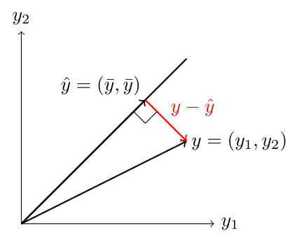
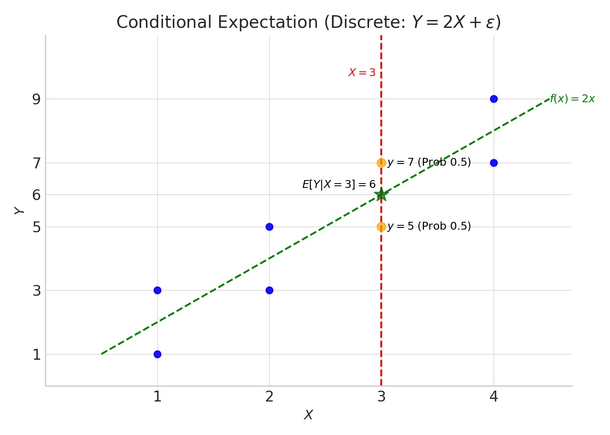

<!-- 
I am using the Chirpy theme in Jekyll.
Please use the Kramdown MathJax syntax.

In regular Markdown, please use the following syntax:

Inline equations are surrounded by dollar signs on the same line: $$inline$$

Block equations are isolated by two newlines above and below, and newlines between the delimiters and the equation:

$$
block
$$

like so. Note that sometimes, if you have an inline equation following text in the first sentence of a paragraph (this includes lists), you must escape the leftmost delimiter with a backslash. But sometimes you are not supposed to escape it, I am not sure when. I believe that you are supposed to escape it when there are characters that might be parsed as HTML or Markdown, such as an underscore like a vertical bar like in conditional expectation or probability. I am not sure if this is a bug or a feature. It is thus preferable to use the LaTeX syntax for symbols as much as possible such as $$\vert$$ or $$\ast$$. Actually, after changing all instances of a vertical bar to \vert, it seems to have fixed the issue for the ones with underscores. So please avoid using the vertical bar symbol, only use \vert, \Vert.

The syntax for lists is:
1. $$inline$$ item
2. item $$inline$$

Inside HTML environments (like blockquotes), please use the following syntax:

\( inline \)

\[
block
\]

like so. Also, HTML markers must be used rather than markdown, e.g. <b>bold</b> rather than **bold**.

-->

## Introduction

You might feel "at a loss" when trying to understand the math behind loss functions. They are often presented without much context, leaving their origins and motivations unclear. Why square the error in regression? Why use that peculiar log-likelihood formula for classification?

This blog post explores the intuition and deeper meanings behind common loss functions. As hinted in the title, we'll find that the concept of the **mean** (or expectation) provides a surprisingly central viewpoint for understanding why these functions take the forms they do and what goals they implicitly pursue.

---

### 0. Warm Up: Linear Regression & A First Look at Loss

One of the simplest settings where loss functions appear is linear regression. Imagine we have data consisting of input features $$x$$ and target values $$y$$, and we want to model their relationship with a line: $$\hat{y} = w^T x + b$$. Here, $$w$$ and $$b$$ are the parameters (weights and bias) we need to learn.

The standard approach is to find the parameters that minimize the **Sum of Squared Errors (SSE)** between the predicted values $$\hat{y}_i$$ and the true values $$y_i$$ across all $$n$$ data points in our dataset $$\mathcal{D} = \{(x_1, y_1), \dots, (x_n, y_n)\}$$:

$$
\min_{w,b} \sum_{i=1}^n (y_i - \hat{y}_i)^2 = \min_{w,b} \sum_{i=1}^n (y_i - (w^T x_i + b))^2 = \min_{w,b} \Vert y - \hat{y}\Vert _2^2
$$

This is often called the **L2 loss**. Minimizing the SSE is equivalent to minimizing the **Mean Squared Error (MSE)**,

$$
\min_{w,b} \frac{1}{n} \sum_{i=1}^n (y_i - \hat{y}_i)^2 = \min_{w,b} \frac{1}{n} \Vert y - \hat{y}\Vert _2^2
$$

since they only differ by a constant factor $$1/n > 0$$. This minimization problem is convex and can be solved efficiently, for instance, using gradient descent or even analytically via the Normal Equations. L2 loss is used in many machine learning applications, including regression and diffusion models.

Why squared error? Common justifications include:
1.  **Nonnegative Penalty:** Squaring ensures errors are always non-negative, $$ (y_i - \hat{y}_i)^2 \ge 0 $$, with zero error only when prediction matches the target perfectly.
2.  **Differentiability:** The squared error is smooth and easily differentiable, which is convenient for gradient-based optimization.
3.  **Penalizing Large Errors:** Squaring magnifies larger errors more than smaller ones (e.g., an error of 2 contributes 4 to the sum, while an error of 4 contributes 16). This pushes the model to avoid significant mistakes.

While useful, these points don't fully capture the deeper reasons. To explore those, let's first formalize what we mean by a loss function.

<blockquote class="prompt-info">
    
<b>Definition (Loss Function):</b>

    
In supervised learning, we seek a model \( f_\theta: \mathcal{X} \to \mathcal{Y} \) parameterized by \( \theta \in \Theta \), mapping inputs \( x \in \mathcal{X} \) to outputs \( \hat{y} \in \mathcal{Y} \). We assume the data \((x, y)\) arises from an underlying (usually unknown or computationally intractable) joint probability distribution \( P(X, Y) \).

    <ol>
        <li>A <b>Pointwise Loss Function</b> (or Cost Function) \( \ell: \mathcal{Y} \times \mathcal{Y} \to [0, \infty) \) measures the discrepancy between a <i>single</i> true target value \( y \) and its corresponding prediction \( \hat{y} \). Typically, \( \ell(y, y) = 0 \) and \( \ell(y, \hat{y}) \ge 0 \).</li>
        <li>The <b>True Loss</b> (also called Expected Loss or Risk) \( L: \Theta \to [0, \infty) \) measures the expected pointwise loss over the <i>entire data distribution</i> \( P(X, Y) \). It represents the true generalization performance of the model with parameters \( \theta \):
            \[
            L(\theta) = E_{(X, Y) \sim P}[\ell(Y, f_\theta(X))] = \int_{\mathcal{X} \times \mathcal{Y}} \ell(y, f_\theta(x)) \, dP(x, y)
            \]
            Ideally, we want to find parameters \( \theta \) that minimize this true loss, but this is usually impossible because we don't know \( P(X, Y) \).</li>
        <li>Given a finite dataset \( \mathcal{D} = \{(x_1, y_1), \dots, (x_N, y_N)\} \) sampled i.i.d. from \( P(X, Y) \), the <b>Empirical Loss</b> (or Objective Function) \( L_{emp}: \Theta \to [0, \infty) \) aggregates the pointwise losses over this dataset. It serves as a <b>discrete approximation</b> to the true loss \( L(\theta) \), calculated as the sample mean:
            \[
            L_{emp}(\theta; \mathcal{D}) = \frac{1}{N} \sum_{i=1}^N \ell(y_i, f_\theta(x_i))
            \]
            By the Law of Large Numbers, as the dataset size \( N \to \infty \), \( L_{emp}(\theta; \mathcal{D}) \) converges to \( L(\theta) \).</li>
    </ol>
    
The process of <b>training</b> typically involves finding the parameters \( \theta^\ast \) that minimize this empirical loss (or a regularized version) as a proxy for minimizing the true loss:

    \[
    \theta^\ast = \arg\min_{\theta \in \Theta} L_{emp}(\theta; \mathcal{D})
    \]
    
<i>(Often, a regularization term is added to \( L_{emp} \) to improve generalization and prevent overfitting, effectively balancing the empirical loss approximation with prior beliefs about the parameters.)</i>

</blockquote>

Now that we have a clearer definition, let's return to the question: why specific forms for $$\ell(y, \hat{y})$$? We'll start by connecting the familiar squared error to the concept of the mean.

---

### 1. The Mean: A Central Point of Reference

The arithmetic mean is perhaps the most fundamental statistic. For a set of numbers $$\{y_1, \dots, y_N\}$$, it's simply their sum divided by the count: 

$$
\bar{y} = \frac{1}{N} \sum_{i=1}^N y_i.
$$

In probability theory, this generalizes to the **expected value** (or expectation) of a random variable $$Y$$, denoted $$E[Y]$$, representing its probability-weighted average value.

What makes the mean so special? Let's reconsider the squared error criterion. Suppose we have a set of data points $$\{y_1, \dots, y_N\}$$, and we want to find a *single constant value* $$c$$ that is "closest" to all these points. If we define "closest" using the sum of squared differences, our objective is to find the $$c$$ that solves:

$$
\min_{c \in \mathbb{R}} J(c) \quad \text{where} \quad J(c) = \sum_{i=1}^N (y_i - c)^2
$$

This is an unconstrained optimization problem. Since $$J(c)$$ is a convex quadratic function (a parabola opening upwards), we can find the minimizing input (argument) of a quadratic equation $$a_2 x^2 + a_1 x + a_0$$ as $$\frac{-a_1}{2a_2}$$.

Thus, expanding:

$$
J(c) = \sum_{i=1}^N (y_i - c)^2 = \sum_{i=1}^N (y_i^2 - 2y_i c + c^2) = N c^2 - 2\sum_{i=1}^N y_ic + \sum_{i=1}^N y_i^2
$$

Then, we find the optimal $$c^\ast$$:

$$
c^\ast = \frac{1}{N} \sum_{i=1}^N y_i.
$$

The value $$c^\ast$$ that minimizes the sum of squared differences is precisely the **arithmetic mean** of the data points, $$\bar{y}$$!

**What does this mean?** It tells us that the mean is the optimal "summary" or "representative point" for a dataset *if* our criterion for optimality is minimizing squared deviations. 

<blockquote class="prompt-info">
In more physical terms, the mean is the center of mass of the data.
</blockquote>

This provides our first deep insight into the L2 loss: 

<blockquote class="prompt-tip">
Minimizing squared error is intrinsically linked to finding the mean.
</blockquote>

This connection extends to random variables. If $$Y$$ is a random variable, the constant $$c$$ that minimizes the **expected squared error** $$E[(Y - c)^2]$$ is the expected value $$c = E[Y]$$. The minimum value achieved is $$E[(Y - E[Y])^2]$$, which is the definition of the **Variance** of $$Y$$.

<blockquote class="prompt-info">

Variance is the second moment of a random variable. It measures the minimum possible expected L2 loss incurred by a constant approximation, i.e. the <b>mean</b>.

</blockquote>

#### A Geometric Perspective: The Mean as a Projection

There's also a powerful geometric interpretation of the mean using **orthogonal projection** and the **Pythagorean theorem**.

Think of the data vector $$ y = (y_1, y_2, \dots, y_N)^T $$ as a point in $$ \mathbb{R}^N $$. Now consider the 1-dimensional subspace of $$ \mathbb{R}^N $$ that consists of all constant vectors—those of the form $$ (c, c, \dots, c)^T $$. This subspace is spanned by the all-ones vector $$ \mathbf{1} = (1, 1, \dots, 1)^T $$.

Finding the constant $$c$$ that minimizes the sum of squared errors $$ \sum_{i=1}^N (y_i - c)^2 = \Vert y - c \mathbf{1}\Vert _2^2 $$ is equivalent to finding the point $$ \hat{y} = c \mathbf{1} $$ in the subspace $$ \mathcal{S} $$ that is closest to the point $$ y $$ in terms of Euclidean (L2) distance.

The **Projection Theorem** in linear algebra states that this closest point $$ \hat{y} $$ is the **orthogonal projection** of $$ y $$ onto the subspace $$ \mathcal{S} $$. The formula for projecting a vector $$ y $$ onto the line spanned by a vector $$ a $$ (in our case, $$a=\mathbf{1}$$) is:

$$
\text{proj}_a y = \frac{y \cdot a}{a \cdot a} a = \frac{\langle y, a \rangle}{\Vert a\Vert _2^2} a
$$

Applying this with $$ a = \mathbf{1} $$:
*   The dot product $$ \langle y, \mathbf{1} \rangle = y \cdot \mathbf{1} = \sum_{i=1}^N y_i \cdot 1 = \sum_{i=1}^N y_i $$.
*   The squared norm $$ \Vert \mathbf{1}\Vert _2^2 = \mathbf{1} \cdot \mathbf{1} = \sum_{i=1}^N 1^2 = N $$.

So, the orthogonal projection of $$ y $$ onto the subspace of constant vectors is:

$$
\hat{y} = \frac{\sum_{i=1}^N y_i}{N} \mathbf{1} = \bar{y} \mathbf{1} = (\bar{y}, \bar{y}, \dots, \bar{y})^T
$$

The vector in the subspace $$ \mathcal{S} $$ closest to $$ y $$ is the constant vector where each component is the arithmetic mean $$ \bar{y} $$. This confirms our previous result geometrically: the mean $$ \bar{y} $$ is the coefficient of this projection. It's not just an average—it's the **best constant approximation** to the data vector $$ y $$ under squared error, viewed as an orthogonal projection in $$ \mathbb{R}^N $$.

The **Pythagorean theorem** then relates the original vector, its projection, and the residual (error) vector $$ y - \hat{y} $$. Since $$ \hat{y} $$ is the projection onto $$ \mathcal{S} $$, the residual $$ y - \hat{y} $$ is orthogonal to $$ \mathcal{S} $$ (and thus orthogonal to $$ \hat{y} $$). Therefore:

$$
\Vert y\Vert _2^2 = \Vert \hat{y} + (y - \hat{y})\Vert _2^2 = \Vert \hat{y}\Vert _2^2 + \Vert y - \hat{y}\Vert _2^2
$$

The term $$ \Vert y - \hat{y}\Vert _2^2 = \sum_{i=1}^N (y_i - \bar{y})^2 $$ is exactly the sum of squared errors (or residuals) that we minimized. This quantity is related to the sample variance ($$ s^2 = \frac{1}{N-1} \Vert y - \hat{y}\Vert _2^2 $$).

_Figure: 2D Mean as Projection onto Diagonal Subspace_

This shows that squared loss has deep geometric roots: minimizing it is equivalent to orthogonally projecting $$ y $$ onto a subspace, and the mean arises as the optimal point in that subspace. This perspective will resurface again when we look at linear regression more generally.

This fundamental property sets the stage for understanding L2 loss in more complex modeling scenarios.

Before moving on, let's briefly list some key properties of Expectation, which will be useful later:

- **Linearity**: $$E[aX + bY] = aE[X] + bE[Y]$$
- **Independence**: $$E[XY] = E[X]E[Y]$$
- **Constants**: $$E[C] = C \quad \forall C constant \in \mathbb{R}^{m \times n}$$
- **Jensen's Inequality**: $$g(E[X]) \leq E[g(X)]$$ for convex $$g$$ (i.e. $$g(\lambda x + (1-\lambda)y) \leq \lambda g(x) + (1-\lambda)g(y) \quad \forall \lambda \in [0,1]$$)

---

### 2. Conditional Expectation: The Optimal Predictor for L2 Loss

In Section 1, we found that the arithmetic mean $$\bar{y}$$ is the best *constant* predictor $$c$$ for minimizing the sum of squared errors over a dataset. Now, we generalize this idea significantly. Suppose our predictor is not restricted to be a constant, but can be a function $$f(x)$$ that depends on input features $$x$$. If we consider the underlying *true* data-generating distribution $$P(X, Y)$$, what function $$f(x)$$ is optimal in minimizing the *expected* squared error $$E[(Y - f(X))^2]$$?

The answer lies in the **Conditional Expectation**.

#### Intuition and Examples

Let $$X$$ and $$Y$$ be random variables representing our inputs and targets, drawn from a joint probability distribution $$P(X, Y)$$. The **conditional expectation** of $$Y$$ given $$X=x$$, denoted $$E[Y \vert X=x]$$, represents the average value of $$Y$$ we expect to see, given that we have observed $$X$$ taking the specific value $$x$$.

Intuitively, we take the slice $$X=x$$ of the joint distribution, and average the values of $$Y$$ in that slice. So within that slice, it's the best constant predictor we can have.

_Figure: Conditional Expectation as Mean of Slice_

That means that the conditional expectation is a function of the slice $$X$$, so it's a random variable.

*   **Discrete Case:** If $$X$$ and $$Y$$ are discrete, $$E[Y \vert X=x]$$ is the weighted average of possible $$y$$ values, using the conditional probabilities $$P(Y=y \vert X=x)$$ as weights:

    $$
    E[Y \vert X=x] = \sum_y y \cdot P(Y=y \vert X=x) = \sum_y y \frac{P(X=x, Y=y)}{P(X=x)}
    $$

    (where $$P(X=x) > 0$$).

*   **Continuous Case:** If $$X$$ and $$Y$$ are continuous with joint density $$p(x, y)$$, and conditional density $$p(y \vert x) = p(x, y) / p(x)$$ (where $$p(x) = \int p(x, y) dy > 0$$ is the marginal density of $$X$$), then:

    $$
    E[Y \vert X=x] = \int_{-\infty}^{\infty} y \cdot p(y \vert x) \, dy
    $$

In both scenarios, $$E[Y \vert X=x]$$ gives the "local mean" of $$Y$$ in the context provided by $$X=x$$. It defines a function of $$x$$, often called the **regression function**.

**Example 1 (Discrete):** Let $$X$$ be the result of a fair die roll ($$\{1, ..., 6\}$$) and $$Y = X^2$$.
If we observe $$X=3$$, then $$Y$$ is deterministically $$3^2=9$$. So, $$E[Y \vert X=3] = 9$$.
In this case, $$E[Y \vert X=x] = x^2$$.

**Example 2 (Discrete):** Let $$X \in \{0, 1\}$$ and $$Y \in \{0, 1\}$$ with the following joint probabilities:
$$P(0,0)=0.1, P(0,1)=0.3, P(1,0)=0.4, P(1,1)=0.2$$.
The marginals are $$P(X=0)=0.4, P(X=1)=0.6$$.
What is $$E[Y \vert X=1]$$?

$$
P(Y=0 \vert X=1) = P(1,0) / P(X=1) = 0.4 / 0.6 = 2/3
$$

$$
P(Y=1 \vert X=1) = P(1,1) / P(X=1) = 0.2 / 0.6 = 1/3
$$

So, $$E[Y \vert X=1] = 0 \cdot P(Y=0 \vert X=1) + 1 \cdot P(Y=1 \vert X=1) = 0 \cdot (2/3) + 1 \cdot (1/3) = 1/3$$.
Similarly, $$E[Y \vert X=0] = 0 \cdot (0.1/0.4) + 1 \cdot (0.3/0.4) = 3/4$$.
The conditional expectation function here takes value $$3/4$$ at $$x=0$$ and $$1/3$$ at $$x=1$$.

**Example 3 (Continuous):** Let $$X \sim U[0, 1]$$ and, given $$X=x$$, let $$Y \sim U[0, x]$$. The conditional density is $$p(y\vert x) = 1/x$$ for $$0 \le y \le x$$ (and 0 otherwise).
The conditional expectation is:

$$
E[Y \vert X=x] = \int_0^x y \cdot p(y\vert x) \, dy = \int_0^x y \cdot \frac{1}{x} \, dy = \frac{1}{x} \left[ \frac{y^2}{2} \right]_0^x = \frac{1}{x} \frac{x^2}{2} = \frac{x}{2}.
$$

So, the conditional expectation function is $$f(x) = x/2$$ for $$x \in [0, 1]$$.

Let's visualize some examples.

_Figure: Example: Discrete Conditional Mean_

**Explanation of Diagram 1:**
1.  The blue dots represent possible data points $$(x, y)$$ generated from the model $$Y = 2X + \epsilon$$.
2.  The vertical dashed red line highlights the condition $$X=3$$.
3.  When $$X=3$$, the only possible outcomes for $$Y$$ are 5 and 7 (orange circles), each occurring with a conditional probability of 0.5.
4.  The conditional expectation $$E[Y \vert X=3]$$ is the average of these possible outcomes, weighted by their probabilities: $$0.5 \times 5 + 0.5 \times 7 = 6$$. This is marked by the green star.
5.  The dashed green line shows the function $$y=2x$$, which represents the true conditional expectation $$E[Y\vert X=x]$$ for *any* $$x$$. Notice the green star lies exactly on this line.

**Diagram 2: Continuous Case (Example 3: $$Y \sim U[0, x]$$)**

This diagram illustrates finding $$E[Y \vert X=x]$$ where $$Y$$ is uniformly distributed on $$[0, x]$$, given $$X=x$$. We pick a specific value, say $$x=0.8$$. Given $$X=0.8$$, $$Y$$ is uniform on $$[0, 0.8]$$. The conditional expectation $$E[Y \vert X=0.8]$$ is the midpoint of this interval, which is $$0.8 / 2 = 0.4$$.

_Figure: Example: Continuous Conditional Mean_

**Explanation of Diagram 2:**
1.  We focus on a specific value $$x=0.8$$. The vertical dashed red line indicates this condition.
2.  Given $$X=0.8$$, the variable $$Y$$ is uniformly distributed over the interval $$[0, 0.8]$$. This range is shown by the thick blue vertical line segment along $$X=0.8$$. The faint blue rectangle hints at the uniform probability density over this range.
1.  The conditional expectation $$E[Y \vert X=0.8]$$ for a uniform distribution is its midpoint: $$(0 + 0.8) / 2 = 0.4$$. This is marked by the green star.
1.  The dashed green line shows the function $$y=x/2$$, which represents the true conditional expectation $$E[Y\vert X=x]$$ for *any* $$x \in [0, 1]$$. Again, the green star lies perfectly on this line.

These diagrams should help clarify how $$E[Y\vert X=x]$$ relates to the distribution of $$Y$$ *after* fixing the value of $$X$$, and why it represents the "best guess" for $$Y$$ under squared error.

*(Note: While the intuitive definitions using sums/integrals are sufficient for understanding the concept's role here, conditional expectation has a more rigorous foundation in measure theory, which guarantees its existence and uniqueness under general conditions. See [Appendix A](#appendix-a-formal-justification-for-conditional-expectation) for details.)*

#### Optimality of Conditional Expectation for L2 Loss

Now, let's formally state why $$E[Y\vert X]$$ is the optimal predictor under expected squared error. We are looking for the function $$f(X)$$ that minimizes $$E[(Y - f(X))^2]$$.

It's a fundamental result in probability theory that the unique function $$f^*(x)$$ achieving this minimum is precisely the conditional expectation function:

$$
f^*(x) = E[Y \vert X=x]
$$

This means that the predictor $$f^*(X) = E[Y \vert X]$$ minimizes the expected squared error $$E[(Y - f(X))^2]$$ over all possible functions $$f$$ that depend only on $$X$$.

Intuitively, this optimality arises because the conditional expectation acts like an orthogonal projection in a space of random variables (specifically, the Hilbert space $$L^2$$). It finds the function of $$X$$ that is "closest" to $$Y$$ in terms of the average squared difference. *(The rigorous proof involves the Hilbert Projection Theorem and is provided in [Appendix A](#appendix-a-formal-justification-for-conditional-expectation).)*

#### Interpretation

This is a profound result! It tells us that the **theoretically best possible predictor** for a target variable $$Y$$ based on input features $$X$$, when using expected squared error as the criterion for "best", is the conditional mean of $$Y$$ given $$X$$.

When we train a machine learning model (like linear regression, a neural network, etc.) using Mean Squared Error loss on a large dataset, we are implicitly trying to find a function $$f_\theta(x)$$ (parameterized by $$\theta$$) that approximates this underlying conditional expectation function $$E[Y \vert X=x]$$ based on the finite samples we have.

$$
\hat{y} = f_\theta(x) \approx E[Y \vert X=x]
$$

The choice of L2 loss fundamentally steers the learning process towards finding the *conditional mean* of the target variable. This provides a clear statistical meaning to the objective pursued when minimizing squared errors. Any deviation of our learned model $$f_\theta(x)$$ from the true $$E[Y\vert X=x]$$ contributes to the reducible error.

The minimum achievable expected squared error, obtained when $$f(X) = E[Y\vert X]$$, is:

$$
E[(Y - E[Y\vert X])^2] = E[\text{Var}(Y\vert X)]
$$

This is the expected conditional variance, representing the inherent uncertainty or noise in $$Y$$ that *cannot* be explained by $$X$$, no matter how good our model is. This is the irreducible error or Bayes error rate (for squared loss).

#### Aside: Variance Additivity via Orthogonality

This geometric view also illuminates why variance is additive for **independent** random variables. Recall $$\text{Var}(X) = E[(X - E[X])^2]$$. In the $$L^2$$ space, this is the squared norm of the *centered* variable $$\tilde{X} = X - E[X]$$: $$\text{Var}(X) = \Vert \tilde{X} \Vert^2$$.

Consider $$\text{Var}(X+Y)$$. The centered version of the sum is $$\widetilde{X+Y} = (X+Y) - E[X+Y] = \tilde{X} + \tilde{Y}$$.
So, $$\text{Var}(X+Y) = \Vert \tilde{X} + \tilde{Y} \Vert^2$$.

By the Pythagorean theorem in $$L^2$$, $$\Vert \tilde{X} + \tilde{Y} \Vert^2 = \Vert \tilde{X} \Vert^2 + \Vert \tilde{Y} \Vert^2$$ if and only if $$\tilde{X}$$ and $$\tilde{Y}$$ are orthogonal, meaning their inner product is zero:

$$
\langle \tilde{X}, \tilde{Y} \rangle = E[\tilde{X} \tilde{Y}] = E[(X - E[X])(Y - E[Y])] = \text{Cov}(X, Y) = 0
$$

Since **independence** of $$X$$ and $$Y$$ implies their covariance is zero, $$\text{Cov}(X, Y) = 0$$, independence implies the centered variables $$\tilde{X}$$ and $$\tilde{Y}$$ are orthogonal.

Therefore, if $$X$$ and $$Y$$ are independent:

$$
\text{Var}(X+Y) = \Vert \tilde{X} + \tilde{Y} \Vert^2 = \Vert \tilde{X} \Vert^2 + \Vert \tilde{Y} \Vert^2 = \text{Var}(X) + \text{Var}(Y)
$$

Thus, the additivity of variance for independent variables is a direct consequence of the Pythagorean theorem in the $$L^2$$ space applied to centered random variables.

---

### 3. Revisiting L2 Loss: Geometry, Probability, and Performance

In Section 2, we discovered that the conditional expectation $$E[Y\vert X=x]$$ is the ideal target predictor when using squared error loss. Now, let's explore the multifaceted nature of L2 loss when applied in practice, particularly in the context of linear regression. We'll see it connects deeply to geometry (projections), probability theory (Gaussian noise and likelihood), and the fundamental challenge of model generalization (the bias-variance tradeoff).

#### 3.1 The Geometric View: L2 Loss as Orthogonal Projection

Remember our warm-up (Section 1) where finding the best constant $$c$$ to minimize $$\sum (y_i - c)^2$$ was equivalent to projecting the data vector $$y$$ onto the line spanned by the all-ones vector $$\mathbf{1}$$? This powerful geometric picture extends directly to linear regression.

Our goal in linear regression is to model the relationship between inputs $$x$$ and outputs $$y$$ using a linear function:

$$
\hat{y} = \beta_0 + \beta_1 x_1 + \dots + \beta_d x_d
$$

In matrix form, for $$N$$ data points, this is $$\hat{y} = X\beta$$, where $$X$$ is the $$N \times (d+1)$$ design matrix (often including a column of ones for the intercept $$\beta_0$$) and $$\beta$$ is the $$(d+1) \times 1$$ vector of coefficients we want to learn.

The L2 loss objective is to minimize the Sum of Squared Errors (SSE), which is the squared Euclidean distance between the vector of true target values $$y$$ and the vector of predictions $$\hat{y}$$.

$$
\min_{\beta} \text{SSE}(\beta) = \min_{\beta} \sum_{i=1}^N (y_i - (X\beta)_i)^2 = \min_{\beta} \Vert y - X\beta\Vert _2^2
$$

Now, think geometrically in the $$N$$-dimensional space where the vector $$y$$ lives. Each possible choice of coefficients $$\beta$$ defines a potential prediction vector $$\hat{y} = X\beta$$. The set of *all* possible prediction vectors that can be formed this way, i.e., $$\{X\beta \mid \beta \in \mathbb{R}^{d+1}\}$$, constitutes a subspace of $$\mathbb{R}^N$$. This is the **column space** of $$X$$, denoted $$\text{Col}(X)$$ – the subspace spanned by the columns of the design matrix (our input features, plus the intercept).

Minimizing $$\Vert y - X\beta\Vert _2^2$$ is therefore equivalent to finding the vector $$\hat{y}$$ *within the column space of* $$X$$ that is **closest** to the actual target vector $$y$$, measured by Euclidean distance.

From linear algebra (specifically, the **Projection Theorem**), we know that the unique vector in a subspace closest to an external point is the **orthogonal projection** of that point onto the subspace.

<blockquote class="prompt-info">
Minimizing the L2 loss in linear regression geometrically corresponds to finding the orthogonal projection of the target vector \(y\) onto the subspace spanned by the input features (the column space of \(X\)).
</blockquote>

The familiar Ordinary Least Squares (OLS) solution, $$\hat{\beta}_{OLS} = (X^T X)^{-1} X^T y$$ (assuming $$X^T X$$ is invertible), provides exactly the coefficients needed to achieve this projection. The resulting prediction vector $$\hat{y}_{OLS} = X\hat{\beta}_{OLS}$$ is precisely $$\text{proj}_{\text{Col}(X)} y$$. This gives a clear and elegant geometric interpretation to minimizing squared errors in this context. (Note however, that in practice, just like with eigenvalues and determinants, this way of calculating the solution numerically is very inefficient, and there are better ways to do it.)

#### 3.2 The Probabilistic View: L2 Loss, Gaussian Noise, and MLE

Beyond geometry, L2 loss has a strong justification rooted in probability theory, specifically through the **Maximum Likelihood Estimation (MLE)** framework.

Let's assume our data is generated according to a model where the true target $$y_i$$ is determined by some underlying function $$f(x_i)$$ plus some additive random noise $$\epsilon_i$$:

$$
y_i = f(x_i) + \epsilon_i
$$

Ideally, $$f(x_i)$$ represents the true conditional mean $$E[Y\vert X=x_i]$$. Our goal is to find a model, say $$\hat{f}(x_i; \theta)$$, parameterized by $$\theta$$, that approximates $$f(x_i)$$.

Now, let's make a crucial assumption about the nature of the noise: suppose the errors $$\epsilon_i$$ are **independent and identically distributed (i.i.d.)** according to a **Gaussian (Normal) distribution** with a mean of zero and a constant variance $$\sigma^2$$. We write this as $$\epsilon_i \sim \mathcal{N}(0, \sigma^2)$$.

This assumption implies that $$y_i$$, given $$x_i$$ and our model's approximation $$\hat{f}(x_i; \theta)$$, follows a normal distribution centered around the model's prediction:

$$
y_i \vert x_i, \theta \sim \mathcal{N}(\hat{f}(x_i; \theta), \sigma^2)
$$

The probability density function (PDF) for observing a specific $$y_i$$ is then:

$$
P(y_i \vert x_i, \theta, \sigma^2) = \frac{1}{\sqrt{2\pi\sigma^2}} \exp\left(-\frac{(y_i - \hat{f}(x_i; \theta))^2}{2\sigma^2}\right)
$$

The **likelihood** of observing our entire dataset $$\mathcal{D} = \{(x_1, y_1), \dots, (x_N, y_N)\}$$ is the product of the probabilities for each independent data point:

$$
L(\theta, \sigma^2; \mathcal{D}) = P(\mathcal{D} \vert \theta, \sigma^2) = \prod_{i=1}^N P(y_i \vert x_i, \theta, \sigma^2)
$$

$$
L(\theta, \sigma^2; \mathcal{D}) = \prod_{i=1}^N \frac{1}{\sqrt{2\pi\sigma^2}} \exp\left(-\frac{(y_i - \hat{f}(x_i; \theta))^2}{2\sigma^2}\right)
$$

The principle of MLE states that we should choose the parameters $$\theta$$ that make the observed data *most probable*, i.e., maximize this likelihood function. It's mathematically more convenient to maximize the **log-likelihood**, as the logarithm turns products into sums and doesn't change the location of the maximum:

$$
\log L(\theta, \sigma^2; \mathcal{D}) = \sum_{i=1}^N \log P(y_i \vert x_i, \theta, \sigma^2)
$$

$$
\log L(\theta, \sigma^2; \mathcal{D}) = \sum_{i=1}^N \left( \log\left(\frac{1}{\sqrt{2\pi\sigma^2}}\right) - \frac{(y_i - \hat{f}(x_i; \theta))^2}{2\sigma^2} \right)
$$

$$
\log L(\theta, \sigma^2; \mathcal{D}) = -\frac{N}{2}\log(2\pi\sigma^2) - \frac{1}{2\sigma^2} \sum_{i=1}^N (y_i - \hat{f}(x_i; \theta))^2
$$

To find the parameters $$\theta$$ that maximize this expression (for a fixed, assumed $$\sigma^2$$), we only need to consider the terms involving $$\theta$$. Since the first term is constant, maximizing the log-likelihood is equivalent to minimizing the sum-of-squares term:

$$
\arg\max_{\theta} \log L(\theta, \sigma^2; \mathcal{D}) = \arg\min_{\theta} \sum_{i=1}^N (y_i - \hat{f}(x_i; \theta))^2
$$

This is precisely the **Sum of Squared Errors (SSE)** or **L2 loss** objective function!

<blockquote class="prompt-tip">
Under the assumption of additive, independent, identically distributed Gaussian noise with zero mean and constant variance (\(\epsilon_i \sim \mathcal{N}(0, \sigma^2)\)), the Maximum Likelihood Estimate for the model parameters is obtained by minimizing the Sum of Squared Errors (L2 Loss).
</blockquote>

This provides a strong justification for L2 loss from a probabilistic modeling perspective. If you believe your errors are roughly normal, minimizing MSE is the "right" thing to do from a likelihood standpoint.

#### 3.3 Generalization Performance: The Bias-Variance Tradeoff

We've seen that L2 minimization has nice geometric and probabilistic interpretations. But how does a model $$\hat{f}$$ trained by minimizing empirical MSE on a *finite* dataset $$\mathcal{D}$$ actually perform on *new, unseen* data? This question leads us to the crucial **bias-variance tradeoff**, which decomposes the expected prediction error specifically for squared loss.

Imagine we have trained our model $$\hat{f}(x)$$ using a specific dataset $$\mathcal{D}$$. Now, consider a new test point $$(x_0, y_0)$$, drawn from the same underlying distribution that generated $$\mathcal{D}$$. We assume $$y_0 = f(x_0) + \epsilon$$, where $$f(x_0) = E[Y\vert X=x_0]$$ is the true conditional mean and $$\epsilon$$ is noise with $$E[\epsilon]=0$$ and $$Var(\epsilon)=\sigma^2$$.

Our model, trained on $$\mathcal{D}$$, makes a prediction $$\hat{f}(x_0)$$. Crucially, the model $$\hat{f}$$ itself is a random quantity because it depends on the specific random sample $$\mathcal{D}$$ we happened to draw. If we drew a different dataset $$\mathcal{D}'$$, we would likely get a slightly different model $$\hat{f}'$$.

We are interested in the **expected squared prediction error** at $$x_0$$, averaged over all possible training datasets $$\mathcal{D}$$ we could have drawn, and also over the randomness in the test point $$y_0$$ itself (due to its noise term $$\epsilon$$). This expected error is given by:

$$
E_{\mathcal{D}, y_0} [(y_0 - \hat{f}(x_0))^2]
$$

A fundamental result shows that this expected error can be decomposed into three components:

$$
E[(y_0 - \hat{f}(x_0))^2] = \underbrace{(E_{\mathcal{D}}[\hat{f}(x_0)] - f(x_0))^2}_{\text{Bias}[\hat{f}(x_0)]^2} + \underbrace{E_{\mathcal{D}} [(\hat{f}(x_0) - E_{\mathcal{D}}[\hat{f}(x_0)])^2]}_{\text{Variance}[\hat{f}(x_0)]} + \underbrace{\sigma^2}_{\text{Irreducible Error}}
$$

Let's carefully understand each term:

1.  **Irreducible Error** ($$\sigma^2$$): This is $$Var(y_0 \vert x_0)$$, the inherent noise variance in the data generation process itself. Even the true function $$f(x_0)$$ cannot predict $$y_0$$ perfectly because of this randomness. It sets a lower bound on the expected error for any model.
2.  **Bias ($$\text{Bias}[\hat{f}(x_0)] = E_{\mathcal{D}}[\hat{f}(x_0)] - f(x_0)$$):** This is the difference between the *average prediction* of our model at $$x_0$$ (if we were to train it on many different datasets $$\mathcal{D}$$ and average the predictions) and the *true* value $$f(x_0)$$. Squared bias measures how much our model's average prediction deviates from the truth. High bias suggests the model is systematically wrong, perhaps because it's too simple to capture the underlying structure (e.g., fitting a line to a curve). This leads to **underfitting**.
3.  **Variance ($$\text{Variance}[\hat{f}(x_0)] = E_{\mathcal{D}} [(\hat{f}(x_0) - E_{\mathcal{D}}[\hat{f}(x_0)])^2]$$):** This measures how much the model's prediction $$\hat{f}(x_0)$$ tends to vary *around its own average prediction* as we train it on different datasets $$\mathcal{D}$$. High variance indicates that the model is very sensitive to the specific training data; small changes in the data lead to large changes in the model's predictions. This often happens with overly complex models that fit the noise in the training data. This leads to **overfitting**.

_Figure: Target Practice Analogy. Imagine you're trying to hit a target. The irreducible error is the size of the target itself (the inherent noise). The bias is how far your average shot lands from the target. The variance is how much your shots vary from the average._

_Figure: Bias-Variance Plot_

_Figure: Underfitting vs Overfitting example with polynomials_

<blockquote class="prompt-warning">
    
<b>The Classic Tradeoff Narrative:</b>

    
The traditional interpretation of this decomposition suggests a fundamental <b>tradeoff</b>: decreasing bias (by making the model more complex/flexible) often increases variance, and decreasing variance (by simplifying the model or using regularization) often increases bias. The goal, according to this view, is to find a model complexity that balances these two sources of error to minimize the total expected prediction error (\( \text{Bias}^2 + \text{Variance} \)). This decomposition is a cornerstone for understanding model selection, regularization (like Ridge and Lasso, which intentionally introduce some bias to dramatically reduce variance), and diagnosing under/overfitting, <i>especially in the context of simpler models and squared error loss</i>.

</blockquote>

<blockquote class="prompt-danger">
    
<b>Important Caveats and Limitations: Why the Tradeoff Can Be Misleading</b>

    
However, while foundational, it's crucial to understand the limitations and context of this specific decomposition, particularly in modern machine learning:

    <ol>
        <li><b>Specificity to Squared Loss:</b> This elegant additive decomposition is unique to <b>squared error loss</b>. Other loss functions (like L1, Huber, or Cross-Entropy used in classification) do not decompose total expected error into bias-squared and variance in the same way. While analogous concepts of model misspecification (bias-like) and sensitivity to data (variance-like) exist, the quantitative tradeoff doesn't hold directly.</li>
        <li><b>Theoretical Expectation vs. Practice:</b> The bias and variance terms are defined based on an <b>expectation over different potential training datasets</b> (\(\mathcal{D}\)). In practice, we usually have only <i>one</i> dataset. We can estimate the <i>total</i> test error, but we cannot easily compute the true bias and variance components for our specific trained model. They remain theoretical quantities useful for conceptual understanding but not directly measurable.</li>
        <li><b>Challenges in Deep Learning:</b> The practical relevance of the <i>classic</i> tradeoff narrative (as depicted in the simple U-shaped curve above) has been significantly challenged by empirical observations in deep learning:
            <ul>
                <li><b>Double Descent:</b> Very complex models (often with more parameters than data points) can exhibit "double descent," where test error first decreases, then increases (as per the classic tradeoff), but then <i>decreases again</i> as complexity grows further into the highly overparameterized regime.</li>
                <li><b>Benign Overfitting:</b> Large models can sometimes achieve near-zero training error (perfectly interpolating noisy training data, suggesting high variance) yet still generalize surprisingly well on unseen data. This contradicts the classic notion that extreme overfitting always harms generalization.</li>
            </ul>
            These phenomena suggest the relationship between complexity, bias, variance, and generalization is more nuanced than the simple tradeoff implies, especially for overparameterized models optimized with methods like Stochastic Gradient Descent (SGD).</li>
        <li><b>Role of Optimization and Implicit Regularization:</b> In deep learning, the optimization process itself (e.g., SGD dynamics, learning rate schedules) and architectural choices (e.g., convolutions, attention mechanisms) can act as <i>implicit regularizers</i>, controlling the effective complexity and generalization behavior in ways not captured by simply varying model size or explicit regularization terms. The simple "model complexity" axis of the classic plot becomes hard to define and map directly to bias/variance.</li>
    </ol>
    
<b>Conclusion on Relevance:</b> Therefore, while the bias-variance decomposition provides invaluable <i>intuition</i> about the fundamental tension between model expressiveness (reducing bias) and model sensitivity to training data (increasing variance), especially for simpler models evaluated with squared error, it is <b>not the whole story</b>. Its direct applicability as a predictive quantitative framework is limited, particularly for complex models like deep neural networks and non-squared loss functions. The underlying <i>concepts</i> of bias and variance remain useful for qualitative reasoning about model behavior, but the simple tradeoff curve should not be taken as a universal law governing generalization in all settings.

</blockquote>

This decomposition is specific to **squared error loss** and is a cornerstone for understanding model selection, regularization (like Ridge and Lasso, which intentionally introduce some bias to dramatically reduce variance), and diagnosing under/overfitting.

#### 3.4 Theoretical Guarantees: The Gauss-Markov Theorem

Finally, let's touch on another important theoretical result justifying L2 minimization, specifically for *linear models*, which relies on weaker assumptions than the full Gaussian noise model needed for the MLE connection.

The **Gauss-Markov Theorem** provides conditions under which the Ordinary Least Squares (OLS) estimator is optimal within a certain class of estimators. Consider the linear model:

$$
Y = X\beta + \epsilon
$$

The theorem states that if the following assumptions hold:

1.  **Linearity:** The true relationship between $$X$$ and $$Y$$ is linear ($$E[Y\vert X] = X\beta$$).
2.  **Strict Exogeneity / Zero Conditional Mean Error:** The expected value of the error term is zero for any values of the predictors ($$E[\epsilon \vert X] = 0$$). This implies the predictors are not correlated with the errors.
3.  **Homoscedasticity:** The errors all have the same finite variance ($$Var(\epsilon_i \vert X) = \sigma^2 < \infty$$ for all $$i$$). The variance doesn't depend on $$X$$.
4.  **Uncorrelated Errors:** Errors for different observations are uncorrelated ($$Cov(\epsilon_i, \epsilon_j \vert X) = 0$$ for all $$i \neq j$$).

**If** these assumptions are met, then the OLS estimator $$\hat{\beta}_{OLS} = (X^T X)^{-1} X^T y$$ is the **Best Linear Unbiased Estimator (BLUE)** of $$\beta$$.

*   **Best:** It has the minimum variance among all estimators in the class. No other linear unbiased estimator is more precise.
*   **Linear:** $$\hat{\beta}_{OLS}$$ is a linear combination of the observed $$y$$ values.
*   **Unbiased:** On average (over many datasets), the estimator gives the true parameter value ($$E[\hat{\beta}_{OLS}] = \beta$$).

Note that this theorem does *not* require the errors to be normally distributed. It provides a strong justification for using OLS (which minimizes L2 loss) based on its efficiency (minimum variance) within the class of linear unbiased estimators, provided the core assumptions hold. Violations of these assumptions (e.g., heteroscedasticity, correlated errors, omitted variables causing correlation between X and $$\epsilon$$) mean OLS may no longer be BLUE, and alternative estimation methods might be preferred.

---

### 4. Other Loss Functions: Estimating Different Quantities

While L2 loss targets the conditional mean $$E[Y \vert X]$$, alternative loss functions aim for different statistical properties of the conditional distribution.

#### L1 Loss (Mean Absolute Error - MAE)

The pointwise L1 loss is the absolute difference:
$$
\ell_{L1}(y, \hat{y}) =  \vert y - \hat{y} \vert 
$$
Minimizing the sum of absolute errors $$ \sum_{i=1}^N  \vert y_i - c \vert  $$ for a constant predictor $$c$$ yields the **median** of the data $$\{y_1, \dots, y_N\}$$. More generally, the function $$f(x)$$ that minimizes the expected absolute error $$ E[  \vert Y - f(X) \vert  ] $$ is the **conditional median** function, $$ f^*(x) = \text{Median}(Y  \vert  X=x) $$.

**Key Aspects:**
*   **Target:** Conditional median.
*   **Robustness:** Less sensitive to outliers than L2 loss due to linear penalization of errors.
*   **Differentiability:** Not differentiable at $$y = \hat{y}$$, requiring techniques like subgradients for optimization.

#### Huber Loss

Huber loss provides a compromise between L1 and L2, defined piecewise using a threshold $$\delta$$:
$$
L_\delta(y, \hat{y}) =
\begin{cases}
\frac{1}{2}(y - \hat{y})^2 & \text{for }  \vert y - \hat{y} \vert  \le \delta \quad (\text{L2-like}) \\
\delta ( \vert y - \hat{y} \vert  - \frac{1}{2}\delta) & \text{for }  \vert y - \hat{y} \vert  > \delta \quad (\text{L1-like})
\end{cases}
$$
It benefits from L2's smoothness near the minimum and L1's robustness for larger errors. The choice between L1, L2, and Huber depends on the data's noise characteristics and the desired robustness.

---

### Recap
That was a lot of math, so let's recap what we've learned so far:

1.  **Loss functions** quantify the mismatch between predictions $$\hat{y}$$ and true values $$y$$. Empirical loss aggregates these over a dataset.
2.  **Squared Error (L2 Loss)** is deeply connected to the **mean**. Minimizing $$ \sum (y_i - c)^2 $$ yields the arithmetic mean $$c = \bar{y}$$. Geometrically, this corresponds to orthogonal projection onto the subspace of constant vectors.
3.  The **Conditional Expectation** $$E[Y\vert X=x]$$ is the function $$f(x)$$ that minimizes the **expected squared error** $$E[(Y - f(X))^2]$$. It represents the theoretically optimal predictor under L2 loss.
4.  Training models with **MSE** aims to approximate this conditional expectation function. This connection is justified by the Hilbert Projection Theorem in $$L^2$$ space.
5.  Assuming **Gaussian noise** also leads to L2 loss via Maximum Likelihood Estimation.
6.  Other losses like **L1 (MAE)** are connected to different statistical quantities like the **median**.

The choice of L2 loss isn't arbitrary; it implicitly sets the goal of learning to finding the conditional mean and assumes that squared deviations are the appropriate way to measure error (which aligns well with Gaussian noise).

Now, how can we generalize these ideas further, especially towards classification and information theory?

---

### 5. Generalizing Distance: Bregman Divergences

The connection we found between L2 loss and the mean ($$\min_{c} E[(X-c)^2]$$ yields $$c=E[X]$$) is actually a specific instance of a more general phenomenon related to a family of "distance-like" measures called **Bregman divergences**. These provide a powerful framework linking convex analysis, optimization, and information geometry.

#### Definition

Let $$\phi: S \to \mathbb{R}$$ be a strictly convex function defined on a convex set $$S \subseteq \mathbb{R}^d$$, which is continuously differentiable on the interior of $$S$$. The **Bregman divergence** associated with $$\phi$$ is a function $$D_\phi: S \times \text{int}(S) \to [0, \infty)$$ defined as:

$$
D_\phi(p \Vert  q) = \phi(p) - \phi(q) - \langle \nabla \phi(q), p - q \rangle
$$

Here, $$\nabla \phi(q)$$ is the gradient of $$\phi$$ evaluated at $$q$$, and $$\langle \cdot, \cdot \rangle$$ denotes the standard inner product (dot product).

Geometrically, $$D_\phi(p \Vert  q)$$ represents the difference between the value of $$\phi(p)$$ and the value of the first-order Taylor expansion of $$\phi$$ around $$q$$, evaluated at $$p$$. Because $$\phi$$ is strictly convex, this difference is always non-negative, and it equals zero if and only if $$p=q$$.

**Important Note:** Bregman divergences are generally *not* symmetric ($$D_\phi(p \Vert  q) \neq D_\phi(q \Vert  p)$$) and do not satisfy the triangle inequality. Therefore, they are not true distance metrics, but they serve as useful measures of discrepancy or "generalized distance".

In particular, a Bregman divergence is symmetric if and only if it is the strictly convex function $$\phi$$ that generates it is a positive definite quadratic form under some Riemannian metric (sometimes called Mahalanobis distance, especially in the context of probability distributions). See [Nielsen et Nock (2007) - On the Centroids of Symmetrized Bregman Divergences](https://arxiv.org/abs/0711.3242).

#### Squared Euclidean Distance as a Bregman Divergence

Let's see how the familiar squared Euclidean distance fits into this framework. Consider the function $$\phi(x) = \Vert x\Vert _2^2 = \sum_{i=1}^d x_i^2$$ defined on $$S = \mathbb{R}^d$$. This function is strictly convex. Its gradient is $$\nabla \phi(q) = 2q$$.

Plugging this into the Bregman divergence definition:

$$
D_\phi(p \Vert  q) = \phi(p) - \phi(q) - \langle \nabla \phi(q), p - q \rangle
$$

$$
= \Vert p\Vert _2^2 - \Vert q\Vert _2^2 - \langle 2q, p - q \rangle
$$

$$
= \Vert p\Vert _2^2 + \Vert q\Vert _2^2 - 2 \langle q,p \rangle = \Vert p - q\Vert _2^2
$$

Thus, the squared Euclidean distance is precisely the Bregman divergence generated by the convex function $$\phi(x) = \Vert x\Vert _2^2$.

#### The Bregman Centroid Property

The connection to the mean generalizes beautifully. For any Bregman divergence $$D_\phi$$ and any probability distribution $$P$$ over $$S$$, the point $$c \in \text{int}(S)$$ that minimizes the expected divergence from points $$X$$ drawn according to $$P$$ is the **mean** (expected value) of $$X$$ under $$P$$.

$$
\arg\min_{\boxed{c} \in \text{int}(S)} E_P[D_\phi(X \Vert  \boxed{c})] = E_P[X]
$$

This point $$E_P[X]$$ is sometimes called the **right Bregman centroid** of the distribution $$P$$ since we are varying the argument on the right of the Bregman divergence. See Theorem 2.1 in [Nielsen and Nock (2007)](https://arxiv.org/abs/0711.3242) for a proof.

#### Generalized Pythagorean Theorem and Bregman Information

Bregman divergences also satisfy a **generalized Pythagorean theorem**. If we consider projecting a point $$p$$ onto a convex set $$C$$ using Bregman divergence (finding $$q^\ast = \arg\min_{q \in C} D_\phi(p \Vert  q)$$), then for any other point $$r \in C$$, the following holds under certain conditions:

$$
D_\phi(p \Vert  r) \ge D_\phi(p \Vert  q^\ast) + D_\phi(q^\ast \Vert  r)
$$

with equality if $$q^\ast \in \text {relint } C$$. See [Wikipedia - Bregman Divergence](https://en.wikipedia.org/wiki/Bregman_divergence#:~:text=%5B3%5D-,Generalized%20Pythagorean%20Theorem,-%3A%5B1) for more. This inequality relates the divergence from $$p$$ to $$r$$ with the divergence from $$p$$ to its projection $$q^\ast$$ and the divergence between the projection $$q^\ast$$ and $$r$$. When equality holds (which happens in dually flat spaces, common in information geometry), it resembles the Pythagorean theorem $$a^2 = b^2 + c^2$$. This reinforces the geometric projection intuition.

Furthermore, the minimum value of the expected divergence, $$E_P[D_\phi(X \Vert  E_P[X])]$$, serves as a generalized measure of the statistical dispersion or "spread" of the distribution $$P$$, analogous to variance. This quantity is sometimes called the **Bregman information** (see Chodrow, 2022). For the squared error divergence ($$\phi(x)=x^2$$), this minimum expected divergence is $$E[(X - E[X])^2]$$, which is exactly the variance.

More generally, you can prove the following:

> #### Theorem: Jensen's Equality [(Banarjee et al., 2004)](https://www.researchgate.net/publication/224754032_Optimal_Bregman_prediction_and_Jensen's_equality)
>
> Given a continuously differentiable strictly convex function (called Bregman generator) $$\phi$$, let its corresponding Bregman divergence be defined as the error incurred in a local linear approximation at $$x$$ to $$y$$:
>
> $$
> D_\phi (x,y) := \phi(x) - \left( \phi(y) + \langle \nabla \phi(y), x-y \rangle \right).
> $$
> 
> The conditional expectation (a.k.a. conditional mean) $$E[X \vert \mathcal{G}]$$ is the **right Bregman centroid**, which minimizes 
>
> $$
> E[X \vert \mathcal{G}] = \arg\min_{\boxed{Y} \in \mathcal{G}} E[D_\phi(X, \boxed{Y})]
> $$
>
> Thus, the Bregman information (generalization of variance) is defined as the minimized expected Bregman divergence:
>
> $$
> I_\phi (X \vert G) := E[D_\phi(X,E[X \vert \mathcal{G}])]
> $$
> 
> Note that $$I_\phi(X \vert \mathcal{G}) \ge 0$$. When $$\phi = \Vert \cdot \Vert_2^2$$, this is the variance.
>
> Then, Jensen's equality holds:
>
> $$
> E[\phi(X) \vert \mathcal{G}] = \phi(E[X \vert \mathcal{G}]) + I_\phi(X \vert \mathcal{G})
> $$

---

### 6. Measuring Information and Surprise: Entropy and Cross-Entropy

We saw that **L2 loss** focuses on the conditional **mean** $$\mathbb{E}[Y \vert X]$$, and **Bregman divergences** generalize this idea. However, many machine learning tasks, particularly **classification**, require us to work with *probability distributions*. Instead of predicting a single value, we often predict the **probability** of an input belonging to different classes.

How do we measure the **error** or **discrepancy** between distributions? How does this relate to **expectation**? **Information theory** provides the tools, starting with **entropy**.

#### 6.1 Entropy: Expected Surprise

Entropy measures the **uncertainty** of a probability distribution. The **Shannon entropy** of a distribution $$P$$ quantifies the average amount of "surprise" (or "information") contained in a random variable $$X$$ drawn from $$P$$. The **surprise** of observing an outcome $$x$$ is measured by its **negative log-probability**, $$-\log P(x)$$.

Entropy is the **expected value** of this surprise:

$$
H(P) = \mathbb{E}_P[-\log P(X)]
$$

For a discrete distribution with probability mass function $$p(x)$$ over a set $$\mathcal{X}$$:

$$
H(P) = - \sum_{x \in \mathcal{X}} p(x) \log p(x)
$$

Using log base 2 gives entropy in **bits**.

##### Intuition:
1.  If $$P$$ is a uniform distribution, all outcomes are equally likely, leading to **maximum entropy**.
2.  If $$P$$ assigns high probability to one outcome (high certainty), entropy is **low**.
3.  **Entropy represents the minimum number of bits** needed, on average, to encode outcomes from $$P$$.

##### Example:
A fair coin flip with $$P(\text{heads}) = P(\text{tails}) = 0.5$$ has entropy:

$$
H(P) = - (0.5 \log 0.5 + 0.5 \log 0.5) = 1 \text{ bit}
$$

A biased coin with $$P(\text{heads}) = 0.9$$ has **lower** entropy:

$$
H(P) = - (0.9 \log 0.9 + 0.1 \log 0.1) \approx 0.469
$$

Since the outcome is more predictable, **fewer bits** are needed on average to describe it.

#### 6.2 Cross-Entropy: Expected Surprise Using a Model

Now, suppose we have a **true distribution** $$P$$ but instead use a different distribution $$Q$$ (our **model**) to assign probabilities to outcomes. The **cross-entropy** measures the **expected surprise** of outcomes drawn from $$P$$ when evaluated using $$Q$$:

$$
H(P, Q) = \mathbb{E}_P[-\log Q(X)]
$$

For a discrete probability distribution:

$$
H(P, Q) = - \sum_{x \in \mathcal{X}} p(x) \log q(x)
$$

Cross-entropy quantifies **how many bits are needed on average** if we encode events from $$P$$ using probabilities from $$Q$$.

Since $$H(P, Q) \geq H(P)$$, the difference:

$$
H(P, Q) - H(P)
$$

represents the **extra expected surprise (or extra coding cost)** incurred by using the wrong model $$Q$$ instead of the true distribution $$P$$.

#### 6.3 Cross-Entropy Loss in Machine Learning

Cross-entropy is **directly used as a loss function** in classification tasks.

Let’s say we have a **multi-class classification problem** with $$K$$ classes. For a given input $$x_i$$, the true label $$y_i$$ corresponds to a "true" distribution $$P_i$$ which is typically a **one-hot vector**:
(Probability = 1 for the correct class, and 0 for all others).

Our model $$f_\theta$$ takes $$x_i$$ and outputs a vector of predicted probabilities $$\hat{y}_i = f_\theta(x_i) = (\hat{y}_{i1}, \dots, \hat{y}_{iK})$$, representing the model’s distribution $$Q_i$$.

The **cross-entropy loss** for this single data point is:

$$
\ell_{CE}(y_i, \hat{y}_i) = H(P_i, Q_i) = \mathbb{E}_{P_i}[-\log q_i(X)]
$$

Since $$y_i$$ is a **one-hot vector**, the expectation simplifies:

$$
\ell_{CE}(y_i, \hat{y}_i) = - \log (\hat{y}_i)_{c}
$$

where $$c$$ is the correct class.

The **total empirical cross-entropy loss** (over $$N$$ training samples) is:

$$
L_{CE}(\theta) = - \frac{1}{N} \sum_{i=1}^N \log (\hat{y}_{ic_i})
$$

This is exactly the **Negative Log Likelihood (NLL)** of the true class labels under the model’s predicted probabilities.

#### 6.4 Connection to Maximum Likelihood Estimation

Maximizing the likelihood of the data under our model is equivalent to **minimizing the cross-entropy loss**.

For independent samples, the **log-likelihood** of the dataset is:

$$
\log L(\theta; \mathcal{D}) = \sum_{i=1}^N \log P(y_i \vert x_i; \theta)
$$

Since our model assigns probabilities to classes, we have:

$$
\log L(\theta; \mathcal{D}) = \sum_{i=1}^N \log (\hat{y}_{ic_i})
$$

Maximizing this is the same as **minimizing the negative log-likelihood**, which is the **cross-entropy loss**:

$$
L_{CE}(\theta) = - \frac{1}{N} \sum_{i=1}^N \log (\hat{y}_{ic_i})
$$

<blockquote class="prompt-tip">
Minimizing cross-entropy loss is equivalent to performing <b>Maximum Likelihood Estimation (MLE)</b> for a classification model that outputs probabilities.
</blockquote>

---

### 7. KL Divergence: The Expected Extra Bits

#### 7.1 Definition via Expected Log-Ratio

The **Kullback-Leibler (KL) divergence** measures how much **extra information** is needed to encode samples from $$P$$ when using a mismatched model $$Q$$:

$$
D_{KL}(P \Vert Q) = \mathbb{E}_P\left[\log \frac{P(X)}{Q(X)}\right]
$$

For discrete distributions:

$$
D_{KL}(P \Vert Q) = \sum_{x \in \mathcal{X}} p(x) \log \frac{p(x)}{q(x)}
$$

#### 7.2 Alternative Definition via Entropy and Cross-Entropy

Rearranging:

$$
D_{KL}(P \Vert Q) = H(P, Q) - H(P)
$$

KL divergence is the **extra expected surprise** caused by using $$Q$$ instead of $$P$$.

1.  If $$P = Q$$, then $$D_{KL}(P \Vert Q) = 0$$ (no extra bits needed).
2.  If $$P \neq Q$$, then $$D_{KL}(P \Vert Q) > 0$$ (extra bits needed).

#### 7.3 Why Minimizing KL is Equivalent to Minimizing Cross-Entropy

Since:

$$
D_{KL}(P \Vert Q) = H(P, Q) - H(P)
$$

Minimizing **KL divergence**:

$$
\arg\min_Q D_{KL}(P \Vert Q)
$$

is equivalent to minimizing **cross-entropy**, because $$H(P)$$ is a constant that does not depend on $$Q$$.

<blockquote class="prompt-tip">
Minimizing \(D_{KL}(P \Vert Q)\) with respect to \(Q\) is <b>equivalent</b> to minimizing the cross-entropy \(H(P, Q)\).
</blockquote>

This explains why **cross-entropy loss is used in classification**:
1.  It **implicitly minimizes KL divergence**, bringing the model’s distribution $$Q$$ closer to the true distribution $$P$$.

#### Summary

1.  **Entropy $$H(P)$$** = Expected surprise of a distribution $$P$$.
2.  **Cross-Entropy $$H(P, Q)$$** = Expected surprise when using $$Q$$ instead of $$P$$.
3.  **KL Divergence $$D_{KL}(P \Vert Q)$$** = Extra bits needed when using $$Q$$ instead of $$P$$.
4.  **Minimizing cross-entropy loss = Minimizing KL divergence**.
5.  **This is why cross-entropy is used as a loss function in classification**.

### 8. Total Bregman Divergence

The total Bregman divergence is a normalized version of the Bregman divergence. It's useful in some more traditional ML algorithms, but as far as I know, it's less commonly used in modern machine learning. There was a cool geometric view, so I included it.

Given a generator $$\phi$$, rather than defining the divergence as the vertical gap between the tangent point $$y$$ and a target $$x$$, we instead use the orthogonal distance between the tangent space at $$y$$ and the target $$x$$. Thus, the total Bregman divergence is invariant under change of basis.

If we define a local Cartesian coordinate system $$(\vec u,v)$$ for our Bregman generator, a strictly convex function $$\phi: \mathbb{R}^n \to \mathbb{R}; u \mapsto v$$ with some vector $$u$$ and some scalar $$v$$, then our equation is $$v = \phi(u) \iff v - \phi(u) = 0$$.

The tangent space at $$y$$ is then given by $$\{(u,v) \mid v = \phi(y) + \langle \nabla \phi(y), u - y \rangle \}$$. The gradient at $$(u,v)$$ is $$\nabla (u,v) = \nabla (u,\phi(u)) = (1, \nabla \phi(u))$$. 

Thus, the normal vector at $$y$$ is in the direction $$(-\nabla \phi(y), 1)$$, which we normalize by dividing its length: 

$$
\hat n = \frac{1}{\sqrt{1 + \Vert \nabla \phi(y) \Vert^2}} (-\nabla \phi(y), 1).
$$

The vertical gap has coordinates $$(0, D_\phi (y, x))$$. The length of the orthogonal projection is thus: 

$$
TBD(y,x) = (0, D_\phi (y, x)) \cdot \hat n = \frac{D_\phi (y, x)}{\sqrt{1+\Vert \nabla \phi(y) \Vert^2}}.
$$

_Figure: Total Bregman Divergence as Orthogonal Error_

---

## Conclusion

We started with the simple squared error loss and found its deep connection to the **mean** and **conditional expectation**. This connection, rooted in minimization principles and geometric projections, reveals that L2 loss implicitly aims to capture the central tendency of the data, conditioned on the inputs. This perspective extends through the framework of **Bregman divergences**, where squared error is just one instance, and the concept of the mean generalizes to the Bregman centroid.

We then saw that **KL divergence**, a fundamental measure from information theory, is also a Bregman divergence. Minimizing KL divergence between the true data distribution and the model's distribution is equivalent to minimizing **cross-entropy loss**, commonly used in classification. This objective drives the model to match the overall shape and probabilities of the target distribution, equivalent to maximizing the **log-likelihood**.

So, what do loss functions mean?
*   They define the **objective** of learning, specifying what constitutes a "good" prediction.
*   They often implicitly target a specific statistical property of the conditional distribution $$P(Y\vert X)$$:
    *   **L2 Loss (MSE)** targets the **Conditional Mean** $$E[Y\vert X]$$.
    *   **L1 Loss (MAE)** targets the **Conditional Median**.
    *   **Cross-Entropy / KL Divergence** targets the **entire Conditional Distribution** $$P(Y\vert X)$$.
*   The choice of loss function encodes **assumptions** about the data (e.g., Gaussian noise for L2) and the relative importance of different types of errors.
*   Many common loss functions can be understood as **Bregman divergences**, linking optimization, geometry, and information theory through the unifying concept of finding a "central" point or distribution (often related to an expectation).

Understanding the meaning behind loss functions helps us choose appropriate ones for our tasks, interpret our models' results, and appreciate the elegant mathematical structures underlying machine learning. They aren't just arbitrary formulas, but encapsulate fundamental principles of estimation and information.

---

## Appendix A: Formal Justification for Conditional Expectation

This appendix provides the more rigorous measure-theoretic definition of conditional expectation and the proof of its optimality for minimizing expected squared error using Hilbert space projections.

#### Formal Definition (Measure-Theoretic)

While the formulas using sums and integrals are useful for discrete and continuous cases, a more general and powerful definition comes from measure theory. Let $$(\Omega, \mathcal{F}, P)$$ be our underlying probability space. $$X$$ and $$Y$$ are random variables defined on this space. Assume $$Y$$ is integrable ($$E[ \vert Y \vert ] < \infty$$).

The **conditional expectation** of $$Y$$ given $$X$$, denoted $$E[Y \vert X]$$ or more formally $$E[Y \vert \sigma(X)]$$, is defined as *any* random variable $$Z$$ that satisfies two conditions:

1.  **Measurability:** $$Z$$ is $$\sigma(X)$$-measurable. This means $$Z$$ is a function of $$X$$; its value depends only on the outcome of $$X$$. *(Technically, for any Borel set $$B$$, the pre-image $$Z^{-1}(B)$$ belongs to the $$\sigma$$-algebra generated by $$X$$, denoted $$\sigma(X)$$, which represents the information contained in $$X$$)*.
2.  **Partial Averaging:** For any set $$A \in \sigma(X)$$,

    $$
    \int_A Z \, dP = \int_A Y \, dP \quad \Leftrightarrow \quad E[Z \cdot \mathbb{1}_A] = E[Y \cdot \mathbb{1}_A]
    $$

    where $$\mathbb{1}_A$$ is the indicator function for the set $$A$$. This property essentially says that $$Z$$ has the same average value as $$Y$$ over any event $$A$$ that can be defined solely in terms of $$X$$.

It's a fundamental theorem in probability theory (related to the Radon-Nikodym theorem) that such a random variable $$Z$$ exists and is unique up to sets of measure zero. We denote this unique random variable by $$E[Y \vert X]$$. The value $$E[Y \vert X=x]$$ we discussed earlier can be seen as a specific evaluation (or version) of this random variable $$E[Y \vert X]$$ when $$X$$ happens to be $$x$$.

#### Optimality via Orthogonal Projection (in Function Space)

Now, let's formally show why $$E[Y\vert X]$$ is the optimal predictor under expected squared error using the geometric intuition of orthogonal projection in a function space.

Consider the space $$L^2(\Omega, \mathcal{F}, P)$$, which is the Hilbert space of all random variables $$V$$ defined on our underlying probability space $$(\Omega, \mathcal{F}, P)$$ such that their variance is finite ($$E[V^2] < \infty$$). This space is equipped with an inner product defined by expectation:

$$
\langle U, V \rangle = E[UV]
$$

The squared norm induced by this inner product is $$\Vert V\Vert ^2 = \langle V, V \rangle = E[V^2]$$. The distance between two random variables $$U, V$$ in this space is $$\Vert U - V\Vert  = \sqrt{E[(U - V)^2]}$$. Minimizing the expected squared error $$E[(Y - f(X))^2]$$ is equivalent to minimizing the squared distance $$ \Vert Y - f(X)\Vert ^2 $$ in this $$L^2$$ space.

We are looking for a predictor $$f(X)$$ that is a function *only* of $$X$$. This means $$f(X)$$ must belong to the subspace of $$L^2$$ consisting of random variables that are measurable with respect to the information contained in $$X$$. Let's call this subspace $$\mathcal{M} = L^2(\Omega, \sigma(X), P)$$, where $$\sigma(X)$$ is the sigma-algebra generated by $$X$$. This is a closed subspace of the full Hilbert space $$L^2(\Omega, \mathcal{F}, P)$$.

Our problem is to find the element $$Z^\ast \in \mathcal{M}$$ (representing the optimal predictor $$f^\ast(X)$$) that is closest to the target random variable $$Y \in L^2(\Omega, \mathcal{F}, P)$$ in the $$L^2$$ norm. That is, we want to solve:

$$
\min_{Z \in \mathcal{M}} \Vert Y - Z\Vert ^2 = \min_{f \text{ s.t. } f(X) \in \mathcal{M}} E[(Y - f(X))^2]
$$

Due to the construction of Hilbert spaces to behave just like Euclidean spaces, we can extend the projection theorem in linear algebra to these spaces. The **Hilbert Projection Theorem** guarantees that for any closed subspace $$\mathcal{M}$$ of a Hilbert space $$\mathcal{H}$$, and any element $$y \in \mathcal{H}$$, there exists a unique element $$z^\ast \in \mathcal{M}$$ (the orthogonal projection of $$y$$ onto $$\mathcal{M}$$) such that:
1.  $$z^\ast$$ minimizes the distance: $$\Vert y - z^\ast\Vert  = \min_{z \in \mathcal{M}} \Vert y - z\Vert $$
2.  The error vector $$(y - z^\ast)$$ is orthogonal to the subspace $$\mathcal{M}$$. That is, $$\langle y - z^\ast, z \rangle = 0$$ for all $$z \in \mathcal{M}$$.

Applying this theorem to our problem ($$\mathcal{H} = L^2(\Omega, \mathcal{F}, P)$$, $$y=Y$$, $$\mathcal{M} = L^2(\Omega, \sigma(X), P)$$): The unique minimizer $$Z^\ast$$ exists and is characterized by the orthogonality condition:

$$
\langle Y - Z^\ast, Z \rangle = 0 \quad \text{for all } Z \in \mathcal{M}
$$

Substituting the inner product definition $$ \langle U, V \rangle = E[UV] $$:

$$
E[(Y - Z^\ast) Z] = 0 \quad \text{for all } Z \in L^2(\Omega, \sigma(X), P)
$$

This implies:

$$
E[Y Z] = E[Z^\ast Z] \quad \text{for all } Z \in L^2(\Omega, \sigma(X), P)
$$

Now, recall the formal definition of conditional expectation $$E[Y \vert \sigma(X)]$$ (often written as $$E[Y \vert X]$$). A random variable $$W$$ is the conditional expectation of $$Y$$ given $$X$$ if and only if:
1.  $$W$$ is $$\sigma(X)$$-measurable (i.e., $$W$$ is a function of $$X$$, $$W \in \mathcal{M}$$).
2.  $$E[W Z] = E[Y Z]$$ for all bounded $$\sigma(X)$$-measurable random variables $$Z$$ (this condition can be extended to hold for all $$Z \in L^2(\Omega, \sigma(X), P)$$).

Comparing the orthogonality condition $$E[Z^\ast Z] = E[Y Z]$$ for all $$Z \in \mathcal{M}$$ with the defining property of conditional expectation, and noting that the projection $$Z^\ast$$ must be in $$\mathcal{M}$$ (i.e., $$\sigma(X)$$-measurable), we see that $$Z^\ast$$ exactly satisfies the definition of the conditional expectation $$E[Y \vert X]$$.

Therefore, the unique element $$Z^\ast \in \mathcal{M}$$ that minimizes the expected squared error is exactly the conditional expectation:

$$
Z^\ast = E[Y \vert X]
$$

This rigorously proves that the optimal predictor function $$f^\ast(x)$$ that minimizes $$E[(Y - f(X))^2]$$ is the conditional expectation function, $$f^\ast(x) = E[Y \vert X=x]$$.

---

## Acknowledgements

Thanks to:

- Frank Nielsen for his excellent explanations of Bregman divergences and their applications to machine learning. His work is a great source of inspiration for this post.
- Artem Kirsanov for his video on KL divergence and entropy. His explanations are very clear and easy to understand.
- Datta Nimmaturi for pointing out the rendering error of Tikz diagrams in the post.
- @toe_of_frege on X for pointing out the limitations of the bias-variance tradeoff diagram.

---

## Further Reading

Wikipedia is a great resource for all the math in this post.

1.  **Kirsanov, A. (2024).** "The Key Equation Behind Probability". *YouTube*. [Video Link](https://www.youtube.com/watch?v=KHVR587oW8I)
    *   *Excellent visual explanation of the connection between KL divergence and entropy.*
2.  **Wikipedia. (Accessed 2025).** "Bregman Divergence". *Wikipedia, The Free Encyclopedia*. [Link](https://en.wikipedia.org/wiki/Bregman_divergence)
    *   *A comprehensive overview of Bregman divergences and their properties.*
3.  **Nielsen, F. (2022).** "The Many Faces of Information Geometry". *Notices of the American Mathematical Society*, 69(1), 36-45. [PDF Link](https://www.ams.org/journals/notices/202201/rnoti-p36.pdf)
    *   *A great, very short and readable introduction to Information Geometry concepts.*
4.  **Nielsen, F. (2021).** "Bregman Divergences, dual information geometry, and generalized convexity". *Personal Course Notes/Slides*. [PDF Link](https://franknielsen.github.io/BregmanDivergenceDualIGGenConvexity-25Nov2021.pdf)
5.  **Nielsen, F., & Nock, R. (2007).** "On the Centroids of Symmetrized Bregman Divergences". *arXiv preprint arXiv:0711.3242*. [arXiv Link](https://arxiv.org/abs/0711.3242)
6.  **Banerjee, A., Guo, X., & Wang, H. (2005).** "On the optimality of conditional expectation as a Bregman predictor". *IEEE Transactions on Information Theory*, 51(7), 2664-2669. [IEEE Xplore Link](https://ieeexplore.ieee.org/document/1459065)
    *   *Formalizes the connection between conditional expectation and Bregman divergences.*
7.  **Banerjee, A., Guo, X., & Wang, H. (2004).** "Optimal Bregman prediction and Jensen's equality". *Proceedings of the International Symposium on Information Theory (ISIT 2004)*, p. 169. [DOI: 10.1109/ISIT.2004.1365205](https://doi.org/10.1109/ISIT.2004.1365205), [ResearchGate Link](https://www.researchgate.net/publication/224754032_Optimal_Bregman_prediction_and_Jensen's_equality)
    *   *Single page paper on optimality of conditional expectation as a Bregman predictor.*
8.  **Chodrow, P. S. (2022).** "The Short Story of Bregman Information for Measuring Segregation". *Personal Blog*. [Blog Post Link](https://www.philchodrow.prof/posts/2022-06-24-bregman/)
    *   *An accessible introduction to Bregman information in a specific context.*
9.  **Reid, M. (2013).** "Meet the Bregman Divergences". *Personal Blog*. [Blog Post Link](https://mark.reid.name/blog/meet-the-bregman-divergences.html)
    *   *A classic blog post introducing Bregman divergences.*
