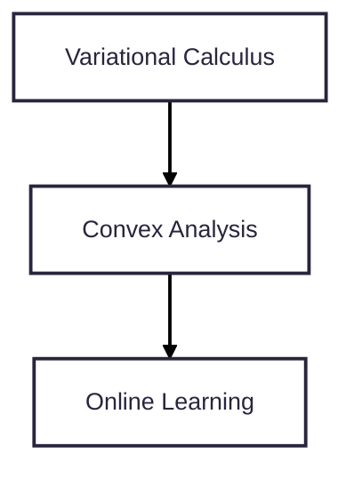

## Introduction to Convex Analysis

Convex analysis is a branch of mathematics devoted to the study of convex sets and convex functions. It plays a pivotal role in the field of optimization. Many optimization problems encountered in machine learning, statistics, finance, and engineering are, or can be transformed into, convex optimization problems.

**Why is convexity so important?**
- **Global Optimality:** For convex optimization problems, any locally optimal solution is also globally optimal. This property dramatically simplifies the search for the best solution.
- **Efficient Algorithms:** Convex optimization problems can often be solved efficiently, both in theory and practice. Algorithms like gradient descent, interior-point methods, and proximal methods have strong convergence guarantees for convex problems.
- **Duality:** Convex optimization problems possess a rich duality theory, which provides powerful analytical tools, insights into problem structure, and can lead to alternative solution methods or distributed algorithms.

This crash course aims to provide a focused yet comprehensive introduction to the core concepts of convex analysis. Understanding these principles is fundamental for anyone looking to delve deeper into optimization theory and its applications in machine learning.

## Purpose of This Crash Course

The primary goal of this crash course is to equip you with the essential mathematical tools and intuition from convex analysis. These concepts are frequently invoked in the study of optimization algorithms, particularly those discussed in our main series on "Mathematical Optimization Theory in ML."

While this course is designed to be self-contained in its coverage of convex analysis topics, it builds upon foundational knowledge in linear algebra and multivariable calculus. We will focus on definitions, key theorems (often without full proofs, for brevity), illustrative examples, and the connections between different concepts.

## Prerequisites

To make the most of this crash course, you should be familiar with:
- **Linear Algebra:** Vector spaces, matrices, linear transformations, eigenvalues/eigenvectors.
- **Multivariable Calculus:** Gradients, Hessians, partial derivatives.

These prerequisites align with those for the main blog post series.

## Course Structure

This crash course is divided into the following interconnected modules:

1.  **Part 1: Convex Sets – The Building Blocks**
    *   Understanding the fundamental geometric objects of convex analysis.
2.  **Part 2: Convex Functions – Shaping the Landscape**
    *   Exploring functions that preserve convexity and their desirable properties.
3.  **Part 3: Subdifferential Calculus – Handling Non-Smoothness**
    *   Generalizing derivatives for non-differentiable convex functions.
4.  **Part 4: Convex Optimization Problems – Formulation and Properties**
    *   Defining and categorizing convex optimization problems and their significance.
5.  **Part 5: Duality and Optimality Conditions**
    *   Investigating the powerful concept of duality and the KKT conditions for optimality.
6.  **Part 6: Introduction to Convex Optimization Algorithms**
    *   A brief overview of key algorithms for solving convex problems.

By the end of this crash course, you will have a solid understanding of the language and tools of convex analysis, enabling you to better grasp advanced optimization techniques and their theoretical underpinnings.

## Relation to the Main Series

Convex analysis is a cornerstone for many topics in the main "Mathematical Optimization Theory in ML" series. Specifically, it is a direct prerequisite for understanding:
- Convergence analyses of various optimization algorithms (e.g., gradient descent, SGD) when applied to convex objectives.
- The theory behind Regularization techniques (e.g., L1 and L2 regularization often lead to convex problems).
- Duality concepts used in algorithms like Support Vector Machines (SVMs).
- Concepts in Online Learning, particularly "Follow The Regularized Leader" (FTRL) which often involves convex loss functions and regularizers.

As indicated in the series prerequisite graph:

This crash course on Convex Analysis (CA) follows Variational Calculus (VC) and is essential before diving into Online Learning (OL) and many other advanced optimization topics.

We encourage you to work through this crash course to build a strong foundation. Let's begin!
