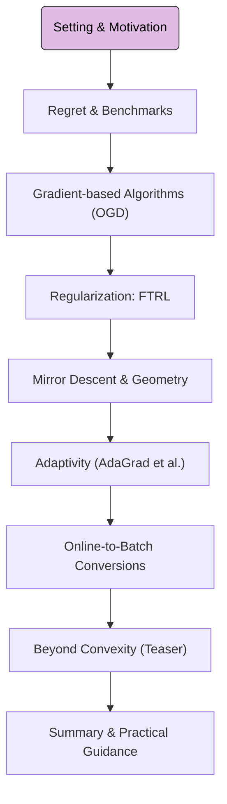

Welcome to this crash course on Online Learning! This series provides foundational knowledge for understanding sequential decision-making algorithms, crucial for many areas of modern machine learning and optimization.

## 1. Road-map at a Glance

This crash course is structured into several modules. We are currently at **Module 0: Setting & Motivation**.

**Navigational Tip.** This flowchart will appear in each post, with the current module highlighted, to orient you within the crash course.

## 2. Module 0: Setting & Motivation

### What is Online Learning?

At its core, online learning is about making a sequence of predictions or decisions over time. Data arrives sequentially, instance by instance, and the learning algorithm must make a choice (e.g., a prediction, an action, or setting model parameters) for the current instance before (or as) the next one is revealed. After each choice, feedback is typically received, which is then used to update the algorithm's strategy for future interactions. This contrasts with batch learning, which processes an entire dataset at once.

### Why Online Learning?

The motivations for studying and employing online learning are multifaceted:

1.  **Streaming Data:** Many real-world applications involve data that is continuously generated, such as sensor networks, financial tickers, or user interactions on websites. Online algorithms are naturally suited for these environments.
2.  **Resource Constraints:** For massive datasets, batch processing can be infeasible due to memory limitations or computational cost. Online methods offer a way to learn from such data with fixed, often small, resource footprints.
3.  **Adaptive Systems:** When the environment or data distribution is non-stationary (i.e., changes over time), online algorithms can adapt their models more readily than batch methods, which would require frequent retraining on new, complete datasets.
4.  **Theoretical Underpinning:** Online learning provides a powerful theoretical framework for analyzing iterative algorithms, including those used in stochastic optimization (like Stochastic Gradient Descent, SGD). Concepts like regret minimization offer insights into algorithm performance and generalization.
5.  **Game-Theoretic Perspective:** Online learning can be framed as a repeated game between a **learner** and an **environment** (or adversary). The learner makes sequential decisions, and the environment reveals information (e.g., costs or losses) associated with those decisions. This perspective is particularly useful for designing robust algorithms.

### Illustrative Examples

The online learning framework finds application in diverse areas:

*   **Spam Filtering:** Classifying emails as spam or not-spam as they arrive, updating the filter based on user feedback or new spam characteristics.
*   **Recommendation Systems:** Suggesting items (e.g., products, news articles) to users in real-time, learning from their immediate responses (clicks, purchases).
*   **Real-time Ad Prediction:** Deciding which ad to show a user based on their current context and historical data, optimizing for click-through rates or conversions.
*   **Dynamic Resource Allocation:** Adjusting resource provisioning in cloud computing or network routing based on evolving demand patterns.

### The Online Learning Protocol

The interaction between the learner and the environment is formalized by the online learning protocol.

<blockquote class="box-definition" markdown="1">

**Definition.** The Online Learning Protocol

The learning process unfolds over a sequence of rounds $$t = 1, 2, \dots, T$$. In each round $$t$$:

1.  The **learner** chooses an action (or prediction, model parameters, etc.) $$x_t$$ from a pre-defined **decision set** $$\mathcal{X}$$.
2.  Concurrently or subsequently, the **environment** (or nature, or an adversary) reveals a **loss function** $$\ell_t : \mathcal{X} \to \mathbb{R}$$. This function quantifies the penalty associated with any possible action the learner could have taken.
3.  The learner incurs the loss $$\ell_t(x_t)$$ for the chosen action $$x_t$$.
4.  The learner observes information about $$\ell_t$$ (e.g., the full function, its value $$\ell_t(x_t)$$, or its gradient $$\nabla \ell_t(x_t)$$) and uses this to update its strategy for subsequent rounds.

The cumulative loss incurred by the learner up to round $$T$$ is $$\sum_{t=1}^T \ell_t(x_t)$$.
</blockquote>

<blockquote class="box-info" markdown="1">

**A Note on Assumptions: Online Convex Optimization (OCO)**

A significant portion of online learning theory, and much of this crash course, focuses on **Online Convex Optimization (OCO)**. In the OCO setting:
*   The decision set $$\mathcal{X}$$ is a **convex subset** of $$\mathbb{R}^d$$.
*   Each loss function $$\ell_t(\cdot)$$ is **convex** over $$\mathcal{X}$$.

These assumptions enable powerful analytical tools and guarantees, many of which have direct implications for understanding widely used optimization algorithms in machine learning. We will explore these in detail starting from Module 2.
</blockquote>

The primary goal in online learning is typically to design a sequence of actions $$\{x_t\}_{t=1}^T$$ such that the cumulative loss is minimized, often relative to some benchmark. This leads directly to the concept of **regret**, which we will define and explore in the next module.

---

This concludes our introduction to the setting and motivation of online learning. Next, we will delve into how we measure performance in this paradigm.

**Next Up:** Module 1: Regret & Benchmarks
