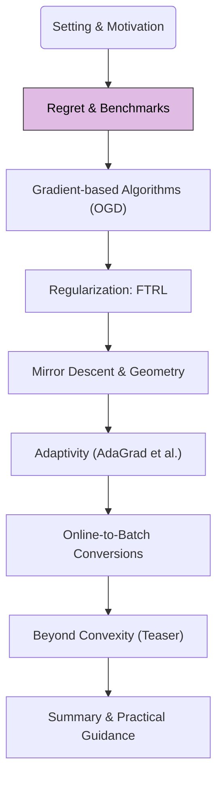

In Module 0, we introduced the online learning protocol. Now, we address a fundamental question: how do we measure the performance of an online learning algorithm? The central concept for this is **regret**.

## 1. Road-map at a Glance

We are currently at **Module 1: Regret & Benchmarks**.

**Navigational Tip.** This flowchart will appear in each post, with the current module highlighted, to orient you within the crash course.

## 2. Module 1: Regret & Benchmarks

### The Notion of Regret

In online learning, we typically cannot hope to make the optimal decision at every single round, especially if the environment is adversarial or future loss functions are unknown. Instead, we aim to perform nearly as well as a powerful benchmark. Regret quantifies the difference between our algorithm's cumulative loss and the cumulative loss of this benchmark, typically the best single fixed action chosen in hindsight.

<blockquote class="box-definition" markdown="1">

**Definition.** Static Regret

Let $$\{x_t\}_{t=1}^T$$ be the sequence of actions chosen by the learner, and $$\{\ell_t\}_{t=1}^T$$ be the sequence of loss functions revealed by the environment. The (external or static) regret $$R_T$$ of the learner over $$T$$ rounds is defined as:

$$
R_T = \sum_{t=1}^T \ell_t(x_t) - \min_{x^\ast  \in \mathcal{X}} \sum_{t=1}^T \ell_t(x^\ast )
$$

Here, $$x^\ast $$ represents the best single fixed action from the decision set $$\mathcal{X}$$ chosen with full knowledge of all loss functions $$\ell_1, \dots, \ell_T$$.
</blockquote>

The term "static" emphasizes that we compare against the best *fixed* decision. Our goal is to design algorithms that ensure $$R_T$$ grows slowly with $$T$$.

### Why Sublinear Regret?

A desirable property for an online learning algorithm is to achieve **sublinear regret**, meaning that the regret $$R_T$$ grows slower than $$T$$ (i.e., $$R_T = o(T)$$). If an algorithm achieves sublinear regret, its average per-round regret approaches zero as $$T \to \infty$$:

$$
\lim_{T \to \infty} \frac{R_T}{T} = \lim_{T \to \infty} \left( \frac{1}{T}\sum_{t=1}^T \ell_t(x_t) - \frac{1}{T}\min_{x^\ast  \in \mathcal{X}} \sum_{t=1}^T \ell_t(x^\ast ) \right) = 0
$$

This implies that, on average, the learner's performance is asymptotically as good as the best fixed action in hindsight. Achieving sublinear regret is a hallmark of effective online learning. Common sublinear regret bounds include $$O(\sqrt{T})$$, $$O(\log T)$$, or even $$O(1)$$ in some specialized settings.

### Regret Variants

While static regret is the most common benchmark, other notions of regret exist, tailored to different scenarios or stronger performance guarantees:

*   **Adversarial vs. Stochastic Regret:**
    *   **Adversarial Setting:** Loss functions $$\ell_t$$ can be chosen by an adversary, potentially to maximize the learner's regret, given the learner's algorithm (but not its internal randomness). This is a worst-case scenario.
    *   **Stochastic Setting:** Loss functions (or the data generating them) are assumed to be drawn independently and identically distributed (i.i.d.) from some fixed (but unknown) distribution. This often allows for better regret bounds (e.g., $$O(\log T)$$ or constant regret under certain conditions).
*   **Dynamic Regret (or Shifting Regret):** Compares the learner's loss to a sequence of comparators $$\{x_t^\ast \}_{t=1}^T$$ that can change over time, rather than a single fixed $$x^\ast $$. This is relevant when the optimal strategy itself is non-stationary. Quantifying this often involves bounding $$R_T^{\text{dyn}} = \sum \ell_t(x_t) - \sum \ell_t(x_t^\ast )$$.
*   **Internal Regret:** Compares the loss of always playing action $$i$$ to the loss of always playing action $$j$$, for all pairs $$i, j \in \mathcal{X}$$. This is stronger than external regret and has implications for reaching correlated equilibria in games.

For this crash course, we will primarily focus on **static regret in the adversarial setting** unless specified otherwise, as it provides robust guarantees applicable to Online Convex Optimization (OCO).

### Fundamental Limits on Regret

It's important to understand that there are inherent limits to how well any online algorithm can perform. Information theory provides lower bounds on achievable regret.

<blockquote class="box-info" markdown="1">

**Example Lower Bound.**

For online convex optimization with Lipschitz continuous convex loss functions over a bounded convex set, it can be shown that any deterministic algorithm must suffer regret of at least $$\Omega(\sqrt{T})$$ in the worst case. For strongly convex losses, this can improve to $$\Omega(\log T)$$.
</blockquote>

These lower bounds tell us what the best possible regret rates are (up to constant factors) and serve as a benchmark for evaluating the optimality of specific algorithms. For instance, an algorithm achieving $$O(\sqrt{T})$$ regret for Lipschitz convex losses is considered optimal in terms of its dependence on $$T$$.

### Towards a Cheat-Sheet

Throughout this crash course, we will encounter various algorithms, assumptions, and their corresponding regret bounds. We will gradually build up a "cheat-sheet" to summarize these key relationships. For now, we've established our primary performance metric:

| Concept       | Definition / Goal                                                                      |
| ------------- | -------------------------------------------------------------------------------------- |
| Decision Set  | $$\mathcal{X}$$ (often convex)                                                         |
| Loss Function | $$\ell_t(x)$$ (often convex)                                                           |
| Static Regret | $$R_T = \sum \ell_t(x_t) - \min_{x^\ast  \in \mathcal{X}} \sum \ell_t(x^\ast )$$       |
| Goal          | Achieve sublinear regret, e.g., $$R_T = o(T)$$, often $$O(\sqrt{T})$$ or $$O(\log T)$$ |

---

With the concept of regret established, we are ready to explore the first family of algorithms designed to minimize it: gradient-based methods.

**Next Up:** Module 2: Gradient-based Algorithms (OGD)
