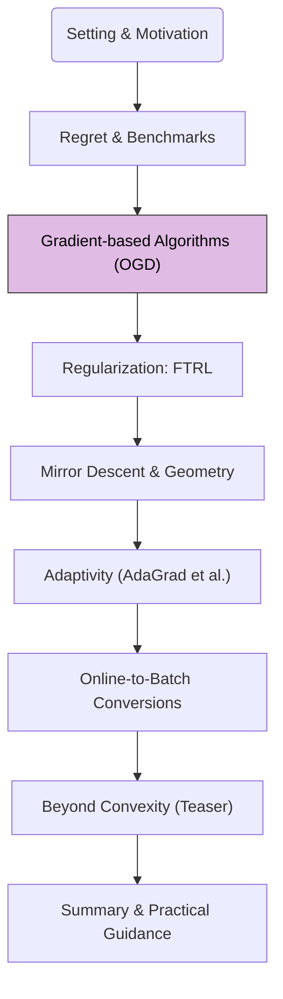

Having established regret as our performance metric in Module 1, we now turn to our first concrete algorithm for online learning: **Online Gradient Descent (OGD)**. This algorithm is a cornerstone of Online Convex Optimization (OCO).

## 1. Road-map at a Glance

We are currently at **Module 2: Gradient-based Algorithms (OGD)**.

**Navigational Tip.** This flowchart will appear in each post, with the current module highlighted, to orient you within the crash course.

## 2. Module 2: Online Gradient Descent (OGD)

Online Gradient Descent is a natural adaptation of the classic batch gradient descent algorithm to the online setting. It's simple, effective, and its analysis provides fundamental insights into online learning.

<blockquote class="box-info" markdown="1">

**Recall: OCO Assumptions**

For OGD and its standard analysis, we assume the Online Convex Optimization (OCO) setting:
1. The decision set $$\mathcal{X} \subseteq \mathbb{R}^d$$ is **convex** and **bounded**.
2. Each loss function $$\ell_t: \mathcal{X} \to \mathbb{R}$$ is **convex**.
3. The learner has access to the gradient (or a subgradient) $$\nabla \ell_t(x_t)$$ after playing $$x_t$$ and observing $$\ell_t$$.
</blockquote>

### The OGD Algorithm

The OGD algorithm iteratively updates its chosen action by taking a step in the negative direction of the current loss function's gradient, and then projecting the result back onto the feasible decision set $$\mathcal{X}$$.

<blockquote class="box-lemma" markdown="1">

**Algorithm.** Online Gradient Descent (OGD)

**Initialization:**
*   Choose a learning rate sequence $$\{\eta_t\}_{t=1}^T$$.
*   Select an initial action $$x_1 \in \mathcal{X}$$.

**For each round** $$t = 1, 2, \dots, T$$:
1.  **Play** the action $$x_t$$.
2.  **Observe** the loss function $$\ell_t(\cdot)$$.
3.  **Compute** the gradient (or a subgradient) $$g_t = \nabla \ell_t(x_t)$$.
4.  **Update** to an intermediate point:

    $$
    x'_{t+1} = x_t - \eta_t g_t
    $$

5.  **Project** back onto the decision set:

    $$
    x_{t+1} = \Pi_{\mathcal{X}}(x'_{t+1}) = \Pi_{\mathcal{X}}(x_t - \eta_t g_t)
    $$

    where $$\Pi_{\mathcal{X}}(y) = \arg\min_{z \in \mathcal{X}} \Vert y - z \Vert_2$$ is the Euclidean projection onto $$\mathcal{X}$$.
</blockquote>

The projection step ensures that $$x_{t+1}$$ remains within the feasible decision set $$\mathcal{X}$$. If $$\mathcal{X} = \mathbb{R}^d$$ (unconstrained), the projection step is unnecessary.

### Regret Analysis of OGD

The standard regret analysis for OGD provides an upper bound on the static regret $$R_T$$. The key ingredients for this analysis are the convexity of $$\ell_t$$ and properties of Euclidean projection.

Let $$x^\ast  = \arg\min_{x \in \mathcal{X}} \sum_{s=1}^T \ell_s(x)$$ be the best fixed action in hindsight.
The analysis typically involves bounding the term $$\ell_t(x_t) - \ell_t(x^\ast )$$ at each step.

**Sketch of OGD Regret Bound Derivation.**

The derivation relies on three main steps:

1.  **Convexity of $$\ell_t$$**: By first-order condition for convexity, we have

    $$
    \ell_t(x_t) - \ell_t(x^\ast ) \le \langle g_t, x_t - x^\ast  \rangle
    $$

2.  **Properties of Projection**: The projection $$\Pi_{\mathcal{X}}$$ is non-expansive, which helps bound $$\Vert x_{t+1} - x^\ast  \Vert_2^2$$:

    $$
    \Vert x_{t+1} - x^\ast  \Vert_2^2 = \Vert \Pi_{\mathcal{X}}(x_t - \eta_t g_t) - x^\ast  \Vert_2^2 \le \Vert (x_t - \eta_t g_t) - x^\ast  \Vert_2^2
    $$

    Expanding the right-hand side:

    $$
    \Vert (x_t - x^\ast ) - \eta_t g_t \Vert_2^2 = \Vert x_t - x^\ast  \Vert_2^2 - 2\eta_t \langle g_t, x_t - x^\ast  \rangle + \eta_t^2 \Vert g_t \Vert_2^2
    $$

    Rearranging and combining with the convexity inequality:

    $$
    \ell_t(x_t) - \ell_t(x^\ast ) \le \langle g_t, x_t - x^\ast  \rangle \le \frac{1}{2\eta_t}(\Vert x_t - x^\ast  \Vert_2^2 - \Vert x_{t+1} - x^\ast  \Vert_2^2) + \frac{\eta_t}{2}\Vert g_t \Vert_2^2
    $$

3.  **Telescoping Sum**: Summing over $$t=1, \dots, T$$:

    $$
    \sum_{t=1}^T (\ell_t(x_t) - \ell_t(x^\ast )) \le \frac{1}{2\eta_t} \sum_{t=1}^T (\Vert x_t - x^\ast  \Vert_2^2 - \Vert x_{t+1} - x^\ast  \Vert_2^2) + \frac{\eta_t}{2} \sum_{t=1}^T \Vert g_t \Vert_2^2
    $$

    Assuming a constant learning rate $$\eta_t = \eta$$ for simplicity:

    $$
    R_T \le \frac{1}{2\eta} (\Vert x_1 - x^\ast  \Vert_2^2 - \Vert x_{T+1} - x^\ast  \Vert_2^2) + \frac{\eta}{2} \sum_{t=1}^T \Vert g_t \Vert_2^2
    $$

    Since $$\Vert x_{T+1} - x^\ast  \Vert_2^2 \ge 0$$, we get:

    $$
    R_T \le \frac{\Vert x_1 - x^\ast  \Vert_2^2}{2\eta} + \frac{\eta}{2} \sum_{t=1}^T \Vert g_t \Vert_2^2
    $$

<blockquote class="box-theorem" markdown="1">

**Theorem.** OGD Regret Bound

Assume the decision set $$\mathcal{X}$$ has diameter $$D$$, i.e., $$\Vert x - y \Vert_2 \le D$$ for all $$x, y \in \mathcal{X}$$.
Assume the gradients are bounded, i.e., $$\Vert g_t \Vert_2 \le G$$ for all $$t$$.
If we use a constant learning rate $$\eta_t = \eta = \frac{D}{G\sqrt{T}}$$, then the regret of OGD is bounded by:

$$
R_T \le \frac{D^2}{2\eta} + \frac{\eta}{2} T G^2 = \frac{D^2 G \sqrt{T}}{2D} + \frac{D}{2G\sqrt{T}} T G^2 = \frac{DG\sqrt{T}}{2} + \frac{DG\sqrt{T}}{2} = DG\sqrt{T}
$$

Thus, $$R_T = O(\sqrt{T})$$.
</blockquote>

This $$O(\sqrt{T})$$ regret bound is optimal (up to constants) for general convex losses in the adversarial setting, matching the lower bound mentioned in Module 1.

### Learning Rate ($$\eta_t$$) Strategies

The choice of learning rate is crucial for OGD's performance:

*   **Constant Learning Rate $$\eta$$:** As shown above, if $$T$$ is known, setting $$\eta \propto 1/\sqrt{T}$$ yields an $$O(\sqrt{T})$$ regret. If $$T$$ is unknown, a fixed $$\eta$$ might lead to linear regret if too large, or slow convergence if too small initially.
*   **Diminishing Learning Rates (e.g., $$\eta_t = \eta_0 / \sqrt{t}$$):** This is a common strategy when $$T$$ is unknown. It can also achieve $$O(\sqrt{T})$$ regret (possibly with logarithmic factors or different constants) and adapts to the problem horizon.
    *   For example, if $$\eta_t = \frac{D}{G\sqrt{t}}$$, one can show $$R_T = O(DG\sqrt{T})$$.
*   **Adaptive Learning Rates:** More sophisticated methods (which we'll see in Module 5) adapt $$\eta_t$$ based on the history of gradients, often per-coordinate.

### Summary of OGD Properties

| Feature                      | Description                                                                                      |
| ---------------------------- | ------------------------------------------------------------------------------------------------ |
| **Algorithm Type**           | Online, Gradient-based, Projection-based                                                         |
| **Assumptions**              | Convex losses, Convex & Bounded decision set $$\mathcal{X}$$                                     |
| **Update Rule**              | $$x_{t+1} = \Pi_{\mathcal{X}}(x_t - \eta_t \nabla \ell_t(x_t))$$                                 |
| **Key Strength**             | Simplicity, strong theoretical guarantees (optimal regret for convex losses)                     |
| **Regret (Convex)**          | $$O(\sqrt{T})$$ with proper $$\eta_t$$ (e.g., $$\propto 1/\sqrt{T}$$)                            |
| **Regret (Strongly Convex)** | Can achieve $$O(\log T)$$ with $$\eta_t \propto 1/t$$ (if losses are $$\sigma$$-strongly convex) |
| **Key Parameter**            | Learning rate $$\eta_t$$                                                                         |

OGD forms the basis for many other online learning algorithms and provides a direct link to stochastic optimization methods like SGD.

---

Next, we will explore how regularization can be incorporated into online learning through the Follow-The-Regularized-Leader (FTRL) framework, which provides an alternative perspective and a generalization of OGD.

**Next Up:** Module 3: Regularization: FTRL
