In Module 2, we examined Online Gradient Descent (OGD), a powerful algorithm for online convex optimization. Now, we explore a different, yet related, family of strategies centered around the idea of "following the leader," and how regularization plays a critical role in making these strategies robust and effective.

## 1. Road-map at a Glance

We are currently at **Module 3: Regularization: FTL & FTRL**.

```mermaid
flowchart LR
    C0("0. Setting & Motivation") --> C1["1. Regret & Benchmarks"]
    C1 --> C2["2. Gradient-based Algorithms (OGD)"]
    C2 --> C3["3. Regularization: FTRL"]
    C3 --> C4["4. Mirror Descent & Geometry"]
    C4 --> C5["5. Adaptivity (AdaGrad et al.)"]
    C5 --> C6["6. Online-to-Batch Conversions"]
    C6 --> C7["7. Beyond Convexity (Teaser)"]
    C7 --> C8["8. Summary & Practical Guidance"]

    style C3 fill:#E0BBE4,stroke:#333,stroke-width:2px % Highlight current module
```

**Navigational Tip.** This flowchart will appear in each post, with the current module highlighted, to orient you within the crash course.

## 2. Module 3: Regularization: FTL & FTRL

### Follow-The-Leader (FTL)

A very intuitive approach to online learning is to, at each round, choose the action that would have been optimal given all the loss functions observed so far. This is known as the **Follow-The-Leader (FTL)** strategy.

<blockquote class="box-definition" markdown="1">

**Algorithm.** Follow-The-Leader (FTL)

**Initialization:**
*   Define an initial action $$x_1$$ (e.g., an arbitrary point in $$\mathcal{X}$$ or a minimizer of a default loss $$\ell_0$$).

**For each round** $$t = 1, 2, \dots, T$$:
1.  **Play** the action $$x_t = \arg\min_{x \in \mathcal{X}} \sum_{s=0}^{t-1} \ell_s(x)$$. (Assume $$\ell_0$$ is some initial state or tie-breaking loss if $$t=1$$).
2.  **Observe** the loss function $$\ell_t(\cdot)$$.
</blockquote>

While simple and appealing, FTL can perform poorly in adversarial settings. It is susceptible to "traps" set by an adversary, leading to instability and potentially linear regret.

<blockquote class="box-example" markdown="1">

**Example.** FTL Failure

Consider a decision set $$\mathcal{X} = [-1, 1]$$. An adversary can choose the following sequence of linear loss functions:
*   Round 1: $$\ell_1(x) = -x$$. FTL plays $$x_1 = \arg\min_{x \in [-1,1]} 0 = \text{any } x_0$$. Let's say $$x_1=0$$. Oops, better define $$x_1$$ more carefully.
    Let $$x_1 = \arg\min_{x \in \mathcal{X}} \ell_0(x)$$ where $$\ell_0(x)=0$$ or some fixed prior. If we need to predict at $$t=1$$ based on history up to $$t-1=0$$, FTL would be $$\arg\min_{x \in \mathcal{X}} 0$$, which is undefined.
    A common convention is to set $$x_1$$ arbitrarily or play $$x_1 = \arg\min_{x \in \mathcal{X}} R_0(x)$$ for some initial regularizer, or simply initialize based on prior knowledge.

Let's rephrase the FTL play rule for consistency:
At round $$t$$, the learner plays $$x_t$$ which minimizes the sum of past losses $$\sum_{s=1}^{t-1} \ell_s(x)$$. (For $$t=1$$, $$x_1$$ can be chosen arbitrarily in $$\mathcal{X}$$).

Consider $$\mathcal{X} = [-1, 1]$$ and the following loss sequence:
*   Round 1: Arbitrary $$x_1 \in [-1,1]$$. Say $$x_1=0$$. Loss $$\ell_1(x) = 0.6x$$. Learner suffers $$\ell_1(0)=0$$.
*   Round 2: FTL plays $$x_2 = \arg\min_{x \in [-1,1]} \ell_1(x) = \arg\min_{x \in [-1,1]} 0.6x = -1$$. Adversary chooses $$\ell_2(x) = -0.6x$$. Learner suffers $$\ell_2(-1) = 0.6$$.
*   Round 3: FTL plays $$x_3 = \arg\min_{x \in [-1,1]} (\ell_1(x) + \ell_2(x)) = \arg\min_{x \in [-1,1]} (0.6x - 0.6x) = \arg\min 0$$. FTL is indifferent, suppose it picks $$x_3=1$$ (or it could oscillate). Adversary chooses $$\ell_3(x) = 0.6x$$. Learner suffers $$\ell_3(1)=0.6$$.

A classic example showing linear regret for FTL:
Let $$\mathcal{X} = [-1, 1]$$.
*   Round $$t=1$$: $$x_1=0$$ (arbitrary). $$\ell_1(x) = -x + 1$$. Loss $$\ell_1(0)=1$$.
*   Round $$t=2$$: FTL plays $$x_2 = \arg\min_x \ell_1(x) = 1$$. Adversary sets $$\ell_2(x) = x + 1$$. Loss $$\ell_2(1)=2$$. Total learner loss: $$1+2=3$$.
*   Round $$t=3$$: FTL plays $$x_3 = \arg\min_x (\ell_1(x) + \ell_2(x)) = \arg\min_x (-x+1 + x+1) = \arg\min_x 2 = \text{any } x \in [-1,1]$$. Suppose FTL picks $$x_3=-1$$. Adversary sets $$\ell_3(x) = -x + 1$$. Loss $$\ell_3(-1)=2$$. Total learner loss: $$3+2=5$$.
The pattern: FTL always picks an endpoint, adversary makes that endpoint have high loss. The best fixed point $$x^\ast =0$$ would have losses $$1, 1, 1, \dots$$. FTL can incur linear regret.
This example needs careful construction to make the FTL choice unique or its oscillation clear.

A simpler, standard example:
Consider $$\mathcal{X} = [0, 1]$$ and a sequence of $$T$$ loss functions:
$$\ell_t(x) = \begin{cases} -2x & \text{if } t \text{ is odd} \\ 2x & \text{if } t \text{ is even} \end{cases}$$
Assume $$x_1 = 0$$.
*   $$t=1$$ (odd): Play $$x_1=0$$. $$\ell_1(x)=-2x$$. Loss incurred $$\ell_1(0)=0$$.
*   $$t=2$$ (even): FTL plays $$x_2 = \arg\min_{x \in [0,1]} \ell_1(x) = \arg\min_{x \in [0,1]} -2x = 1$$. Observe $$\ell_2(x)=2x$$. Loss incurred $$\ell_2(1)=2$$.
*   $$t=3$$ (odd): FTL plays $$x_3 = \arg\min_{x \in [0,1]} (\ell_1(x)+\ell_2(x)) = \arg\min_{x \in [0,1]} (-2x+2x) = \arg\min_{x \in [0,1]} 0$$. FTL is indifferent, assume it picks $$x_3=0$$. Observe $$\ell_3(x)=-2x$$. Loss incurred $$\ell_3(0)=0$$.
*   $$t=4$$ (even): FTL plays $$x_4 = \arg\min_{x \in [0,1]} (\ell_1(x)+\ell_2(x)+\ell_3(x)) = \arg\min_{x \in [0,1]} (-2x+2x-2x) = \arg\min_{x \in [0,1]} -2x = 1$$. Observe $$\ell_4(x)=2x$$. Loss incurred $$\ell_4(1)=2$$.
The FTL algorithm alternates between playing $$0$$ and $$1$$. Its cumulative loss is $$0+2+0+2+\dots = T$$.
The best fixed action is $$x^\ast =0.5$$, for which $$\ell_t(0.5) = \pm 1$$. However, the sum $$\sum \ell_t(x)$$ for a *fixed* $$x$$ is what matters for static regret.
The comparator: $$\min_{x^\ast  \in [0,1]} \sum_{t=1}^T \ell_t(x^\ast )$$.
If $$T$$ is even, $$\sum_{t=1}^T \ell_t(x) = \sum_{k=1}^{T/2} (\ell_{2k-1}(x) + \ell_{2k}(x)) = \sum_{k=1}^{T/2} (-2x + 2x) = 0$$. So the optimal fixed action achieves total loss 0.
FTL's regret is $$T - 0 = T$$, which is linear.
</blockquote>
This instability makes FTL unsuitable for general adversarial online learning, despite its good performance in some specific (e.g., stochastic i.i.d.) settings.

### Follow-The-Regularized-Leader (FTRL)

To mitigate FTL's instability, we introduce regularization. The **Follow-The-Regularized-Leader (FTRL)** algorithm adds a regularization term to the cumulative loss minimization.

<blockquote class="box-proposition" markdown="1">

**Algorithm.** Follow-The-Regularized-Leader (FTRL)

**Initialization:**
*   Choose a sequence of non-negative learning rates / regularization parameters $$\{\eta_t\}_{t=0}^{T-1}$$.
*   Choose a regularization function $$R(x)$$, which is typically strongly convex.

**For each round** $$t = 1, 2, \dots, T$$:
1.  **Play** the action:

    $$
    x_t = \arg\min_{x \in \mathcal{X}} \left( \sum_{s=1}^{t-1} \ell_s(x) + \frac{1}{\eta_{t-1}} R(x) \right)
    $$

    Alternatively, and more commonly for analysis relating to OGD:

    $$
    x_t = \arg\min_{x \in \mathcal{X}} \left( \sum_{s=1}^{t-1} \langle g_s, x \rangle + \frac{1}{\eta_{t-1}} R(x) \right)
    $$

    where $$g_s = \nabla \ell_s(x_s)$$ are the gradients observed at previous points $$x_s$$.
    A common variant uses a single learning rate $$\eta$$ and updates the sum of gradients with the current gradient *before* minimization for $$x_{t+1}$$:

    $$
    x_{t+1} = \arg\min_{x \in \mathcal{X}} \left( \sum_{s=1}^{t} \langle g_s, x \rangle + \frac{1}{\eta} R(x) \right)
    $$

    Or, using cumulative losses and a time-dependent regularizer (common in some FTRL literature):

    $$
    x_t = \arg\min_{x \in \mathcal{X}} \left( \sum_{s=1}^{t-1} \ell_s(x) + R_t(x) \right)
    $$

    where $$R_t(x)$$ can incorporate learning rates and the base regularizer $$R(x)$$.

2.  **Observe** the loss function $$\ell_t(\cdot)$$ and compute $$g_t = \nabla \ell_t(x_t)$$.
</blockquote>

<blockquote class="box-info" markdown="1">

**A Common FTRL Formulation (for our purposes)**

For consistency and to easily connect with OGD and Mirror Descent, we'll often consider FTRL in the form where decisions are made based on past observed gradients and a fixed regularizer scaled by a learning rate:

Initialize $$x_1 \in \mathcal{X}$$ (e.g., $$x_1 = \arg\min_{x \in \mathcal{X}} R(x)$$).
For $$t=1, \dots, T$$:
1. Play $$x_t$$.
2. Observe $$\ell_t(\cdot)$$ and compute $$g_t = \nabla \ell_t(x_t)$$.
3. Update for next round:

   $$
   x_{t+1} = \arg\min_{x \in \mathcal{X}} \left( \sum_{s=1}^{t} \langle g_s, x \rangle + \frac{1}{\eta} R(x) \right)
   $$

Here, $$R(x)$$ is often a $$\sigma$$-strongly convex function with respect to some norm, e.g., $$R(x) = \frac{1}{2} \Vert x \Vert_2^2$$ (which is 1-strongly convex w.r.t. L2 norm). The parameter $$\eta > 0$$ acts as a learning rate.
</blockquote>

**Benefits of Regularization in FTRL:**

*   **Stability:** The regularizer $$R(x)$$ penalizes large changes in $$x$$, making the sequence of decisions $$x_t$$ more stable and less susceptible to adversarial traps. If $$R(x)$$ is strongly convex, it ensures a unique minimizer.
*   **Improved Regret Bounds:** With an appropriate choice of $$R(x)$$ and learning rates, FTRL can achieve optimal regret bounds (e.g., $$O(\sqrt{T})$$ for convex losses, $$O(\log T)$$ for strongly convex losses).
*   **Unifying Framework:** FTRL is a general framework that encompasses many well-known online learning algorithms as special cases, depending on the choice of $$R(x)$$ and how gradients are incorporated.

### FTRL Variants and Connections

1.  **FTRL with L2 Regularization ($$R(x) = \frac{1}{2}\Vert x \Vert_2^2$$):**
    This choice is closely related to Online Gradient Descent (OGD). In fact, OGD can be seen as an approximation or a specific instantiation of FTRL under certain conditions (often termed "Be-The-Leader" or when FTRL is combined with a linearization of the loss functions). The FTRL update involves solving an optimization problem at each step, which might be computationally more expensive than OGD's simple gradient step + projection. However, for L2 regularization and linear losses, the FTRL update can sometimes be computed efficiently.

2.  **Relationship to Online Mirror Descent (OMD):**
    FTRL is also deeply connected to Online Mirror Descent (OMD), which we will cover in Module 4. OMD generalizes OGD by using Bregman divergences instead of Euclidean distances. FTRL can be shown to be equivalent to OMD for certain choices of regularizers and learning rates. Specifically, if $$R(x)$$ is the mirror map (potential function) used in OMD, the algorithms are closely related or equivalent.

**Optional Detail: Fenchel Conjugacy and FTRL Implementation**

For certain regularizers, the FTRL update can be efficiently computed using Fenchel duality.
If $$x_{t+1} = \arg\min_{x \in \mathcal{X}} \left( \langle G_t, x \rangle + \frac{1}{\eta} R(x) \right)$$, where $$G_t = \sum_{s=1}^t g_s$$.
This is equivalent to $$-\eta G_t \in \partial R(x_{t+1})$$ if $$\mathcal{X} = \mathbb{R}^d$$ (ignoring the constraint for simplicity).
Then $$x_{t+1} = (\nabla R)^\ast  (-\eta G_t)$$, where $$(\nabla R)^\ast $$ is the conjugate of $$\nabla R$$.
This view highlights the connection to dual averaging methods, which are a form of OMD.

### Regret Analysis of FTRL

The regret analysis of FTRL is more general and relies on the properties of the chosen regularizer $$R(x)$$. A key lemma often used is the "FTRL regret lemma" or "Be-The-Leader lemma."

<blockquote class="box-theorem" markdown="1">

**Theorem.** Generic FTRL Regret Bound (Conceptual)

Let $$R(x)$$ be $$\sigma$$-strongly convex with respect to some norm $$\Vert \cdot \Vert$$.
If $$g_s$$ are the gradients of convex loss functions, the regret of FTRL (using the sum of gradients formulation) can often be bounded as:

$$
R_T \le \frac{R(x^\ast ) - R(x_1)}{\eta} + \frac{\eta}{2\sigma} \sum_{t=1}^T \Vert g_t \Vert_\ast ^2
$$

where $$\Vert \cdot \Vert_\ast $$ is the dual norm to $$\Vert \cdot \Vert$$.
By choosing $$\eta$$ appropriately (e.g., balancing the two terms), one can derive specific rates like $$O(\sqrt{T})$$ or $$O(\log T)$$. For instance, if $$R(x)=\frac{1}{2}\Vert x \Vert_2^2$$ ($$\sigma=1$$, $$\Vert \cdot \Vert_\ast  = \Vert \cdot \Vert_2$$), and assuming $$\Vert g_t \Vert_2 \le G$$ and $$R(x^\ast ) \le D_R^2/2$$, setting $$\eta \approx D_R / (G\sqrt{T})$$ gives $$R_T = O(D_R G \sqrt{T})$$.
</blockquote>

The FTRL framework offers a powerful lens for designing and analyzing online algorithms. Its ability to incorporate different regularizers makes it adaptable to various problem structures and geometries, paving the way for algorithms like AdaGrad (which uses an adaptive, data-dependent regularizer).

---

In the next module, we will delve deeper into the geometric perspective offered by Online Mirror Descent, which provides another powerful generalization of OGD and is closely linked to FTRL.

**Next Up:** Module 4: Mirror Descent & Geometry
