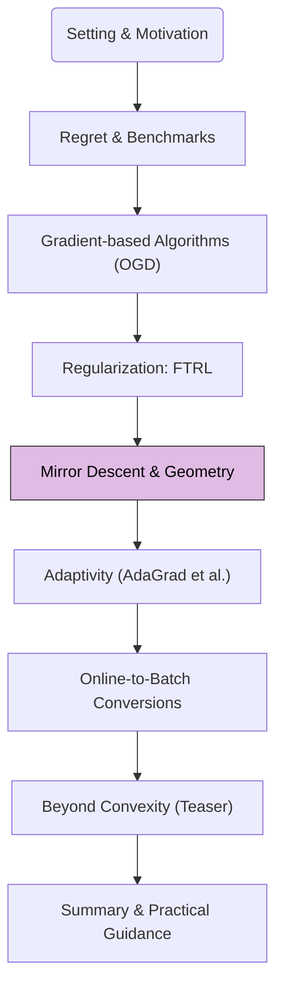

In previous modules, we explored Online Gradient Descent (OGD) and Follow-The-Regularized-Leader (FTRL). OGD implicitly operates in Euclidean space. We now introduce **Online Mirror Descent (OMD)**, a powerful generalization that allows us to leverage non-Euclidean geometries tailored to the structure of the decision set $$\mathcal{X}$$.

## 1. Road-map at a Glance

We are currently at **Module 4: Mirror Descent & Geometry**.

**Navigational Tip.** This flowchart will appear in each post, with the current module highlighted, to orient you within the crash course.

## 2. Module 4: Mirror Descent & Geometry

### Motivation: Beyond Euclidean Geometry

Online Gradient Descent (OGD) performs updates of the form $$x_{t+1} = \Pi_{\mathcal{X}}(x_t - \eta_t g_t)$$. This update can be viewed as solving:

$$
x_{t+1} = \arg\min_{x \in \mathcal{X}} \left( \langle g_t, x \rangle + \frac{1}{2\eta_t} \Vert x - x_t \Vert_2^2 \right)
$$

The term $$\frac{1}{2\eta_t} \Vert x - x_t \Vert_2^2$$ keeps the new iterate $$x_{t+1}$$ close to the previous iterate $$x_t$$ in terms of squared Euclidean distance.

However, Euclidean geometry is not always the most natural fit for the decision set $$\mathcal{X}$$. For example:
*   If $$\mathcal{X}$$ is the probability simplex ($$\Delta_d = \{x \in \mathbb{R}^d : x_i \ge 0, \sum x_i = 1\}$$), Euclidean projections can be computationally non-trivial and may not respect the inherent multiplicative structure of probabilities.
*   For problems involving matrices or other structured objects, different notions of distance or "closeness" might be more appropriate.

Online Mirror Descent (OMD) addresses this by replacing the squared Euclidean distance with a more general **Bregman divergence**, induced by a **mirror map** (or potential function).

### Core Components of Mirror Descent

1.  **Mirror Map (Potential Function $$\psi$$):**
    A continuously differentiable function $$\psi: \mathcal{X} \to \mathbb{R}$$ that is $$\sigma$$-strongly convex with respect to some norm $$\Vert \cdot \Vert_{\psi}$$ (often the L1 or L2 norm). The choice of $$\psi$$ defines the geometry we operate in.

2.  **Bregman Divergence ($$D_\psi$$):**
    Associated with a mirror map $$\psi$$, the Bregman divergence $$D_\psi(x, y)$$ measures a form of "distance" between points $$x, y \in \text{int}(\text{dom}(\psi))$$:
    <blockquote class="box-definition" markdown="1">
    

    **Definition.** Bregman Divergence
    

    For a differentiable convex function $$\psi$$, the Bregman divergence $$D_\psi : \text{dom}(\psi) \times \text{int}(\text{dom}(\psi)) \to \mathbb{R}_{\ge 0}$$ is defined as:

    $$
    D_\psi(x, y) = \psi(x) - \psi(y) - \langle \nabla \psi(y), x - y \rangle
    $$

    Key properties: $$D_\psi(x,y) \ge 0$$, and $$D_\psi(x,y) = 0$$ if and only if $$x=y$$ (if $$\psi$$ is strictly convex). It is convex in its first argument but generally not in the second, nor is it necessarily symmetric.
    </blockquote>

### The Online Mirror Descent (OMD) Algorithm

OMD operates by mapping iterates from the "primal space" (where $$x_t$$ lives) to a "dual space" via $$\nabla \psi$$, performing a gradient-like update in this dual space, and then mapping back to the primal space.

<blockquote class="box-lemma" markdown="1">

**Algorithm.** Online Mirror Descent (OMD)

**Initialization:**
*   Choose a mirror map $$\psi(\cdot)$$ that is $$\sigma$$-strongly convex on $$\mathcal{X}$$ w.r.t. some norm $$\Vert \cdot \Vert$$.
*   Choose a learning rate sequence $$\{\eta_t\}_{t=1}^T$$.
*   Select an initial action $$x_1 \in \mathcal{X}$$ (e.g., $$x_1 = \arg\min_{x \in \mathcal{X}} \psi(x)$$).

**For each round** $$t = 1, 2, \dots, T$$:
1.  **Play** the action $$x_t$$.
2.  **Observe** the loss function $$\ell_t(\cdot)$$ and compute the gradient $$g_t = \nabla \ell_t(x_t)$$.
3.  **Update** (Conceptual primal-dual view):
    a. Map to dual space: $$\theta_t = \nabla \psi(x_t)$$.
    b. Gradient step in dual space: $$\theta'_{t+1} = \theta_t - \eta_t g_t$$.
    c. Map back to primal space (and project): $$x_{t+1} = (\nabla \psi)^{-1}(\theta'_{t+1})$$, projected onto $$\mathcal{X}$$ if necessary.
    More commonly, the update is written as a single minimization problem:

    $$
    x_{t+1} = \arg\min_{x \in \mathcal{X}} \left( \eta_t \langle g_t, x \rangle + D_\psi(x, x_t) \right)
    $$

    This formulation shows OMD as choosing the next iterate $$x_{t+1}$$ to be close to $$x_t$$ (measured by $$D_\psi$$) while making progress on the linearized loss $$\langle g_t, x \rangle$$.
</blockquote>

<blockquote class="box-info" markdown="1">

**Alternative OMD Formulation (Dual Averaging Connection)**

Another common OMD variant, often called Dual Averaging or Follow-The-Regularized-Leader with Bregman Projections, updates using the sum of past gradients:

$$
x_{t+1} = \arg\min_{x \in \mathcal{X}} \left( \eta \sum_{s=1}^t \langle g_s, x \rangle + \psi(x) \right)
$$

This form makes the connection to FTRL particularly clear: if we set the regularizer $$R(x) = \psi(x)/\eta$$, this is precisely the FTRL update rule using the sum of gradients.
For this crash course, we emphasize the general OMD update:
$$x_{t+1} = \arg\min_{x \in \mathcal{X}} \left( \eta_t \langle g_t, x \rangle + D_\psi(x, x_t) \right)$$
as it clearly generalizes OGD's proximal step.
</blockquote>

### Examples of Mirror Maps and Bregman Divergences

1.  **Euclidean Geometry (OGD as a special case):**
    *   Mirror Map: $$\psi(x) = \frac{1}{2} \Vert x \Vert_2^2$$. (1-strongly convex w.r.t. L2 norm)
    *   Gradient: $$\nabla \psi(x) = x$$.
    *   Bregman Divergence: $$D_\psi(x, y) = \frac{1}{2}\Vert x \Vert_2^2 - \frac{1}{2}\Vert y \Vert_2^2 - \langle y, x-y \rangle = \frac{1}{2} (\Vert x \Vert_2^2 - 2\langle x,y \rangle + \Vert y \Vert_2^2) = \frac{1}{2}\Vert x - y \Vert_2^2$$.
    *   OMD update: $$x_{t+1} = \arg\min_{x \in \mathcal{X}} (\eta_t \langle g_t, x \rangle + \frac{1}{2}\Vert x - x_t \Vert_2^2)$$. This is precisely the proximal update form of OGD.

2.  **Entropy Regularization (for Probability Simplex):**
    *   Decision Set: $$\mathcal{X} = \Delta_d = \{x \in \mathbb{R}^d : x_i \ge 0, \sum x_i = 1\}$$.
    *   Mirror Map (Negative Entropy): $$\psi(x) = \sum_{i=1}^d x_i \log x_i$$. (1-strongly convex w.r.t. L1 norm on the simplex after suitable scaling/shifting).
    *   Bregman Divergence: $$D_\psi(x, y) = \sum_{i=1}^d x_i \log(x_i/y_i)$$ (Kullback-Leibler divergence, KL-divergence).
    *   OMD update with this $$\psi$$ leads to algorithms like **Exponentiated Gradient** or **Multiplicative Weights Update** (MWU), which often perform well for problems on the simplex (e.g., "prediction with expert advice"). The update typically involves multiplicative adjustments to the components of $$x_t$$.

3.  **$$p$$-Norm Regularization:**
    *   Mirror Map: $$\psi(x) = \frac{1}{2(p-1)}\Vert x \Vert_p^2$$ for $$p \in (1, 2]$$.
    *   Leads to different geometries, useful for exploiting sparsity if $$p$$ is close to 1.

### Regret Analysis of OMD

The regret analysis for OMD is analogous to OGD, but uses properties of Bregman divergences instead of Euclidean distances.

<blockquote class="box-theorem" markdown="1">

**Theorem.** OMD Regret Bound

Assume $$\psi$$ is $$\sigma$$-strongly convex w.r.t. a norm $$\Vert \cdot \Vert_\psi$$ on $$\mathcal{X}$$. Let $$D_\psi(x^\ast , x_1) \le R_{\max}^2$$. Assume gradients $$g_t$$ are bounded by $$G_\ast $$ in the dual norm $$\Vert \cdot \Vert_{\psi^\ast }$$.
If we use a constant learning rate $$\eta_t = \eta = \frac{R_{\max}}{G_\ast \sqrt{T/\sigma}}$$, then the regret of OMD is bounded by:

$$
R_T \le \frac{D_\psi(x^\ast , x_1)}{\eta} + \frac{\eta}{2\sigma} \sum_{t=1}^T \Vert g_t \Vert_{\psi^\ast }^2 \approx R_{\max} G_\ast  \sqrt{T/\sigma}
$$

Thus, $$R_T = O(\sqrt{T})$$ under appropriate conditions, similar to OGD, but potentially with better constants depending on the geometry induced by $$\psi$$ and its fit to the problem.
</blockquote>

The key is that the "diameter" term $$D_\psi(x^\ast , x_1)$$ and the gradient norm bound $$\Vert g_t \Vert_{\psi^\ast }$$ depend on the chosen geometry. A good choice of $$\psi$$ can make these terms smaller relative to the Euclidean case, leading to tighter regret bounds in specific contexts.

### Relationship between OMD and FTRL

As hinted earlier, OMD and FTRL are very closely related:

*   **FTRL with $$\psi(x)/\eta$$ as regularizer:** If you set the regularizer in FTRL (sum-of-gradients form) to be $$R(x) = \psi(x)/\eta$$, where $$\psi(x)$$ is a mirror map, then the FTRL update
    $$x_{t+1} = \arg\min_{x \in \mathcal{X}} \left( \sum_{s=1}^{t} \langle g_s, x \rangle + \frac{1}{\eta}\psi(x) \right)$$
    is an instance of OMD, often referred to as **Dual Averaging** or **Lazy Mirror Descent**.
*   **OMD as a linearized FTRL:** The OMD update $$x_{t+1} = \arg\min_{x \in \mathcal{X}} (\eta_t \langle g_t, x \rangle + D_\psi(x, x_t))$$ can be seen as an FTRL step where the history $$\sum \ell_s(x)$$ is approximated by a linearization around $$x_t$$ and the regularizer is related to $$D_\psi(x,x_t)$$.

Essentially, both frameworks provide ways to incorporate problem geometry and regularization. FTRL emphasizes the "global" perspective of minimizing regularized cumulative loss, while OMD (in its proximal form) emphasizes "local" steps regularized by Bregman divergences. Many algorithms can be derived or interpreted from either viewpoint.

---

Online Mirror Descent provides a powerful toolkit for adapting optimization algorithms to the intrinsic geometry of the problem domain. This often leads to more efficient algorithms and tighter theoretical guarantees. Next, we will see how these ideas lead to adaptive learning rate methods.

**Next Up:** Module 5: Adaptivity (AdaGrad et al.)
