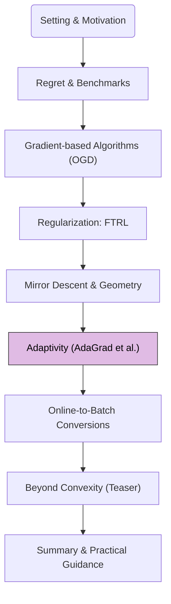

Previous modules covered foundational online algorithms like OGD, FTRL, and OMD, which typically use a pre-set or slowly decaying learning rate, often uniform across all coordinates. We now explore **adaptive algorithms** that tailor learning rates dynamically, often on a per-coordinate basis, by incorporating information from the history of observed gradients.

## 1. Road-map at a Glance

We are currently at **Module 5: Adaptivity (AdaGrad et al.)**.

**Navigational Tip.** This flowchart will appear in each post, with the current module highlighted, to orient you within the crash course.

## 2. Module 5: Adaptivity – Tailoring to Gradient Statistics

### Motivation for Adaptivity

In many real-world problems, especially high-dimensional ones (e.g., natural language processing, recommendation systems), data can be sparse, and different features (coordinates) may have vastly different update frequencies or gradient magnitudes.

*   **Sparse Features:** Some features might appear rarely. We want to make larger updates (higher effective learning rates) for these features when they do appear.
*   **Dense Features:** Frequent features might require smaller learning rates to avoid overshooting.
*   **Varying Curvature:** Different directions in the parameter space might exhibit different curvatures.

Adaptive methods aim to address these challenges by adjusting learning rates for each parameter (coordinate) based on the accumulated history of its gradients.

### AdaGrad: Adaptive Gradient Algorithm

The **Adaptive Gradient (AdaGrad)** algorithm is a prominent example of an adaptive online learning method. It can be derived from the FTRL framework by using a data-dependent regularizer, or from OMD using a time-varying mirror map that incorporates gradient statistics.

<blockquote class="box-proposition" markdown="1">

**Algorithm.** AdaGrad (Diagonal Version)

**Initialization:**
*   A global learning rate $$\eta > 0$$.
*   A small constant $$\epsilon > 0$$ for numerical stability (e.g., $$10^{-8}$$).
*   Initialize $$G_0 = \mathbf{0} \in \mathbb{R}^d$$ (a diagonal matrix, or a vector to store diagonal elements). Equivalently, initialize an accumulator for squared gradients $$H_0 = \mathbf{0} \in \mathbb{R}^d$$.
*   Select an initial action $$x_1 \in \mathcal{X}$$.

**For each round** $$t = 1, 2, \dots, T$$:
1.  **Play** the action $$x_t$$.
2.  **Observe** the loss function $$\ell_t(\cdot)$$ and compute the gradient $$g_t = \nabla \ell_t(x_t)$$.
3.  **Update accumulators for squared gradients** (per-coordinate):
    For each coordinate $$j = 1, \dots, d$$:

    $$
    H_{t,j} = H_{t-1,j} + g_{t,j}^2
    $$

    where $$g_{t,j}$$ is the $$j$$-th component of $$g_t$$.
    Let $$H_t = \text{diag}(H_{t,1}, \dots, H_{t,d})$$.
4.  **Update action** (per-coordinate, followed by projection if needed):
    For each coordinate $$j = 1, \dots, d$$:

    $$
    x_{t+1, j} = x_{t,j} - \frac{\eta}{\sqrt{H_{t,j}} + \epsilon} g_{t,j}
    $$

    Then, project $$x_{t+1}$$ onto $$\mathcal{X}$$: $$x_{t+1} = \Pi_{\mathcal{X}}(x_{t+1})$$.

    Alternatively, as an FTRL step with a specific regularizer:

    $$
    x_{t+1} = \arg\min_{x \in \mathcal{X}} \left( \sum_{s=1}^t \langle g_s, x \rangle + \frac{1}{\eta} \sum_{j=1}^d \sqrt{H_{t,j}} x_j^2 \right)
    $$

    Or, as an OMD step (often called AdaGrad-Diagonal):

    $$
    x_{t+1} = \arg\min_{x \in \mathcal{X}} \left( \langle g_t, x \rangle + \frac{1}{2\eta} \sum_{j=1}^d (\sqrt{H_{t-1,j}} + \epsilon) (x_j - x_{t,j})^2 \right)
    $$

    The most common update rule seen in practice is the first one, resembling a per-coordinate scaled OGD update.
</blockquote>

**Key Idea of AdaGrad:**
The effective learning rate for coordinate $$j$$ is $$\frac{\eta}{\sqrt{H_{t,j}} + \epsilon}$$.
*   If a coordinate $$j$$ has experienced large gradients in the past (large $$H_{t,j}$$), its learning rate will be small.
*   If a coordinate $$j$$ has experienced small gradients (infrequent or small magnitude), its learning rate will be relatively larger.
This mechanism allows AdaGrad to "adapt" to the data characteristics.

**Regret Bound for AdaGrad:**
AdaGrad enjoys strong regret bounds, particularly for sparse data.
For convex losses, AdaGrad's regret is typically bounded by:

$$
R_T \le \frac{1}{2\eta} \sum_{j=1}^d \sqrt{\sum_{t=1}^T g_{t,j}^2} \cdot D_{j,\max}^2 + \eta \sum_{t=1}^T \sum_{j=1}^d \frac{g_{t,j}^2}{\sqrt{\sum_{s=1}^t g_{s,j}^2}}
$$

This can be simplified under certain assumptions on $$D_{j,\max}$$ (max range of $$x_j^\ast $$) and $$G_{j,\max}$$ (max value of $$g_{t,j}$$) to forms like:

$$
R_T = O\left( D_{\infty} \sum_{j=1}^d G_{j,\infty} \right) \text{ or more commonly } O\left( D_{\infty} \sqrt{\sum_{t=1}^T \sum_{j=1}^d g_{t,j}^2} \right)
$$

If $$\Vert g_t \Vert_\infty \le G_\infty$$ and $$\Vert x^\ast  \Vert_1 \le D_1$$, a common bound is $$O(D_1 G_\infty \sqrt{d T})$$.
A key result for AdaGrad is its $$O(\sqrt{T})$$ bound that scales with $$\sum_{j=1}^d (\sum_{t=1}^T g_{t,j}^2)^{1/2}$$ rather than $$T \sum_j G_j^2$$, which can be much better if many gradients are sparse. It achieves a regret of roughly $$O(\max_j \Vert x_j^\ast  \Vert_\infty \sum_{j=1}^d \sqrt{\sum_{t=1}^T g_{t,j}^2})$$.
When gradients are sparse, such that $$\sum_{t=1}^T \Vert g_t \Vert_1$$ is small, AdaGrad can achieve better bounds than standard OGD.
A typical bound is $$R_T = O(D \sqrt{\sum_{t=1}^T \Vert g_t \Vert_H^2})$$ where $$\Vert \cdot \Vert_H$$ is a Mahalanobis norm induced by $$H_t$$. The main result is often stated as $$R_T \le D_{\infty} \sum_{j=1}^d \sqrt{\sum_{t=1}^T g_{t,j}^2}$$, which can be at most $$D_{\infty} G_{\max} \sqrt{d T}$$.

<blockquote class="box-theorem" markdown="1">

**Theorem.** AdaGrad Regret Bound (Simplified)

Let $$\Vert x \Vert_\infty \le D_\infty$$ for all $$x \in \mathcal{X}$$. The regret of AdaGrad (diagonal version with appropriate $$\eta$$) is bounded by:

$$
R_T \le 2 D_\infty \sum_{j=1}^d \sqrt{\sum_{t=1}^T g_{t,j}^2}
$$

This bound is notable because it can be significantly better than $$O(\sqrt{T})$$ bounds of OGD if many features are sparse (i.e., many $$g_{t,j}$$ are zero). In the worst case, if all $$g_{t,j}$$ are non-zero and roughly equal, it can be $$O(D_\infty G \sqrt{dT})$$.
</blockquote>

**Drawback of AdaGrad:** The learning rates in AdaGrad are monotonically decreasing because $$H_{t,j}$$ always increases. This can cause the learning rates to become excessively small, prematurely stopping learning, especially in non-convex optimization (though this course focuses on convex).

### Extensions and Other Adaptive Methods

AdaGrad paved the way for several other adaptive algorithms that try to address its limitations, primarily the aggressively decaying learning rate.

1.  **RMSProp (Root Mean Square Propagation):**
    *   Maintains an exponentially decaying moving average of squared gradients instead of summing all past squared gradients.
    *   Update for $$H_{t,j}$$: $$H_{t,j} = \beta H_{t-1,j} + (1-\beta) g_{t,j}^2$$, where $$\beta$$ is a decay rate (e.g., 0.9).
    *   This prevents the learning rates from shrinking too fast. Not typically analyzed in the online adversarial setting but very popular in deep learning.

2.  **AdaDelta:**
    *   Similar to RMSProp but also maintains an exponentially decaying moving average of squared *parameter updates* in the numerator of the learning rate.
    *   Aims to be less sensitive to the global learning rate $$\eta$$.

3.  **Adam (Adaptive Moment Estimation):**
    *   Combines the ideas of adaptive learning rates (like RMSProp) with momentum (maintaining moving averages of both first and second moments of gradients).
    *   $$m_t = \beta_1 m_{t-1} + (1-\beta_1) g_t$$ (first moment)
    *   $$v_t = \beta_2 v_{t-1} + (1-\beta_2) g_t^2$$ (second moment, component-wise)
    *   Update uses bias-corrected $$m_t$$ and $$v_t$$.
    *   Adam is extremely popular for training deep neural networks. We will revisit it in the main "Mathematical Optimization Theory in ML" series, particularly its FTRL and Information Geometry interpretations.

4.  **Online Newton Step (ONS):**
    *   A more aggressive adaptive method that attempts to incorporate second-order (Hessian) information.
    *   Can be viewed as FTRL with a regularizer $$R_t(x) = \frac{1}{2} x^T A_t x$$, where $$A_t \approx \sum_{s=1}^t g_s g_s^T$$ (an approximation to the Hessian).
    *   Update: $$x_{t+1} = \arg\min_{x \in \mathcal{X}} \left( \langle g_t, x \rangle + \frac{1}{2\eta} (x-x_t)^T A_{t-1} (x-x_t) \right)$$ (simplified, often involves inverting $$A_t$$).
    *   Achieves $$O(\log T)$$ regret for exp-concave losses (a stronger condition than convexity). Computationally more expensive due to matrix operations.

### Parameter-Free Ideas (Brief Mention)

A related line of research aims for "parameter-free" online algorithms that require minimal or no learning rate tuning. These often involve different theoretical frameworks, such as:
*   **Coin-betting algorithms:** Frame online learning as a betting game, relating wealth accumulation to regret minimization.
*   Specialized OGD variants that adapt $$\eta$$ using only properties of the observed losses and gradients, without needing prior knowledge of parameters like $$G$$ or $$D$$.

These are generally more advanced but highlight the ongoing effort to make online algorithms more robust and easier to use.

### Summary of Adaptive Properties

| Feature                 | AdaGrad                                          | RMSProp / AdaDelta / Adam                    | ONS                                      |
| ----------------------- | ------------------------------------------------ | -------------------------------------------- | ---------------------------------------- |
| **Adaptivity**          | Per-coordinate learning rates                    | Per-coordinate, decaying avg. of sq. grads   | Full matrix preconditioning              |
| **Learning Rate Decay** | Monotonically decreasing (can be too aggressive) | Decaying average (less aggressive)           | Based on Hessian approximation           |
| **Theoretical Setting** | Strong guarantees in OCO (esp. sparse)           | Primarily heuristic in DL, some OCO analysis | Strong guarantees for exp-concave losses |
| **Computational Cost**  | Low (vector operations)                          | Low (vector operations)                      | High (matrix inverse/operations)         |

Adaptive methods, particularly AdaGrad and its successors like Adam, have significantly impacted practical machine learning by automating parts of the learning rate tuning process and handling diverse data characteristics effectively.

---

Having explored how to adapt learning algorithms online, we next consider how these online learning techniques and their regret guarantees can be translated into the more traditional batch or stochastic learning settings.

**Next Up:** Module 6: Online-to-Batch Conversions
