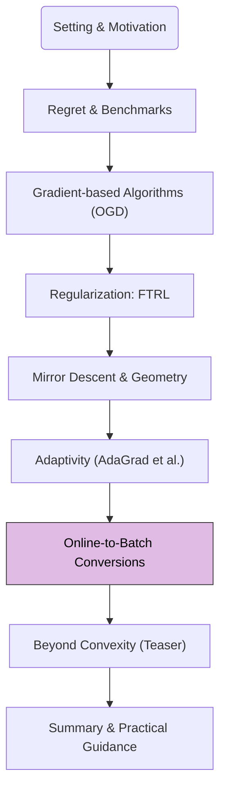

Thus far, our journey through online learning has focused on sequential decision-making against an arbitrary (potentially adversarial) sequence of loss functions, with regret as our primary performance measure. A natural question arises: how do these concepts and algorithms relate to the more traditional settings of batch learning or stochastic optimization, where we typically aim to minimize an expected loss over a data distribution? This module explores **online-to-batch conversions**.

## 1. Road-map at a Glance

We are currently at **Module 6: Online-to-Batch Conversions**.

**Navigational Tip.** This flowchart will appear in each post, with the current module highlighted, to orient you within the crash course.

## 2. Module 6: Online-to-Batch Conversions & Generalization

### The Stochastic Setting

In typical supervised machine learning, we assume data samples $$z_1, z_2, \dots, z_T$$ are drawn independently and identically distributed (i.i.d.) from an unknown underlying data distribution $$\mathcal{D}$$. For each sample $$z_t = (\text{feature}_t, \text{label}_t)$$, we associate a loss function $$\ell(x; z_t)$$ that measures how well a model parameterized by $$x$$ performs on sample $$z_t$$. The goal is to find an $$x$$ that minimizes the **expected risk** (or generalization error):

$$
L(x) = \mathbb{E}_{z \sim \mathcal{D}}[\ell(x; z)]
$$

Since $$\mathcal{D}$$ is unknown, we minimize the **empirical risk** on the observed samples as a proxy:

$$
\hat{L}_T(x) = \frac{1}{T} \sum_{t=1}^T \ell(x; z_t)
$$

### Online Learning in the Stochastic Setting

We can cast the stochastic optimization problem into an online learning framework. At each round $$t$$:
1.  A sample $$z_t \sim \mathcal{D}$$ is drawn.
2.  The online learner chooses an action $$x_t \in \mathcal{X}$$.
3.  The loss function is revealed as $$\ell_t(x) = \ell(x; z_t)$$.
4.  The learner incurs loss $$\ell_t(x_t) = \ell(x_t; z_t)$$.

In this stochastic i.i.d. setting, an online learning algorithm like Online Gradient Descent (OGD), when applied to the sequence of losses $$\ell(x; z_t)$$, becomes equivalent to **Stochastic Gradient Descent (SGD)**:

$$
x_{t+1} = \Pi_{\mathcal{X}}(x_t - \eta_t \nabla_x \ell(x_t; z_t))
$$

### From Regret to Generalization Error

A remarkable connection exists: low-regret online learning algorithms can be converted into batch algorithms with good generalization performance (i.e., low expected risk $$L(x)$$). The key idea is that if an algorithm performs well against the best fixed action in hindsight *on average over the sequence*, it should also perform well on *future unseen data* drawn from the same distribution.

**The Conversion:**
A common way to convert an online algorithm's sequence of iterates $$\{x_t\}_{t=1}^T$$ into a single predictor for batch/stochastic settings is by **averaging**:

*   **Average Iterate:** $$\bar{x}_T = \frac{1}{T} \sum_{t=1}^T x_t$$
*   **Last Iterate:** $$x_T$$ (sometimes used, especially with diminishing step sizes)
*   **Weighted Average:** $$\bar{x}_T^{\text{weighted}} = \sum_{t=1}^T w_t x_t$$ for some weights $$w_t$$

The average iterate $$\bar{x}_T$$ often exhibits better stability and generalization properties.

<blockquote class="box-theorem" markdown="1">

**Theorem.** Online-to-Batch Conversion (Simplified)

Let an online learning algorithm generate a sequence of iterates $$\{x_t\}_{t=1}^T$$ when run on loss functions $$\ell_t(x) = \ell(x; z_t)$$, where $$z_t \sim \mathcal{D}$$ are i.i.d. samples. Assume the loss functions $$\ell(\cdot; z)$$ are convex in their first argument.
Let $$R_T$$ be the static regret of the online algorithm against the best fixed predictor $$x^\ast  = \arg\min_{x \in \mathcal{X}} \sum_{s=1}^T \ell(x; z_s)$$.
Then, the expected excess risk of the average predictor $$\bar{x}_T = \frac{1}{T}\sum_{t=1}^T x_t$$ compared to the true risk minimizer $$x^{opt} = \arg\min_{x \in \mathcal{X}} L(x)$$ can be bounded in terms of the expected regret:

$$
\mathbb{E}[L(\bar{x}_T)] - L(x^{opt}) \le \frac{\mathbb{E}[R_T]}{T}
$$

The expectation $$\mathbb{E}[\cdot]$$ is over the random draws of $$z_1, \dots, z_T$$.
</blockquote>

**Intuition:**
1.  By convexity (using Jensen's inequality): $$L(\bar{x}_T) = L\left(\frac{1}{T}\sum x_t\right) \le \frac{1}{T}\sum L(x_t)$$.
2.  Taking expectation: $$\mathbb{E}[L(\bar{x}_T)] \le \frac{1}{T}\sum \mathbb{E}[L(x_t)]$$. Since $$z_t$$ are i.i.d. and $$x_t$$ only depends on $$z_1, \dots, z_{t-1}$$, then $$\mathbb{E}[L(x_t)] = \mathbb{E}[\ell(x_t; z_t)] = \mathbb{E}[\ell_t(x_t)]$$.
3.  So, $$\mathbb{E}[L(\bar{x}_T)] \le \frac{1}{T}\sum \mathbb{E}[\ell_t(x_t)] = \frac{1}{T} \mathbb{E}\left[\sum \ell_t(x_t)\right]$$.
4.  The regret definition is $$R_T = \sum \ell_t(x_t) - \sum \ell_t(x^\ast )$$.
   Thus, $$\sum \ell_t(x_t) = R_T + \sum \ell_t(x^\ast )$$.
5.  $$\mathbb{E}[L(\bar{x}_T)] \le \frac{1}{T} \mathbb{E}[R_T + \sum \ell_t(x^\ast )] = \frac{\mathbb{E}[R_T]}{T} + \mathbb{E}\left[\frac{1}{T}\sum \ell_t(x^\ast )\right]$$.
6.  The term $$\mathbb{E}\left[\frac{1}{T}\sum \ell_t(x^\ast )\right]$$ is $$\mathbb{E}[\hat{L}_T(x^\ast )]$$. We want to relate this to $$L(x^{opt})$$.
   Typically, the bound is shown for $$\mathbb{E}[L(\bar{x}_T)] - \min_{x \in \mathcal{X}} L(x)$$.
   The standard argument connects $$\frac{1}{T}\sum \ell_t(x_t)$$ to $$\frac{1}{T}\min_x \sum \ell_t(x)$$ via regret, and then relates the empirical average loss of the best fixed $$x$$ to its true expected loss.

A more direct form of the bound is often stated as:

$$
\mathbb{E}[L(\bar{x}_T)] - \min_{x \in \mathcal{X}} L(x) \le \frac{\mathbb{E}[R_T(\text{against } x)]}{T}
$$

where the regret is measured against any fixed comparator $$x \in \mathcal{X}$$.

**Proof Sketch for Online-to-Batch Conversion.**

Consider any fixed $$u \in \mathcal{X}$$.
The regret definition gives: $$\sum_{t=1}^T \ell_t(x_t) - \sum_{t=1}^T \ell_t(u) \le R_T(u)$$.
Taking expectation over the data $$z_1, \dots, z_T$$:

$$
\mathbb{E}\left[\sum_{t=1}^T \ell_t(x_t)\right] - \mathbb{E}\left[\sum_{t=1}^T \ell_t(u)\right] \le \mathbb{E}[R_T(u)]
$$

Since $$\ell_t(x) = \ell(x; z_t)$$ and $$z_t$$ are i.i.d., $$\mathbb{E}[\ell_t(u)] = L(u)$$.
So, $$\mathbb{E}\left[\sum_{t=1}^T \ell_t(x_t)\right] - T \cdot L(u) \le \mathbb{E}[R_T(u)]$$.
Dividing by $$T$$:

$$
\frac{1}{T} \mathbb{E}\left[\sum_{t=1}^T \ell_t(x_t)\right] - L(u) \le \frac{\mathbb{E}[R_T(u)]}{T}
$$

By convexity of $$L(\cdot)$$ (which follows from convexity of $$\ell(\cdot; z)$$) and Jensen's inequality:

$$
L(\bar{x}_T) = L\left(\frac{1}{T}\sum_{t=1}^T x_t\right) \le \frac{1}{T}\sum_{t=1}^T L(x_t)
$$

Taking expectation:

$$
\mathbb{E}[L(\bar{x}_T)] \le \frac{1}{T}\sum_{t=1}^T \mathbb{E}[L(x_t)]
$$

Since $$x_t$$ is determined by $$z_1, \dots, z_{t-1}$$, and $$z_t$$ is independent of past data, $$\mathbb{E}[L(x_t)] = \mathbb{E}[\ell(x_t; z_t)] = \mathbb{E}[\ell_t(x_t)]$$. (This step uses the fact that $$L(x_t) = \mathbb{E}_{z \sim \mathcal{D}}[\ell(x_t; z)]$$ where the expectation is over a new draw $$z$$ independent of how $$x_t$$ was formed).
So,

$$
\mathbb{E}[L(\bar{x}_T)] \le \frac{1}{T}\sum_{t=1}^T \mathbb{E}[\ell_t(x_t)] = \frac{1}{T} \mathbb{E}\left[\sum_{t=1}^T \ell_t(x_t)\right]
$$

Combining these, if we choose $$u = x^{opt} = \arg\min_{x \in \mathcal{X}} L(x)$$:

$$
\mathbb{E}[L(\bar{x}_T)] - L(x^{opt}) \le \frac{\mathbb{E}[R_T(x^{opt})]}{T}
$$

This means if an online algorithm has sublinear regret (e.g., $$R_T = O(\sqrt{T})$$), then the average predictor $$\bar{x}_T$$ has an expected excess risk of $$O(\sqrt{T}/T) = O(1/\sqrt{T})$$. This is a standard convergence rate for stochastic convex optimization.

**Implications:**
*   Algorithms like OGD, FTRL, OMD, and AdaGrad, which achieve $$O(\sqrt{T})$$ or $$O(\log T)$$ regret in the online adversarial setting, can be directly applied to i.i.d. data. The resulting average iterate $$\bar{x}_T$$ will then converge to the optimal expected risk at rates like $$O(1/\sqrt{T})$$ or $$O(\log T / T)$$.
*   This provides a powerful theoretical tool: design and analyze algorithms in the more general (and often harder) online adversarial setting, and then transfer these guarantees to the stochastic i.i.d. setting, which is common in machine learning.

### Example: OGD to SGD

*   **Online Setting (OGD):** On a sequence of convex losses $$\ell_t$$, OGD with $$\eta_t = \eta/\sqrt{t}$$ achieves $$R_T = O(\sqrt{T})$$.
*   **Stochastic Setting (SGD):** If $$\ell_t(x) = \ell(x; z_t)$$ where $$z_t \sim \mathcal{D}$$, then OGD is SGD.
*   **Conversion:** The average iterate $$\bar{x}_T = \frac{1}{T}\sum x_t$$ (or a suffix average) will have expected excess risk
    $$\mathbb{E}[L(\bar{x}_T)] - L(x^{opt}) = O(\mathbb{E}[R_T]/T) = O(\sqrt{T}/T) = O(1/\sqrt{T})$$.
    This matches the known convergence rate for SGD for general convex functions.

If the loss functions are $$\sigma$$-strongly convex, OGD can achieve $$R_T = O(\log T)$$ with $$\eta_t = 1/(\sigma t)$$. The online-to-batch conversion then implies an expected excess risk of $$O(\log T / T)$$ for SGD on strongly convex problems, which is also a standard result.

### Summary

The online-to-batch conversion provides a bridge:
1.  **Algorithm Design:** Develop algorithms in the online setting.
2.  **Regret Analysis:** Prove regret bounds (e.g., $$R_T$$).
3.  **Transfer to Stochastic Setting:** If losses are i.i.d., the same algorithm (now typically called SGD or a variant) can be used.
4.  **Generalization Guarantee:** The average iterate $$\bar{x}_T$$ has expected excess risk bounded by $$\mathbb{E}[R_T]/T$$.

This connection underscores the theoretical importance of online learning beyond scenarios with truly sequential or adversarial data. It provides fundamental insights into the behavior of iterative optimization algorithms in standard machine learning contexts.

---

While most of our discussion has centered on convex problems, online learning also extends to non-convex settings, albeit with different challenges and goals. We will briefly touch upon this in the next teaser module.

**Next Up:** Module 7: Beyond Convexity (Teaser)
