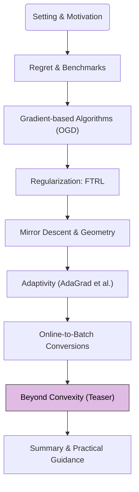

The majority of this crash course has centered on Online Convex Optimization (OCO), where convexity of the decision set and loss functions enables powerful regret guarantees. However, the principles of online learning extend to more challenging scenarios, including those with non-convex losses and limited feedback. This module provides a brief teaser into these advanced areas.

## 1. Road-map at a Glance

We are currently at **Module 7: Beyond Convexity (Teaser)**.

**Navigational Tip.** This flowchart will appear in each post, with the current module highlighted, to orient you within the crash course.

## 2. Module 7: Beyond Convexity (Teaser)

This module serves as a high-level pointer to topics beyond the scope of this introductory crash course. The aim is to illustrate the breadth of the online learning field, not to provide detailed explanations.

### Online Learning with Bandit Feedback

In our discussions so far (full-information setting), the learner observes the entire loss function $$\ell_t(\cdot)$$ or at least its gradient $$\nabla \ell_t(x_t)$$ after playing $$x_t$$. A more challenging scenario arises when the feedback is much more limited.

**Bandit Feedback (or Partial Information Setting):**
*   After playing $$x_t$$, the learner only observes the loss value $$\ell_t(x_t)$$.
*   The learner does not directly see the entire loss function or its gradient.
*   This setting is named after the "multi-armed bandit" problem, where a gambler must choose which slot machine (arm) to play to maximize reward, only observing the outcome of the chosen arm.

**Key Challenges and Approaches:**
*   **Exploration vs. Exploitation:** The learner must balance exploring new actions to discover their potential (even if currently suboptimal) with exploiting actions known to be good.
*   **Gradient Estimation:** Since gradients are not directly observed, algorithms often need to estimate them, e.g., by perturbing actions or using techniques from zeroth-order optimization.
*   **Types of Bandit Problems:**
    *   **Multi-Armed Bandits (MAB):** Decision set $$\mathcal{X}$$ is finite (e.g., choosing one of $$K$$ arms). Algorithms like UCB (Upper Confidence Bound) and Thompson Sampling are common for stochastic MABs, while Exp3 (Exponential-weights for Exploration and Exploitation) is used for adversarial MABs.
    *   **Contextual Bandits:** The learner also observes a context (features) before choosing an action, and the loss depends on both the action and the context. This blends MAB with supervised learning.
    *   **Linear/Convex Bandits:** The unknown reward/loss function is assumed to be linear or convex in the action $$x_t$$, and $$\mathcal{X}$$ can be continuous.

Regret in bandit settings is typically higher than in the full-information setting due to the cost of exploration. For example, in adversarial linear bandits, regret might be $$O(d\sqrt{T})$$ or $$O(\sqrt{dT \log T})$$, where $$d$$ is the dimension.

### Online Non-Convex Optimization

Modern machine learning, particularly deep learning, often involves optimizing highly non-convex loss functions. Extending online learning guarantees to such settings is an active area of research.

**Challenges with Non-Convexity:**
*   **Multiple Local Minima:** Gradient-based methods may converge to suboptimal local minima or saddle points.
*   **Defining "Optimal":** The notion of a single best fixed action $$x^\ast $$ may be less meaningful if many good local minima exist. The global minimum might be computationally intractable to find.
*   **Regret Benchmarks:** Static regret against the global minimizer can be too strong. Alternative benchmarks include:
    *   Regret against the best local minimum found.
    *   Regret against any point satisfying first-order or second-order stationarity conditions ($$\nabla L(x) \approx 0$$).
    *   "No-regret" guarantees for finding stationary points.

**Approaches:**
*   Algorithms like OGD (or SGD in the stochastic setting) are still widely used. While they may not find the global optimum, they can often find "good enough" solutions in practice for deep learning.
*   Theoretical analysis often focuses on convergence to stationary points or characterizing the landscape of non-convex functions that allow for efficient optimization (e.g., Polyak-Łojasiewicz condition, gradient dominance).
*   Some FTRL and OMD variants can be analyzed for non-convex losses, though typically yielding weaker guarantees (e.g., bounds on the expected squared gradient norm).

### Connections to Reinforcement Learning (RL)

Online learning principles are foundational to many areas of Reinforcement Learning.
*   **Sequential Decisions:** RL agents make sequences of actions in an environment.
*   **Delayed Feedback:** Rewards/losses might be delayed and sparse.
*   **State Dependence:** The environment's response (and future states) depends on the agent's actions. This introduces complexities beyond the standard online learning protocol where loss functions $$\ell_t$$ might not depend on past actions $$x_1, \dots, x_{t-1}$$ in such a structured way (though adversarial $$\ell_t$$ can).
*   Policy gradient methods, Q-learning, and actor-critic algorithms in RL often employ iterative updates and exploration strategies reminiscent of online learning and bandit algorithms.

---

This brief overview is merely a glimpse into the vast landscape beyond Online Convex Optimization with full information. These areas are rich with their own specialized algorithms, theoretical tools, and applications. Understanding the core OCO principles from this crash course provides a solid foundation for venturing into these more advanced topics.

**Next Up:** Module 8: Summary & Practical Guidance
