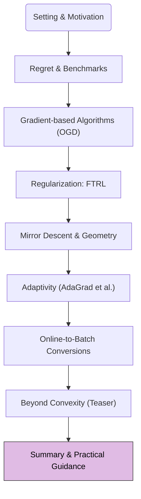

We have reached the concluding module of our Online Learning Crash Course. Over the past modules, we've journeyed from the basic online learning protocol to advanced adaptive algorithms and their connections to stochastic optimization. This final module aims to consolidate this knowledge, offer practical guidance, and prompt reflection.

## 1. Road-map at a Glance

We are at the final module: **Module 8: Summary & Practical Guidance**.

## 2. Module 8: Summary, Practical Guidance & Reflection

### Overall Recap: The Online Learning Journey

Let's briefly revisit the core concepts we've covered:

1.  **Setting & Motivation (Module 0):** Introduced online learning as a sequential decision-making process, vital for streaming data, resource-constrained environments, and as a theoretical tool. Defined the online learning protocol.
2.  **Regret & Benchmarks (Module 1):** Established (static) regret as the primary performance metric, aiming for sublinear regret ($$R_T = o(T)$$) against the best fixed action in hindsight.
3.  **Online Gradient Descent (OGD) (Module 2):** Detailed the foundational OGD algorithm, its update rule $$x_{t+1} = \Pi_{\mathcal{X}}(x_t - \eta_t g_t)$$, and its $$O(\sqrt{T})$$ regret for convex losses.
4.  **FTL & FTRL (Module 3):** Explored the intuitive but flawed Follow-The-Leader (FTL) and introduced Follow-The-Regularized-Leader (FTRL) $$x_{t+1} = \arg\min_{x \in \mathcal{X}} (\sum \langle g_s, x \rangle + \frac{1}{\eta}R(x))$$ as a stabilizing and unifying framework.
5.  **Mirror Descent & Geometry (Module 4):** Generalized OGD using mirror maps ($$\psi$$) and Bregman divergences ($$D_\psi$$) via Online Mirror Descent (OMD): $$x_{t+1} = \arg\min_{x \in \mathcal{X}} (\eta_t \langle g_t, x \rangle + D_\psi(x, x_t))$$, adapting to non-Euclidean problem geometries.
6.  **Adaptivity (AdaGrad et al.) (Module 5):** Introduced adaptive algorithms like AdaGrad that tailor learning rates per-coordinate based on gradient history, e.g., scaling by $$1/\sqrt{\sum g_{s,j}^2}$$.
7.  **Online-to-Batch Conversions (Module 6):** Showed how low-regret online algorithms translate to good generalization in stochastic i.i.d. settings, with $$\mathbb{E}[L(\bar{x}_T)] - L(x^{opt}) \le \mathbb{E}[R_T]/T$$.
8.  **Beyond Convexity (Teaser) (Module 7):** Briefly touched upon bandit feedback and online non-convex optimization as more advanced frontiers.

### Key Takeaways

*   **Online learning is a powerful paradigm** for sequential decision-making under uncertainty, with wide applicability.
*   **Regret minimization** is the central goal, providing a robust measure of performance against strong benchmarks.
*   **FTRL and OMD are unifying frameworks** that encompass many specific algorithms (including OGD) by varying regularizers/mirror maps. These frameworks allow for principled incorporation of problem structure and geometry.
*   **Adaptive methods** (like AdaGrad) can significantly improve performance by tailoring updates to data characteristics, especially for sparse, high-dimensional data.
*   **Online learning theory provides fundamental insights** into stochastic optimization (e.g., SGD), linking regret bounds to generalization error.

### Practical Guidance & Algorithm Selection (Cheat-Sheet Distilled)

Choosing an online learning algorithm depends on problem characteristics:

| Scenario / Algorithm          | Key Characteristics & When to Consider                                                                                              | Typical Regret (Convex)                                                  | Notes                                                              |
| ----------------------------- | ----------------------------------------------------------------------------------------------------------------------------------- | ------------------------------------------------------------------------ | ------------------------------------------------------------------ |
| **General OCO / OGD**         | Default choice for general convex problems. Simple to implement. Requires learning rate tuning ($$\eta_t$$).                        | $$O(\sqrt{T})$$                                                          | Good baseline. Performance sensitive to $$\eta_t$$.                |
| **FTRL (general)**            | Provides flexibility via choice of regularizer $$R(x)$$. Useful if specific problem structure suggests a non-Euclidean regularizer. | Varies with $$R(x)$$                                                     | Can be computationally intensive if $$\arg\min$$ is hard.          |
| **OMD (e.g., with KL)**       | Problem naturally fits a non-Euclidean geometry (e.g., decision set is probability simplex).                                        | $$O(\sqrt{T})$$ (tuned)                                                  | Exponentiated Gradient for simplex often uses KL divergence.       |
| **AdaGrad**                   | High-dimensional, sparse data where features have varying frequencies/scales. Less sensitive to global $$\eta$$ than OGD.           | $$O(\sum_j \sqrt{\sum g_{t,j}^2})$$ (can be better than $$O(\sqrt{T})$$) | Learning rates monotonically decrease; can be too aggressive.      |
| **RMSProp / Adam (variants)** | Commonly used in deep learning (often non-convex). Empirically very effective. Addresses AdaGrad's decaying learning rate.          | (Stochastic setting)                                                     | Less formal regret theory in adversarial online setting for these. |
| **Online Newton Step**        | When second-order information is beneficial and affordable (exp-concave or strongly convex losses where Hessian approx. is useful). | $$O(d \log T)$$                                                          | Computationally expensive (matrix operations).                     |

**General Tips for Learning Rate Tuning (for OGD/OMD):**
*   If problem horizon $$T$$ is known and bounds on diameter $$D$$ and gradient norms $$G$$ are available, $$\eta \propto D/(G\sqrt{T})$$ is theoretically optimal.
*   If $$T$$ is unknown, a decaying schedule like $$\eta_t \propto 1/\sqrt{t}$$ is common.
*   In practice, $$\eta$$ is often tuned via cross-validation on a small dataset if in a stochastic setting, or by monitoring performance if truly online.

### Reflection Prompts

To solidify your understanding, consider these questions:

1.  **Geometric Intuition:** Where did geometric interpretations (e.g., Mirror Descent using Bregman divergences, AdaGrad's adaptive Mahalanobis norm) offer significant conceptual or performance advantages over a purely Euclidean (OGD) view?
2.  **Role of Assumptions:** Which assumptions (e.g., convexity of losses/set, Lipschitz continuity, strong convexity, i.i.d. data for online-to-batch) were critical for the specific regret guarantees or convergence rates of different algorithms? What happens if these are violated?
3.  **Adversarial vs. Stochastic:** How does the "adversarial" perspective in online learning (where loss functions can be chosen by an opponent) influence algorithm design and analysis compared to assuming losses are drawn from a fixed stochastic distribution? Why are adversarial guarantees often more robust?
4.  **FTRL as a Unifier:** How does the Follow-The-Regularized-Leader framework help in understanding the connections between seemingly different algorithms like OGD and AdaGrad? What is the role of the regularizer $$R(x)$$ in this framework?
5.  **Exploration-Exploitation:** Although we focused on full-information, how might the need to balance exploration (gathering information) versus exploitation (using known good actions) change algorithm design, as hinted at in the bandit feedback teaser?

### Connecting Forward: To Mathematical Optimization Theory in ML

This crash course has laid a foundational understanding of online learning. Many concepts introduced here, particularly **FTRL**, **Mirror Descent**, and **adaptive methods**, are not just theoretical curiosities. They form the bedrock for understanding advanced optimization algorithms used in modern machine learning, including:

*   **Adam Optimizer:** Its online learning view via FTRL (specifically, FTRL with adaptive, discounted regularizers) and its information geometry interpretation (approximating natural gradient descent) will be explored in the main "Mathematical Optimization Theory in ML" series.
*   **Metrized Deep Learning / Natural Gradient Methods:** Algorithms like Shampoo, K-FAC, and IsoAdam leverage geometric insights, often related to Fisher information or Hessian approximations, which OMD and Online Newton Step provide a conceptual basis for.
*   **Parameter-Free Optimization:** The quest for optimizers requiring less hyperparameter tuning often draws inspiration from online learning principles.

The tools and perspectives gained here—regret analysis, geometric interpretations, and the FTRL/OMD frameworks—will be invaluable as we delve deeper into the mathematical landscape of optimization in machine learning.

---

Thank you for joining this Online Learning Crash Course! We hope it has equipped you with valuable insights and a solid foundation for further exploration.
