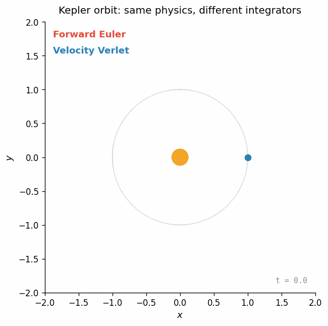
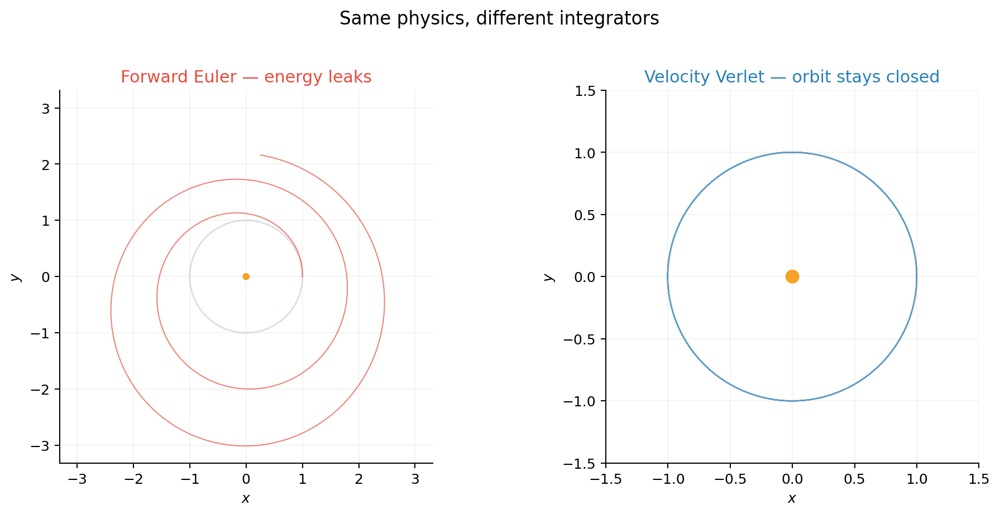
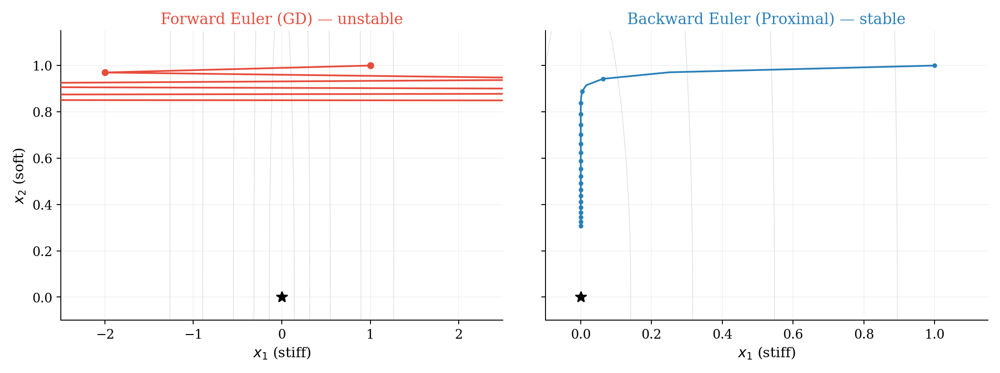
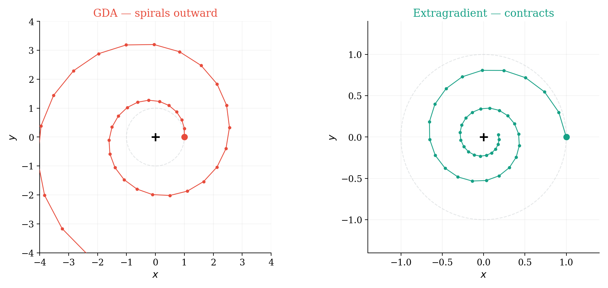
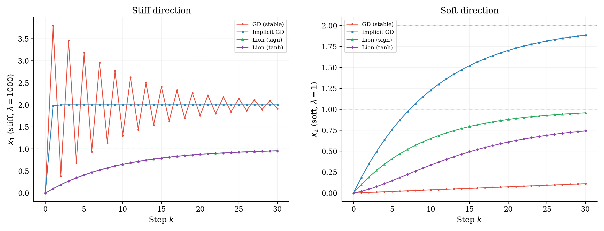
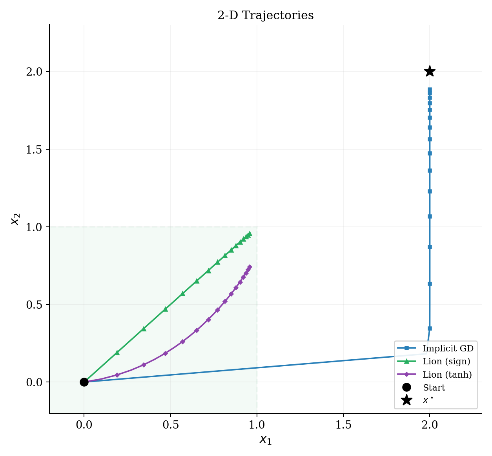

# Gradient-Based Optimization and Differential Equations

> [!info] Overview
> Many phenomena in physics are modeled using differential equations. For computer simulations in game dev physics engines, we use numerical integration methods to solve them. In this setting, **the integrator is not a detail.** You can write the prettiest equations for gravity and springs, but if you step them forward with the wrong numerical method, your simulation explodes, drifts, or leaks energy — especially over long horizons.
>
> This post makes the case that **the same insight is the right lens for understanding gradient-based optimizers.** Every optimizer is a numerical integrator applied to a dynamical system. Gradient descent is forward Euler on gradient flow. Momentum is a multistep method. Lion is an Euler step on a geometry-modified ODE. Each choice has stability properties, and those properties determine what step sizes, what loss landscapes, and what training regimes will actually work.
>
> But there is a critical difference: in physics simulation, you often have access to cheap force evaluations and can afford implicit solves or multiple stages per step. In deep learning, **a single gradient costs one full forward and backward pass**, so the design space for optimizers is heavily constrained. This post explores both the analogy and where it breaks down.

---

## 1. The Simulation Perspective: You Write an ODE, Then You Pick an Integrator

If you have built a particle simulation — a game engine, a cloth sim, a molecular dynamics code — the workflow is familiar:

1. **Write down the physics** as a differential equation.
2. **Pick an integrator** to step it forward in discrete time.
3. **Discover that step 2 matters enormously**: explicit Euler blows up on stiff springs, leaks energy in planetary orbits, and drifts in constrained systems. Better integrators (Verlet, symplectic Euler, implicit methods) fix these problems without changing the physics.

The core lesson is: **the continuous equations can be perfectly well-behaved while the discrete simulation is a disaster, and the fix is choosing a better integrator.** This is exactly the same situation in optimization.

### Euler vs. Verlet on a Kepler orbit

Here is the most classic demonstration: a planet orbiting a star under gravity. The physics is the same in both cases — the only difference is how we step it forward in time.

Forward Euler injects energy on every step — the orbit spirals outward. Velocity Verlet is symplectic: it conserves a modified Hamiltonian, so the orbit stays closed even after many revolutions. **Same physics, different integrator, completely different long-term behavior.**

### The quick math

Newton's law in a potential $U(x)$ (you can intuitively think of $U(x)$ as a "landscape" or "bowl," and the object is pulled downhill by the force $-\nabla U(x)$):

$$
m\ddot{x}(t) = -\nabla U(x(t)).
$$

Introduce velocity $v = \dot{x}$ to get a first-order system:

$$
\dot{x} = v, \qquad \dot{v} = -\frac{1}{m}\nabla U(x).
$$

**Forward Euler** (one evaluation, first order):

$$
v_{k+1} = v_k + h\!\left(-\frac{1}{m}\nabla U(x_k)\right), \qquad
x_{k+1} = x_k + h\,v_k.
$$

**Velocity Verlet** (two evaluations, second order, symplectic):

$$
v_{k+\frac{1}{2}} = v_k + \frac{h}{2}\,a(x_k), \quad
x_{k+1} = x_k + h\,v_{k+\frac{1}{2}}, \quad
v_{k+1} = v_{k+\frac{1}{2}} + \frac{h}{2}\,a(x_{k+1}).
$$

> [!remark] The transferable lesson
> The lesson for optimization is not "use Verlet." It is: **the integrator is not a detail.** It can dominate stability, and stability controls how large a step you can take — which in a training run directly determines convergence speed.

---

## 2. Translation: Gradient Flow and Euler

In optimization you have a loss $f(x)$ you want to minimize. The simplest continuous-time model of "go downhill" is **gradient flow**:

$$
\dot{x}(t) = -\nabla f(x(t)).
$$

This is the optimization analogue of Newton's law: a continuous equation that governs the dynamics. It dissipates energy:

$$
\frac{d}{dt} f(x(t))
= \langle \nabla f(x),\, \dot{x} \rangle
= -\lVert \nabla f(x) \rVert_2^2
\le 0.
$$

> [!definition] Forward Euler
> To solve a differential equation $\dot{x}(t) = F(x(t))$ on a computer, we remove the limit from the definition of the derivative and use a secant approximation:
>
> $$
> \dot{x} \approx \frac{x_{k+1} - x_k}{h} \implies x_{k+1} = x_k + h \cdot F(x_k)
> $$
>
> where $h$ is a small, discrete step size in time.

If we apply **Forward Euler** to gradient flow (substituting $F(x_k) = -\nabla f(x_k)$), we recover exactly the equation for **gradient descent**:

$$
x_{k+1} = x_k - h\,\nabla f(x_k).
$$

Here, the time step $h$ is exactly the **learning rate**.

So "GD is Euler on gradient flow" is literally true. And just like forward Euler on a stiff spring, it can explode if $h$ is too large relative to the curvature of the loss.

---

## 3. Toy 1 — A Stiff Quadratic

> [!example] Example: Why explicit steps explode and implicit steps do not
> Take the 2-D quadratic
>
> $$
> f(x_1, x_2) = \tfrac{1}{2}\!\left(100\,x_1^2 + x_2^2\right),
> \qquad
> \nabla f(x) = \begin{bmatrix} 100\,x_1 \\ x_2 \end{bmatrix}.
> $$
>
> Think of $x_1$ as a stiff spring and $x_2$ as a soft spring — exactly the same setup that causes problems in game physics.

### 3.1 Gradient flow is always stable

$$
\dot{x}_1 = -100\,x_1, \qquad \dot{x}_2 = -x_2
$$

Both directions decay exponentially. The continuous physics is perfectly fine.

### 3.2 Gradient descent (forward Euler) has a hard stability limit

$$
x_{1,k+1} = (1 - 100h)\,x_{1,k}, \qquad
x_{2,k+1} = (1 - h)\,x_{2,k}.
$$

For stability: $|1 - 100h| < 1$, i.e. $h < 0.02$. Pick $h = 0.03$ and start at $(1, 1)$:

- $x_{1,1} = (1 - 3) \cdot 1 = -2$
- $x_{1,2} = (1 - 3) \cdot (-2) = 4$

The stiff direction explodes immediately — **same story as a stiff spring in Euler.**

### 3.3 Backward Euler (implicit) fixes stiffness

$$
x_{k+1} = (I + hH)^{-1} x_k
$$

Stable for **all** $h > 0$. Same step size that exploded under forward Euler now contracts. The optimization version of "implicit integration" is the **proximal point method**.[^prox]

> [!remark] Edge of Stability
> This mismatch — stable ODE, unstable discretization — is exactly the phenomenon studied in the "edge of stability" line of work (Arora, Li, and Panigrahi, ICML 2022[^eos]): the sharpness (largest Hessian eigenvalue) hovers around $2/\eta$ and the loss decreases non-monotonically, behavior not captured by the infinitesimal-step ODE picture.

---

## 4. Why Simulation Methods Don't Transfer Directly to ML

At this point you might ask: if Verlet, implicit methods, and RK4 ([Runge-Kutta 4th order method](https://en.wikipedia.org/wiki/Runge%E2%80%93Kutta_methods), a widely used highly accurate explicit numerical integrator) work so well in physics simulation, why don't we just use them for training neural networks?

The answer comes down to three fundamental differences between simulation and deep learning:

> [!important] The cost bottleneck
> **In simulation**, evaluating the force $\nabla U(x)$ is typically cheap relative to the time step. A molecular dynamics code might compute pairwise interactions in $O(N \log N)$, and then you can afford to call that multiple times per step (RK4 uses 4 evaluations, implicit methods iterate to convergence).
>
> **In deep learning**, a single gradient evaluation $\nabla f(x)$ requires a complete forward and backward pass through the entire network over a batch of data. This is the dominant cost of training. An optimizer that needs 4 gradients per step (like RK4) is 4× more expensive per step — and in practice it rarely converges 4× faster in terms of steps, so you lose.

Beyond cost, there are deeper issues:

1. **No cheap Hessian.** Implicit methods like backward Euler require solving $(I + hH)^{-1}$, which requires access to the Hessian $H = \nabla^2 f$. For a model with $d$ parameters, the Hessian is $d \times d$. For a 1B-parameter model, that is a $10^9 \times 10^9$ matrix — it does not fit in memory and you cannot even form it, let alone invert it. In simulation, the "stiffness matrix" is typically sparse and structured (e.g., tridiagonal for 1-D springs).

2. **Stochastic gradients.** In simulation, forces are deterministic: $\nabla U(x)$ is the exact gradient. In ML, you compute $\nabla f(x)$ on a random minibatch, so you get a noisy estimate. Higher-order methods that assume exact gradients can amplify this noise (RK4 averages four noisy evaluations, but the noise doesn't cancel like it would for deterministic errors). This pushes you toward simpler methods that are robust to gradient noise.

3. **Non-convex landscape.** Simulation potentials are often well-structured (harmonic, Lennard-Jones, etc.). Neural network loss landscapes are highly non-convex with saddle points, flat regions, and sharp features at many scales. The smoothness assumptions that justify higher-order accuracy guarantees rarely hold.

> [!info] Different objectives
> In physics simulation, the goal is to accurately model the entire continuous trajectory over time (we care about all intermediate states). In optimization, the only goal is to find the minimum—we don't actually care about the path taken. The theoretical benefit of more precise integration in ML is that it allows us to take much more aggressive step sizes. If the gain in a reduced step count outweighs the computational overhead of calculating more precise gradients per step, then we get faster, better training. But if it doesn't, the extra precision is wasted compute.

> [!tip] What does transfer
> The simulation perspective is still valuable — but the ideas that transfer are **structural**, not method-specific:
> - **Stability analysis** tells you why learning rates blow up on sharp features (same as stiff springs).
> - **Symplectic structure** explains why momentum methods conserve something (same as Verlet conserving energy).
> - **Implicit treatment** motivates proximal methods and adaptive preconditioning (diagonal approximations to $(I + hH)^{-1}$, which is essentially what Adam does).
> - **Geometry changes** (choosing a non-Euclidean norm) give you sign descent, Lion, Muon — cheap alternatives to full implicit solves.
>
> The winning strategy in ML is: take the **structural insight** from simulation, but implement it with methods that only need **one gradient per step** and **no second-order information**.

---

## 5. Momentum: A Multistep Method in Disguise

In simulation terms, momentum is like switching from a single-step integrator to a **multistep** one that uses history. Two interpretations:

1. **Inertial dynamics.** Optimization as a damped second-order system:

   $$
\ddot{x} + \gamma\,\dot{x} + \nabla f(x) = 0
$$

   — a damped harmonic oscillator with the loss as potential.

2. **Multistep integration.** The heavy-ball update

   $$
x_{k+1} = x_k - \eta\,\nabla f(x_k) + \beta\,(x_k - x_{k-1})
$$

   is a 2-step method on gradient flow. Scieur et al. show that many accelerated methods are multistep integration schemes, with acceleration arising from larger stable step sizes.[^scieur]

The continuous-time limit of Nesterov acceleration is a damped ODE with time-varying friction $3/t$ (Su, Boyd, Candès[^su]). The Bregman Lagrangian framework[^wibisono] generates a large class of accelerated methods in continuous time. And Shi et al.[^shi] show that acceleration depends on using a **symplectic** discretization — exactly the kind of integrator choice that game engine engineers already know matters.

> [!tip] Practical takeaway
> Momentum gives you "more than Euler" while still using **one gradient per step** — it reuses history, just like a multistep integrator.

---

## 6. Toy 2 — A Minmax Game and Why "Optimism" Helps

In game dev, coupled oscillators that should orbit each other spiral apart under forward Euler — energy leaks into the system. The same thing happens when the vector field is rotational.

> [!example] Rotation in a bilinear saddle
> $$
> \min_x \max_y \; f(x, y) = xy.
> $$
>
> Gradients: $\nabla_x f = y$, $\nabla_y f = x$. The continuous dynamics is pure rotation.

**GDA** spirals outward — eigenvalue magnitude $\sqrt{1 + \eta^2} > 1$. It is injecting energy, just like Euler on planetary orbits.

**Extragradient** (predictor–corrector) gives eigenvalue magnitude $\sqrt{1 - \eta^2 + \eta^4} < 1$. It contracts.

**Optimistic methods** (OGDA/OMD) approximate extragradient using past gradients — momentum **in the vector field**, not just in the state.

> [!remark] The simulation analogy
> GDA on a rotational field is Euler on a Hamiltonian system — it leaks energy. Extragradient is a predictor-corrector that fixes the leak. This is the same pattern as Euler vs. Verlet in the orbit demo.

---

## 7. Geometry: What "Steepest Descent" Means Depends on the Norm

Given a norm $\lVert \cdot \rVert$, steepest descent solves:

$$
d(x) \in \arg\min_{\lVert d \rVert \le 1} \langle \nabla f(x),\, d \rangle.
$$

> [!fact] This recovers familiar algorithms
> - **Normalized GD**: steepest descent in $\ell_2$. Direction: $-\nabla f / \lVert \nabla f \rVert_2$.
> - **Sign descent**: steepest descent in $\ell_\infty$. Direction: $-\mathrm{sign}(\nabla f)$.
>
> This sets up **Lion** and **Muon**: choosing a geometry and applying a geometry-induced map — a cheap way to change the ODE without needing second-order information.

---

## 8. Lion-$\mathcal{K}$: Concrete Equations

The Lion-$\mathcal{K}$ paper (Chen et al., ICLR 2024 Spotlight[^lion]) generalizes Lion by replacing $\mathrm{sign}(\cdot)$ with $\nabla K(\cdot)$ for a convex function $K$.

### 8.1 Discrete-time Lion-$\mathcal{K}$

> [!algorithm] Discrete-time Lion-$\mathcal{K}$
> $$
> m_{t+1} = \beta_2\,m_t - (1 - \beta_2)\,\nabla f(x_t),
> $$
>
> $$
> x_{t+1} = x_t + \epsilon\!\left(\nabla K\!\left(\beta_1\,m_t - (1 - \beta_1)\,\nabla f(x_t)\right) - \lambda\,x_t\right).
> $$
>
> Lion: $K(z) = \lVert z \rVert_1$, so $\nabla K(z) = \mathrm{sign}(z)$.

### 8.2 Continuous-time ODE

$$
\dot{m}(t) = -\alpha\,\nabla f(x(t)) - \gamma\,m(t),
$$

$$
\dot{x}(t) = \nabla K\!\left(m(t) - \varepsilon\!\left(\alpha\,\nabla f(x(t)) + \gamma\,m(t)\right)\right) - \lambda\,x(t).
$$

The discrete update is an **Euler discretization** of this ODE — the same Euler-to-ODE link we have been building intuition for since Section 1.

### 8.3 Weight decay as a constraint

> [!fact] What problem does the ODE solve?
> For Lion ($K = \lVert \cdot \rVert_1$), the optimizer targets:
>
> $$
> \min_x\; f(x) \quad \text{s.t.} \quad \lVert x \rVert_\infty \le \frac{1}{\lambda}.
> $$
>
> Decoupled weight decay is not "a bit of regularization" — **it sets the constraint radius directly.** This is a geometry change that only costs one $\mathrm{sign}(\cdot)$ per step — the kind of structural insight from simulation that is practical in ML.

---

## 9. Toy 3 — Lion on a 1-D Example

> [!example] How the box constraint shows up
> $f(x) = (x - 2)^2$, $\nabla f(x) = 2(x - 2)$. Unconstrained minimizer: $x = 2$.
>
> With $\lambda = 1$, the implied Lion constraint is $|x| \le 1$. Constrained minimizer: $x^{\ast} = 1$.

If the sign argument stays positive, the update reduces to:

$$
x_{t+1} = (1 - \epsilon\lambda)\,x_t + \epsilon,
$$

which **contracts to $x = 1/\lambda$** regardless of gradient magnitude. The box constraint shows up as a stable fixed point.

---

## 10. Extended Toy — Four Methods Side by Side

This is where the simulation perspective pays off most clearly. One stiff quadratic, four methods, each corresponding to a different integrator / vector-field design choice.

> [!example] Setup
> $$
> f(x) = \tfrac{1}{2}(x - x^{\star})^\top H\,(x - x^{\star}), \quad
> x^{\star} = (2, 2), \quad
> H = \mathrm{diag}(1000, 1).
> $$
>
> Start at $x_0 = (0, 0)$. One stiff direction, one soft direction.

| Method      | Integrator analogy                                                      | Why it works / fails                      |
| ----------- | ----------------------------------------------------------------------- | ----------------------------------------- |
| GD (stable) | Forward Euler, tiny $h$ | Stiffness caps the global step            |
| Implicit GD | Backward Euler                                                          | Unconditionally stable, big steps         |
| Lion (sign) | Euler on geometry-modified ODE                                          | Ignores gradient magnitude, hits box wall |
| Lion (tanh) | Smoothed geometry variant                                               | Interpolates sign and magnitude           |

> [!info] What to notice
> 1. **GD oscillates wildly in the stiff direction** (red). The step size is capped by stiffness — same as in simulation.
> 2. **Implicit GD takes big steps safely** (blue). This is why implicit methods dominate in stiff simulation — but in ML, it requires a Hessian solve we cannot afford.
> 3. **Lion ignores gradient magnitude** (green). It converges toward $1/\lambda = 1$, not toward $x^{\star} = 2$ — that is the box constraint from weight decay.
> 4. **Smoothing ($\tanh$)** (purple) interpolates: saturates for large arguments (like sign), but produces smaller steps near zero.
> 5. **The practical lesson**: Lion achieves stability on the stiff direction without a Hessian — it pays for it by changing *what* it converges to (the constrained optimum), which is often a feature in ML (better generalization).

---

## 11. A Practical Checklist

When you see a new optimizer, ask:

1. **What is the underlying ODE/SDE?** (What dynamics is it discretizing?)
2. **What is the geometry?** (Euclidean? Preconditioned? Sign? Mirror map?)
3. **What is the discretization?** (Euler? Multistep? Splitting?)
4. **Where is stability gained?** (Larger step sizes? Stiffness robustness? Noise robustness?)
5. **What is the cost per step?** (One gradient? Multiple? Hessian-vector products?)

The last question is what separates practical ML optimizers from theoretical ones. Lion-$\mathcal{K}$ is a good example because it gives you useful structural properties (box constraint, stiffness robustness) while keeping the cost at **one gradient + one elementwise sign per step**.

---

## 12. Future Explorations: Making High-Order Methods Practical

As discussed, while Forward Euler (Gradient Descent) is cheap, it often struggles with stability. Conversely, high-order explicit methods like Runge-Kutta 4 (RK4) are much more stable but historically impractical for deep learning due to the cost of multiple gradient evaluations and their intolerance to noisy, ill-conditioned neural network landscapes.

However, recent research is beginning to bridge this gap. As explored in [arXiv:2505.13397](https://arxiv.org/abs/2505.13397) ("Learning by solving differential equations"), we can make higher-order solvers viable by naturally incorporating the key ingredients that make modern NN optimizers successful:

1. **Preconditioning**: Vanilla high-order solvers fail badly on ill-conditioned problems (the "stiff spring"). We can precondition the ODE by modifying the vector field to scale the geometry. In practice, this means scaling the gradients inside the RK solver using a modified AdaGrad preconditioner built from a diagonal approximation of the trajectory's outer products:
   
   $$
A'_n(\theta) = (1 + \mathrm{diag}(G_n))^{-1/2} \quad \text{where} \quad G_n = \sum_{l=1}^n g(\theta_l)g(\theta_l)^T
$$
   

2. **Adaptive Learning Rates**: Rather than fixing the step size $h$, we can dynamically scale it based on how fast the gradient is changing along the flow. The learning rate should be inversely proportional to the norm of the Hessian-gradient product. We can use the rescaled DAL-$p$ learning rate capped at a tunable value $c$:
   
   $$
h_{\mathrm{DALR}}(\theta) := \dfrac{c}{1 + \dfrac{c}{2} \left(\dfrac{\|H(\theta)g(\theta)\|}{\|g(\theta)\|}\right)^p}
$$

3. **Momentum**: Multi-stage solvers can incorporate historical momentum tracks acting as a predictor-corrector. Instead of maintaining an exponential moving average over raw gradients, we maintain momentum over the RK estimated gradients $g^*$ from the lookahead step:
   
   $$
   m_{n+1} = \beta m_n + g^*(\theta_n, h)
   $$
   
   $$
   \theta_{n+1} = \theta_n - h m_{n+1}
   $$

The frontier of optimizer research is shifting from "inventing new heuristics" to "how do we map the proven stability of classical integrators onto the constraints of the GPU." By adapting RK4 with these methods fundamentally rooted in advanced differential equation solvers, they may become the new standard.

---

## References

[^eos]: Arora, S., Li, Z., & Panigrahi, A. (2022). [Understanding Gradient Descent on the Edge of Stability in Deep Learning](https://proceedings.mlr.press/v162/arora22a/arora22a.pdf). *ICML 2022*.

[^prox]: Parikh, N., & Boyd, S. (2014). [Proximal Algorithms](https://web.stanford.edu/~boyd/papers/pdf/prox_algs.pdf). *Foundations and Trends in Optimization*.

[^scieur]: Scieur, D., Roulet, V., Bach, F., & d'Aspremont, A. (2017). [Integration Methods and Optimization Algorithms](https://papers.neurips.cc/paper/6711-integration-methods-and-optimization-algorithms.pdf). *NeurIPS 2017*.

[^su]: Su, W., Boyd, S., & Candès, E. J. (2016). [A Differential Equation for Modeling Nesterov's Accelerated Gradient Method](https://stanford.edu/~boyd/papers/pdf/ode_nest_grad.pdf). *JMLR*.

[^wibisono]: Wibisono, A., Wilson, A. C., & Jordan, M. I. (2016). [A Variational Perspective on Accelerated Methods in Optimization](https://arxiv.org/abs/1603.04245). *PNAS*.

[^shi]: Shi, B., Du, S. S., Jordan, M. I., & Su, W. J. (2019). [Acceleration via Symplectic Discretization of High-Resolution Differential Equations](https://arxiv.org/abs/1902.03694). *NeurIPS 2019*.

[^lion]: Chen, L., Liu, B., Liang, K., & Liu, Q. (2024). [Lion Secretly Solves Constrained Optimization: As Lyapunov Predicts](https://proceedings.iclr.cc/paper_files/paper/2024/file/986e0caad271b59417287737416d8594-Paper-Conference.pdf). *ICLR 2024 (Spotlight)*.
