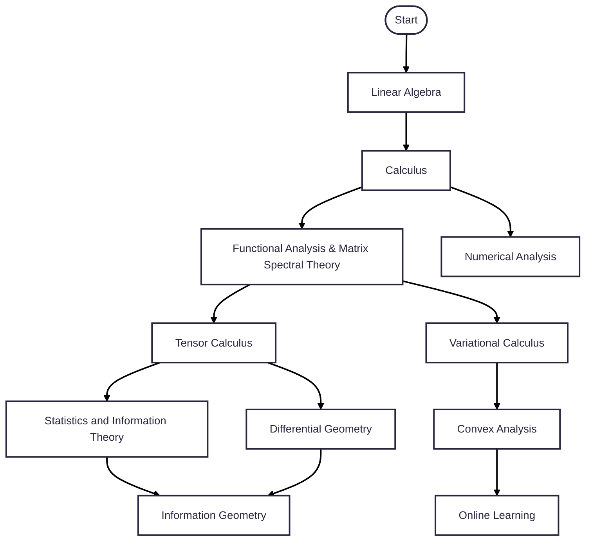

Here is the structure of this blog post series on mathematical optimization theory in ML.

1. Goal
2. Approach
3. Prerequisites

## Goal

Optimization is a cornerstone in modern machine learning. When training a large-scale neural network for image recognition, a simple tweak in the optimizer can mean the difference between hours and days of training. But why does Adam sometimes converge where SGD fails? We need to understand the underlying mechanics of optimization algorithms to make informed decisions.

Whether we are fitting a model to data, tuning hyperparameters, or learning weights in a neural network, we are solving optimization problems that are often large, noisy, and non-convex. Yet, there tends to be a significant disconnect between the theory and practice of optimization in machine learning. This blog post series aims to explore the mathematical landscape of **optimization theory** applied to machine learning.

Our goal is not so much about investigating the implementation details in applying and deploying these algorithms, but analyzing their mathematical properties that allow for efficient convergence while enabling efficient distributed computation. Throughout this series, we will see how many concepts of optimization theory are inspired and cleverly re-used from physics and mathematics, and how they relate to machine learning. We will explore:
- The **intuition** behind optimization algorithms and how they emerged through connections to other fields.
- Why certain methods succeed (or fail).
- How theoretical guarantees relate to practical performance.
- When and how to choose (or design) the right optimizer.

## Approach

This series takes a **problem-first, theory-second** top-down approach. The presentation is centered on mathematical derivations rather than code or implementation details.

I iterated through several iterations and decided to cut down on the breadth and depth of the topics covered because it was getting too long. Ultimately, I decided on the following.

This series is not a textbook. It is intended to be a **self-contained introduction**, that is to say, topics that are covered will be explained mostly from scratch, but many topics and proofs will be omitted for brevity. My goal is to scratch the surface as broadly as possible, by introducing the basic concepts and their accompanying definitions and theorems.

If you achieve to properly master these concepts, you **need** to work through exercises and examples, both theoretical and practical, by working through mathematical problems on paper in addition to implementing and playing around with the algorithms. If you simply read this series without additional effort, you might earn a very rough intuition of the connections between different perspectives and concepts, but you cannot expect to be able to apply these ideas to real-world problems.

The order of presentation is intended to be:

1. Real-world problem
2. Intuition with a concrete example
3. Investigating desired properties
4. Formalizing the theory
5. Leveraging the theory to make meaningful connections

At the end of each post, we will provide a **summary** of the main ideas, a **cheat sheet** in table format for quick reference, and a **reflection** on the post’s contributions.

## Prerequisites

This series is designed for readers with:
- A working knowledge of **linear algebra** and **calculus**.
- Comfort with **mathematical notation and reasoning**.
- (Optional) Basic familiarity with **machine learning terminology** (e.g., regression, classification, neural networks). This is mostly for the sake of context and applications, but it is not strictly required to follow the math.

Many individual points may be harder to appreciate without further background, so I encourage you to study with more in-depth material on the side. There will be crash courses included on the side, with a focus mostly on the necessary background to follow the posts in this series. I recommend to read them in this order:

If the mermaid flowchart does not render:
1. `Linear Algebra`
2. `Multivariable Calculus`
3. Parallel branches from `Linear Algebra`:
    1. `Elementary Functional Analysis`
    2. `Numerical Analysis`
4. From `Functional Analysis & Matrix Spectral Theory`, two branches:
    1. `Tensor Calculus`, which leads to:
        1. `Differential Geometry`
        2. `Statistics and Information Theory` (which then leads to `Information Geometry`)
    2. `Variational Calculus`, which leads to:
        1. `Convex Analysis` (which then leads to `Online Learning`)

The series is mostly intended to be self-contained beyond these items.

## Series Outline

I have inserted an example reading order between the series and the `crash courses`.

1. Introduction to basic mathematical optimization
   - `Multivariable Calculus`
   - `Linear Algebra`
2. Iterative methods: gradient-free vs. gradient-based optimization
3. Desirable properties of optimizers
4. Speedrun of common gradient-based ML optimizers
5. Problem formalization
   - `Numerical Analysis`
6. Gradient descent and gradient flow
   - `Functional Analysis`
7. Challenges of high-dimensional non-convex optimization in deep learning
   - `Tensor Calculus`
   - `Differential Geometry`
8. Stochastic Gradient Descent and effects of randomness
9. Adaptive methods and preconditioning
10. Momentum
11. Soft inductive biases (regularization)
   - `Statistics and Information Theory`
   - `Information Geometry`
12. Adam optimizer, info geo view: diagonal Fisher information approximation
   - `Variational Calculus`
   - `Convex Analysis`
   - `Online Learning`
13. Adam optimizer, online learning view: Discounted Follow-The-Regularized-Leader
14. Metrized deep learning (Iso/IsoAdam, Shampoo, Muon)
15. Parameter-free optimization