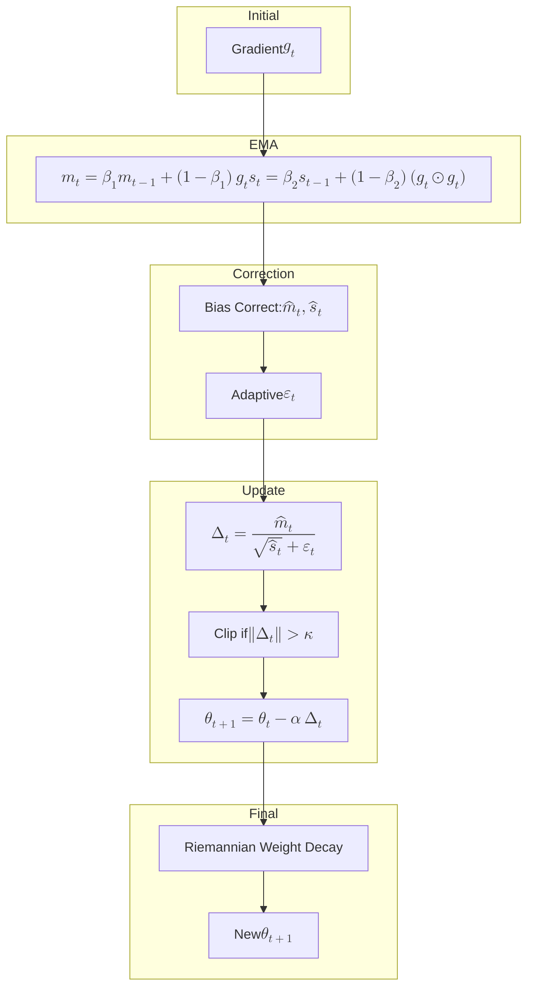

The Adam optimizer has become a staple in training deep neural networks, prized for its empirical success and efficiency. However, its theoretical underpinnings, particularly its relationship to more principled optimization methods, have been a subject of ongoing research. This post delves into the interpretation of Adam as an approximation to **Natural Gradient Descent (NGD)**, focusing on how its second-moment estimate can be viewed as a diagonal **Empirical Fisher Information Matrix (FIM)**. We'll primarily draw upon the insights from Hwang (2024), "FAdam: Adam is a natural gradient optimizer using diagonal empirical Fisher information," to understand this connection and explore proposed improvements.

Why is this perspective important? Understanding Adam as an NGD variant not only provides theoretical clarity but also helps identify its potential shortcomings and guides the development of more robust and theoretically sound optimizers like FAdam.

## 1. Natural Gradient Descent and the Fisher Information Matrix

To appreciate Adam's connection to NGD, we first need to understand NGD and the FIM.

### 1.1. Statistical Manifold & Riemannian Metric

In information geometry, a family of probability distributions parameterized by $$\theta \in \mathbb{R}^d$$, denoted as $$p(x;\theta)$$, forms a **statistical manifold**. Each point $$\theta$$ on this manifold corresponds to a specific probability distribution.

<blockquote class="box-definition" markdown="1">

**Definition.** Fisher Information Matrix (FIM)

The **Fisher Information Matrix** $$F(\theta)$$ at a point $$\theta$$ on the statistical manifold is defined as the expectation of the outer product of the score function (gradient of the log-likelihood with respect to parameters):

$$
F(\theta) = \mathbb{E}_{x\sim p(\cdot;\theta)}\Big[\,\nabla_\theta \log p(x;\theta)\,\nabla_\theta \log p(x;\theta)^\top\Big]
$$

Under mild regularity conditions, $$F(\theta)$$ is a positive semi-definite matrix. It can also be expressed as the negative expectation of the Hessian of the log-likelihood:

$$
F(\theta) = -\mathbb{E}_{x\sim p(\cdot;\theta)}\left[ \frac{\partial^2}{\partial \theta_i \partial \theta_j} \log p(x;\theta) \right]
$$

</blockquote>

The FIM plays a crucial role as it defines a **Riemannian metric** on the parameter space. This metric measures the "distance" between distributions in terms of their distinguishability based on observed data.

### 1.2. Natural Gradient Descent

Standard gradient descent operates in the Euclidean space of parameters. However, this space may not reflect the true geometry of the probability distributions. Natural Gradient Descent (NGD) addresses this by descending along the steepest direction in the Riemannian manifold defined by the FIM.

<blockquote class="box-definition" markdown="1">

**Definition.** Natural Gradient

The **natural gradient** of a loss function $$L(\theta)$$ is given by:

$$
\nabla^{\text{(nat)}} L(\theta) = F(\theta)^{-1} \,\nabla L(\theta)
$$

</blockquote>

The NGD update rule, with a learning rate $$\eta$$, is:

$$
\theta_{t+1} = \theta_t -\eta\,F(\theta_t)^{-1}\,\nabla L(\theta_t)
$$

By preconditioning the standard gradient $$\nabla L(\theta)$$ with the inverse FIM $$F(\theta)^{-1}$$, NGD adapts the step size for each parameter direction according to the local curvature of the probability manifold. This often leads to faster and more stable convergence, especially in complex, high-dimensional landscapes.

### 1.3. The Computational Bottleneck

Despite its theoretical advantages, NGD faces a significant practical challenge: computing, storing, and inverting the full FIM $$F(\theta) \in \mathbb{R}^{d \times d}$$ is computationally prohibitive for large models where $$d$$ (the number of parameters) can be in the millions or billions. This necessitates approximations.

## 2. Approximating the Fisher Information Matrix

To make NGD feasible, two common approximations are employed: using the diagonal of the FIM and using an empirical estimate based on minibatches.

### 2.1. From Full Fisher to Diagonal Fisher

A simplification is to assume that the parameter updates are largely independent or that the off-diagonal elements of the FIM (covariances between score components) are negligible. This leads to the **diagonal Fisher Information Matrix**.

<blockquote class="box-definition" markdown="1">

**Definition.** Diagonal Fisher Information Matrix

The diagonal FIM retains only the variances of each coordinate's score:

$$
F_\text{diag}(\theta) 
= \mathrm{diag}\bigl(F(\theta)\bigr)
= \mathbb{E}_{x\sim p(\cdot;\theta)}
\bigl[\nabla_\theta \log p(x;\theta)\odot\nabla_\theta \log p(x;\theta)\bigr]
$$

where $$\odot$$ denotes the element-wise (Hadamard) product, and $$\mathrm{diag}(A)$$ extracts the diagonal of matrix $$A$$ as a vector (or forms a diagonal matrix from a vector).
</blockquote>

Using $$F_\text{diag}(\theta)$$ significantly reduces computational cost as its inverse is simply the element-wise reciprocal of its diagonal entries.

### 2.2. Empirical Approximation via Minibatches

The true FIM involves an expectation over the entire data distribution $$p(x;\theta)$$. In practice, this expectation is approximated using a minibatch of data. The **empirical Fisher** for a minibatch $$\{x_i\}_{i=1}^B$$ is:

$$
\widehat{F}_\text{emp}(\theta)
= \frac{1}{B}\sum_{i=1}^B \bigl(\nabla_\theta \log p(x_i;\theta)\bigr)\,\bigl(\nabla_\theta \log p(x_i;\theta)\bigr)^\top
$$

Combining these two approximations gives the **diagonal empirical Fisher**:

$$
\widehat{F}_\text{diag‐emp}(\theta) = \frac{1}{B}\sum_{i=1}^B \bigl(\nabla_\theta \log p(x_i;\theta)\odot\nabla_\theta \log p(x_i;\theta)\bigr)
$$

This is a vector representing the diagonal of the FIM, estimated from a minibatch.
Hwang (2024) notes that this "empirical Fisher" accurately reflects the true Fisher's curvature only under specific conditions, particularly when the loss function $$L(\theta)$$ is the negative log-likelihood of a *discrete* probability distribution (e.g., categorical cross-entropy). For other losses, like Mean Squared Error (MSE), this approximation can be misleading (Hwang, 2024; Kunstner et al., 2019).

## 3. Adam’s Second Moment as Diagonal Empirical Fisher

Now, let's connect these concepts to the Adam optimizer.

### 3.1. Recall the Adam Update Rules

Adam (Kingma & Ba, 2015) maintains exponential moving averages (EMAs) of the first moment (mean) and second moment (uncentered variance) of the gradients $$g_t = \nabla L(\theta_t)$$:

*   First moment (biased estimate of mean):

    $$
    m_t = \beta_1\,m_{t-1} +(1-\beta_1)\,g_t
    $$

    Bias-corrected estimate:

    $$
    \hat m_t = \frac{m_t}{1-\beta_1^t}
    $$

*   Second moment (biased estimate of squared gradients):

    $$
    v_t = \beta_2\,v_{t-1} +(1-\beta_2)\,(g_t \odot g_t)
    $$

    Bias-corrected estimate:

    $$
    \hat v_t = \frac{v_t}{1-\beta_2^t}
    $$

The parameter update is then:

$$
\theta_{t+1}
=\theta_t -\alpha \,\frac{\hat m_t}{\sqrt{\hat v_t} + \varepsilon}
$$

where $$\alpha$$ is the learning rate and $$\varepsilon > 0$$ is a small constant for numerical stability. The original Adam paper already noted that $$v_t$$ acts as a diagonal preconditioner.

### 3.2. Interpreting $$v_t$$ as a Diagonal Empirical Fisher

The core insight is that the term $$g_t \odot g_t$$ in the $$v_t$$ update is an estimate of the diagonal of the empirical Fisher information.
Specifically, if the loss function $$L(\theta)$$ is the negative log-likelihood for a single sample $$x_t$$ (or an average over a minibatch), i.e., $$L(\theta_t) = -\log p(x_t;\theta_t)$$, then the gradient $$g_t$$ is:

$$
g_t =\nabla_\theta L(\theta_t)=-\nabla_\theta\log p(x_t;\theta_t)
$$

In this case, the element-wise square of the gradient becomes:

$$
g_t \odot g_t =\bigl(-\nabla_\theta\log p(x_t;\theta_t)\bigr)\odot\bigl(-\nabla_\theta\log p(x_t;\theta_t)\bigr) = \bigl[\nabla_\theta\log p(x_t;\theta_t)\bigr]\odot\bigl[\nabla_\theta\log p(x_t;\theta_t)\bigr]
$$

This term $$g_t \odot g_t$$ is precisely the (unbatched) diagonal empirical Fisher for the sample $$x_t$$. The $$v_t$$ term in Adam, being an EMA of $$g_t \odot g_t$$, can thus be interpreted as a running estimate of the diagonal of the FIM:

$$
\mathbb{E}[g_t \odot g_t] = F_\text{diag}(\theta_t)
$$

And so,

$$
\hat{v}_t \approx F_\text{diag}(\theta_t)
$$

Therefore, **Adam’s update step $$\frac{\hat{m}_t}{\sqrt{\hat{v}_t} + \epsilon}$$ closely resembles a natural gradient update using a diagonal empirical FIM approximation:**

$$
\theta_{t+1} \approx \theta_t - \alpha \left[ F_\text{diag}(\theta_t) \right]^{-1/2} \hat{m}_t
$$

This is because if $$F_\text{diag}(\theta_t)$$ is a diagonal matrix with entries $$\hat{v}_t$$, then $$[F_\text{diag}(\theta_t)]^{-1/2}$$ would be a diagonal matrix with entries $$1/\sqrt{\hat{v}_t}$$. The term $$\hat{m}_t$$ serves as the estimate of the (Euclidean) gradient.

<blockquote class="box-info" markdown="1">

**Key Connection**

Adam's adaptive learning rates, derived from $$\sqrt{\hat{v}_t}$$, effectively implement a form of natural gradient descent where the Fisher Information Matrix is approximated by its diagonal, estimated empirically from squared gradients. This connection hinges on the loss function being a negative log-likelihood.
</blockquote>

## 4. Limitations of the Empirical Fisher and Adam's Approximations

While the connection is insightful, it's important to acknowledge its limitations:

1.  **Loss Function Dependence**: As emphasized by Hwang (2024) and Kunstner et al. (2019), the interpretation of $$g_t \odot g_t$$ as an estimate of the FIM's diagonal is most accurate when $$L(\theta)$$ is the negative log-likelihood of a discrete distribution (e.g., categorical cross-entropy). For other losses (like MSE in regression), $$g_t \odot g_t$$ (the squared gradient of the loss) can deviate significantly from the true FIM's diagonal, potentially leading to suboptimal preconditioning.
    *   Hwang (2024) recommends: "Always adopt *log‐probability* (e.g. softmax‐cross‐entropy for classification) when using Adam from an InfoGeo lens."

2.  **Bias Correction and Momentum**: The bias correction for $$\hat{v}_t$$ in Adam is $$1/(1-\beta_2^t)$$. While it corrects for the initialization at zero, Hwang (2024) points out that this method of EMA for squared gradients might not optimally track the true diagonal Fisher, especially in early iterations, and its interaction with the momentum term $$\hat{m}_t$$ can lead to imbalances in curvature scaling.

3.  **The Role of $$\varepsilon$$**: The small constant $$\varepsilon$$ is added for numerical stability. However, it also implicitly modifies the preconditioning. Adding $$\varepsilon$$ inside the square root is akin to adding $$\varepsilon^2$$ to $$v_t$$, which can be seen as adding a small multiple of the identity matrix to the estimated diagonal FIM. This slightly flattens the perceived geometry, especially where gradient components are small.

## 5. FAdam: Refining Adam with Information Geometry Principles

Based on the information geometry perspective, Hwang (2024) identifies these issues in Adam and proposes **FAdam (Fisher Adam)**, an optimizer that incorporates several corrections to align more closely with NGD principles.

The main corrections in FAdam are:

1.  **Enhanced Bias Corrections & Momentum Averaging**:
    *   FAdam uses distinct bias correction strategies for the first and second moments:

        $$
        \hat{m}_t = \frac{m_t}{1 - \beta_1^t} \quad \text{and} \quad \hat{s}_t = \frac{s_t}{1 - \beta_2^t}
        $$

        The key difference is that FAdam applies momentum averaging **after** preconditioning rather than before, which better preserves the natural gradient direction.

2.  **Adaptive $$\varepsilon_t$$**:
    *   Instead of a fixed small $$\varepsilon$$, FAdam proposes an adaptive $$\varepsilon_t$$ with the schedule:

        $$
        \varepsilon_t = \frac{\varepsilon_0}{1 + \lambda_{\varepsilon} t}
        $$

        This allows the update to more closely resemble a pure natural gradient step in later iterations.

3.  **Riemannian Weight Decay**:
    *   FAdam implements weight decay consistent with the Riemannian geometry by preconditioning the decay term:

        $$
        -\alpha \lambda \frac{\theta_t}{\sqrt{\hat{s}_t} + \varepsilon_t}
        $$

        This corresponds to the natural gradient of the L2 penalty $$\frac{\lambda}{2}\Vert\theta\Vert^2$$.

4.  **Natural Gradient Clipping**:
    *   FAdam clips the preconditioned update vector:

        $$
        \Delta_t = \frac{\hat{m}_t}{\sqrt{\hat{s}_t} + \varepsilon_t}
        $$

        This ensures the Riemannian norm $$\Vert\Delta_t\Vert$$ remains bounded.

### FAdam Pseudocode (Exact Formulation)

The FAdam algorithm (Hwang, 2024) is:

**Initialize**: $$\theta_0$$, $$m_0 = 0$$, $$s_0 = 0$$  
**Set**: $$\alpha$$ (learning rate), $$\beta_1, \beta_2$$ (momentum), $$\lambda_{\text{WD}}$$ (weight decay), $$\varepsilon_0, \lambda_\varepsilon$$, $$\kappa$$ (clipping threshold)

**For** $$t = 1$$ **to** $$T$$:  
&nbsp;&nbsp; $$g_t = \nabla_\theta L(\theta_t)$$  
&nbsp;&nbsp; $$m_t = \beta_1 m_{t-1} + (1 - \beta_1) g_t$$  
&nbsp;&nbsp; $$s_t = \beta_2 s_{t-1} + (1 - \beta_2) (g_t \odot g_t)$$  
&nbsp;&nbsp; $$\hat{m}_t = m_t / (1 - \beta_1^t)$$  
&nbsp;&nbsp; $$\hat{s}_t = s_t / (1 - \beta_2^t)$$  
&nbsp;&nbsp; $$\varepsilon_t = \varepsilon_0 / (1 + \lambda_\varepsilon t)$$  
&nbsp;&nbsp; $$\Delta_t = \hat{m}_t / (\sqrt{\hat{s}_t} + \varepsilon_t)$$  
&nbsp;&nbsp; **If** $$\Vert \Delta_t \Vert_2 > \kappa$$:  
&nbsp;&nbsp;&nbsp;&nbsp;&nbsp;&nbsp; $$\Delta_t \leftarrow \kappa \Delta_t / \Vert \Delta_t \Vert_2$$  
&nbsp;&nbsp; $$\theta_{t+1} = \theta_t - \alpha \Delta_t - \alpha \lambda_{\text{WD}} \frac{\theta_t}{\sqrt{\hat{s}_t} + \varepsilon_t}$$  

*(Note: Compared to Adam, FAdam modifies the weight decay application and uses distinct momentum handling)*

The key components of the FAdam workflow can be visualized as:

## 6. Empirical Performance of FAdam

Hwang (2024) provides empirical evidence showing that FAdam outperforms Adam and AdamW on various challenging tasks, including:
*   **Large Language Models (LLMs):** Achieving better perplexity and faster convergence.
*   **Automatic Speech Recognition (ASR):** Yielding state-of-the-art results with significant reductions in Word Error Rate.
*   **VQ-VAE (Vector Quantized Variational AutoEncoders):** Improving reconstruction quality.

Ablation studies in the paper demonstrate that each of the proposed corrections (enhanced bias handling, adaptive $$\varepsilon_t$$, Riemannian weight decay, and natural gradient clipping) contributes positively to the overall performance improvement.

## 7. Summary & Takeaways

Viewing Adam through the lens of information geometry reveals it as an approximation to natural gradient descent using a diagonal empirical Fisher Information Matrix. This perspective highlights:

*   **Adam's Strength**: Its adaptive per-parameter learning rates derived from $$v_t$$ (approximating $$F_\text{diag}$$) can be seen as a computationally cheap way to harness some benefits of NGD.
*   **Adam's "Kludges"**: The specific ways Adam implements its EMAs, bias correction, and handles $$\varepsilon$$ are heuristics that can deviate from a pure InfoGeo approach. The validity of the FIM approximation is also conditional on the loss function.

**FAdam** attempts to "clean up these kludges" by:
*   Using more theoretically grounded bias corrections.
*   Employing an adaptive $$\varepsilon_t$$.
*   Implementing weight decay and gradient clipping in a way that is consistent with the Riemannian geometry.

**Practical Guidance:**
*   When using Adam (or FAdam) and aiming for an InfoGeo interpretation, prefer loss functions that are negative log-likelihoods of discrete distributions (e.g., categorical cross-entropy for classification).
*   Consider FAdam's corrections if a more principled and potentially higher-performing adaptive optimizer is desired, especially for models where the InfoGeo perspective is relevant.

This exploration underscores that the development of optimization algorithms benefits immensely from a deep understanding of underlying mathematical principles, connecting heuristic successes to more rigorous theoretical frameworks.

## 8. Further Reading and References

*   Hwang, D. (2024). *FAdam: Adam is a Natural Gradient Optimizer Using Diagonal Empirical Fisher Information*. arXiv:2405.12807. ([arXiv](https://arxiv.org/abs/2405.12807), [OpenReview](https://openreview.net/pdf?id=4ihkxIeTFH))
*   Kingma, D. P., & Ba, J. (2015). *Adam: A Method for Stochastic Optimization.* arXiv:1412.6980. ([arXiv](https://arxiv.org/abs/1412.6980))
*   Kunstner, F., Balles, L., & Hennig, P. (2019). *Limitations of the Empirical Fisher Approximation for Natural Gradient Descent.* arXiv:1905.12558. ([arXiv](https://arxiv.org/abs/1905.12558))
*   Martens, J. (2020). *New insights and perspectives on the natural gradient method.* Journal of Machine Learning Research, 21(146), 1-76.
*   Amari, S. (1998). *Natural Gradient Works Efficiently in Learning.* Neural Computation, 10(2), 251-276.

---

*This post aimed to elucidate the connection between Adam and natural gradient descent through the diagonal empirical Fisher approximation, drawing heavily on the recent work on FAdam. By understanding these connections, we can better appreciate the behavior of existing optimizers and contribute to the design of new, more effective methods.*
