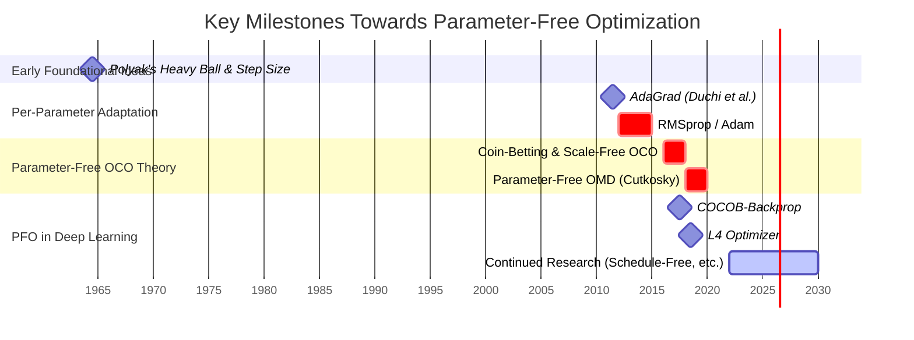

As we conclude this series on optimization theory in machine learning, we turn our attention to a particularly appealing, yet challenging, frontier: **parameter-free optimization**. Throughout our journey, we've encountered algorithms that, while powerful, often come with a suite of hyperparameters – learning rates, momentum coefficients, decay schedules, and more. Tuning these "knobs" correctly can be the difference between a state-of-the-art model and a training run that goes nowhere. But what if we could largely bypass this tuning process?

## 1. The Hyperparameter Hurdle: Why Seek Parameter-Freeness?

The practical reality of applying many optimization algorithms, especially in complex domains like deep learning, is often dominated by the **hyperparameter tuning** phase. This process presents several significant challenges:

*   **Time and Computational Cost:** Searching for an optimal set of hyperparameters can be incredibly time-consuming and computationally expensive. Grid searches, random searches, or more sophisticated Bayesian optimization techniques all require training multiple model instances, often for extended periods.
*   **Sensitivity and Brittleness:** Model performance and convergence speed can be highly sensitive to the precise values of these hyperparameters. A learning rate that works wonders for one architecture or dataset might cause another to diverge or converge painfully slowly. This brittleness makes it difficult to transfer knowledge about good hyperparameters across different problems.
*   **Reproducibility and Fair Comparison:** The reliance on meticulously tuned hyperparameters can hinder reproducibility. Furthermore, it can be challenging to make fair comparisons between different optimization algorithms or model architectures if the extent and success of hyperparameter tuning vary.

This "hyperparameter hell" motivates the search for **"plug-and-play" optimization algorithms** – methods that can perform robustly and efficiently across a wide range of problems with minimal to no manual configuration. The vision is to empower practitioners to focus more on model design and data, rather than getting bogged down in endless optimizer tweaking. This aligns closely with broader goals in **Automated Machine Learning (AutoML)**, aiming to reduce the need for expert human intervention in the machine learning pipeline.

Ideally, such optimizers would possess several desirable properties:

1.  **Robustness to Unknown Problem Scales:** They should perform well without *a priori* knowledge of intrinsic problem characteristics like typical gradient magnitudes, the Lipschitz constant of the loss function, or the distance to the optimal solution.
2.  **Automatic Adaptation:** They should dynamically adapt their behavior based on the observed properties of the loss landscape and the gradients encountered during training.

## 2. Defining "Parameter-Free": What Does It Really Mean?

The term "parameter-free" can sometimes be a bit of a misnomer, leading to varied interpretations. For our purposes in this post, we adopt a definition centered on the algorithm's ability to operate without requiring problem-scale-dependent inputs from the user at runtime.

<blockquote class="box-definition" markdown="1">

**Definition.** Parameter‑Free Algorithm

An optimizer is considered (conceptually) parameter‑free if it achieves (near)‑optimal theoretical guarantees or strong empirical performance **without** requiring external user‑specified parameters that depend on the scale of the problem (like a learning rate tuned to gradient magnitudes, or knowledge of the distance to the optimum) *at run‑time*.

Mathematically, in an online convex optimization context, this often means achieving a regret bound, $$R_T$$, relative to a comparator $$\mathbf{w}^\ast$$, such as:

$$
R_T(\mathbf{w}^\ast) \le C \cdot \Phi(\Vert \mathbf{w}^\ast \Vert) + \text{lower order terms}
$$

where $$C$$ is a constant and $$\Phi(\Vert \mathbf{w}^\ast \Vert)$$ is some (typically unknown) function of the norm of the optimal solution (e.g., $$\Phi(\Vert \mathbf{w}^\ast \Vert) = G \Vert \mathbf{w}^\ast \Vert \sqrt{T}$$ or $$\Phi(\Vert \mathbf{w}^\ast \Vert) = \Vert \mathbf{w}^\ast \Vert^2 \log T$$), crucially *without needing* $$\Vert \mathbf{w}^\ast \Vert$$ or the gradient scale $$G$$ as an input to the algorithm.
</blockquote>

It's important to clarify some nuances:

*   **Parameter-Free vs. Scale-Free vs. Tuning-Free:**
    *   **Scale-Free:** This specifically refers to algorithms whose behavior is invariant to the re-scaling of the objective function or the gradients. For instance, if you multiply all gradients by a constant $$c > 0$$, the sequence of iterates produced by a truly scale-free optimizer should ideally remain unchanged or scale in a predictable, harmless way.
    *   **Parameter-Free:** As defined above, this is broader and focuses on eliminating user-specified, scale-dependent hyperparameters. A parameter-free algorithm is often, but not always, scale-free. It might still possess internal constants, but these are typically fixed and not meant to be tuned by the user based on problem characteristics.
    *   **Tuning-Free:** This is perhaps the most practical aspiration – an algorithm that works well "out of the box" across many problems without any tuning. While true parameter-freeness is a theoretical ideal, "tuning-free" is the empirical goal.

*   **Scope of This Post:** Our exploration will primarily draw intuition and theoretical grounding from the **Online Convex Optimization (OCO)** framework. This perspective provides a rigorous foundation for understanding how algorithms can adapt to unknown problem parameters. We will then discuss how these core ideas are extended, sometimes heuristically, to address the challenges of **stochastic and non-convex optimization** prevalent in modern machine learning, particularly in training deep neural networks.

With these foundational concepts in mind, let's delve into one of the most intuitive starting points for understanding parameter-free optimization: the coin-betting analogy.

## 3. Intuition from a Game: The Coin-Betting Analogy

One of the most elegant and intuitive ways to grasp the core idea behind certain parameter-free optimization algorithms is through the **coin-betting game**. This analogy, pioneered by Orabona and Pál among others, recasts the optimization process as a sequential game where an investor (our optimizer) tries to maximize their wealth by betting on the outcomes of a series of events (related to the gradients of our loss function).

Imagine a simple scenario:
At each time step $$t=1, 2, \ldots, T$$, an outcome $$g_t$$ is revealed. For simplicity, let's assume these outcomes are bounded, say $$g_t \in [-1, 1]$$. Before each outcome $$g_t$$ is revealed, the investor decides on a "bet" or "investment" $$b_t$$. If $$b_t$$ and $$g_t$$ have the same sign, the investor gains $$b_t g_t$$; if they have opposite signs, the investor loses this amount. The investor's goal is to devise a strategy for choosing $$b_t$$ at each step to maximize their cumulative wealth, $$W_T = W_0 + \sum_{t=1}^T b_t g_t$$, where $$W_0$$ is the initial wealth (often normalized to 1).

How does this relate to optimization?
Consider minimizing a sequence of 1-D loss functions $$f_t(w)$$. If we are at a point $$w_t$$, the negative gradient $$-\nabla f_t(w_t)$$ (or simply $$-g_t$$ if $$g_t = \nabla f_t(w_t)$$) points in a direction of decrease for the current loss. Our "bet" $$b_t$$ can be thought of as how much we "trust" or "invest" in moving along this direction. If we make a good "bet" (i.e., our update step is well-chosen), our loss decreases (wealth increases).

The key insight from the coin-betting framework is that it's possible to design a betting strategy $$b_t$$ that adapts based on past outcomes ($$g_1, \ldots, g_{t-1}$$) and the current state of wealth, such that the investor's wealth grows significantly, *without knowing the sequence of $$g_t$$ in advance or any of its statistical properties*.

A crucial element of such strategies is that they often involve betting a *fraction* of the current wealth, or making decisions that are *scale-invariant* with respect to the $$g_t$$ values. For example, if all historical $$g_t$$ values were suddenly doubled, a good adaptive strategy should ideally lead to a correspondingly scaled outcome without requiring a manual change in the strategy's parameters.

The crucial takeaway is that these betting strategies achieve strong performance guarantees *without requiring prior knowledge of the game's statistics* (like the variance of $$g_t$$ or the total sum of $$g_t$$). They are inherently adaptive. This adaptivity is precisely what we seek in parameter-free optimization. The algorithm "learns" the appropriate scale and intensity of its updates from the data it observes.

## 4. Formalizing the Intuition: Online Mirror Descent (OMD) and Scale-Freeness

The coin-betting analogy provides a powerful intuition for how an algorithm can adapt its "bets" or steps without prior knowledge of the environment. To translate this into a rigorous optimization framework suitable for more general problems, particularly in higher dimensions, we turn to concepts like **Online Mirror Descent (OMD)** and **Follow-The-Regularized-Leader (FTRL)**. These frameworks allow us to design algorithms that learn the appropriate scale of updates from the data itself.

### The "Magic" of Adaptive Regularization for Parameter-Freeness

The key to achieving parameter-freeness within these frameworks lies in how the learning rate $$\eta_t$$ (in OMD) or the regularizer $$\Psi_t(\mathbf{w})$$ (in FTRL) is chosen. Instead of being fixed or following a predefined schedule based on unknown constants (like a Lipschitz constant or the distance to the optimum $$\Vert \mathbf{w}^\ast \Vert$$), they are **adapted online using information from the observed gradients**.

This is where the true "parameter-free" nature emerges. The algorithm essentially "learns the learning rate" or "learns the geometry" as it goes.

<blockquote class="box-proposition" markdown="1">

**Insight.** Adaptive Regularization in FTRL for Parameter-Freeness

In parameter-free FTRL algorithms, the regularizer $$\Psi_t(\mathbf{w})$$ is not static. It evolves based on the observed data, often incorporating information about the magnitudes of past gradients. A common form is:

$$
\Psi_t(\mathbf{w}) = \sigma_t \psi(\mathbf{w})
$$

where $$\psi(\mathbf{w})$$ is a base regularizer (e.g., $$\frac{1}{2}\Vert \mathbf{w} \Vert^2_2$$ for Euclidean geometry, or an entropy term for simplex constraints), and the scaling factor $$\sigma_t$$ (analogous to $$1/\eta_t$$) is updated using the gradients. For example, $$\sigma_t$$ might be proportional to $$\sqrt{\sum_{i=1}^t \Vert g_i \Vert^2}$$.

This adaptive scaling ensures that if gradients are consistently large, the regularization becomes stronger (effective learning rate becomes smaller), and if gradients are small, the regularization is weaker (effective learning rate is larger). This dynamic adjustment allows the algorithm to achieve optimal or near-optimal regret bounds without prior knowledge of quantities like $$\max_t \Vert g_t \Vert$$ or $$\sum_{t=1}^T \Vert g_t \Vert^2$$.
</blockquote>

This principle, pioneered in algorithms like AdaGrad and formalized in later parameter-free OMD works by researchers such as Cutkosky, forms the theoretical core of modern adaptive optimization.

### The Scale-Free Property

A direct and powerful consequence of these adaptive mechanisms is the **scale-free property**. Standard Gradient Descent is highly sensitive to the scale of the gradients, but parameter-free methods often normalize this scale away. If $$\eta_t$$ is set, for example, inversely proportional to a running sum or average of $$\Vert g_i \Vert$$, then if all $$g_i$$ are scaled by $$c$$, $$\eta_t$$ will scale by $$1/c$$, effectively cancelling out the scaling in the update term $$\eta_t g_t$$. This makes them robust choices when such scale information is unavailable beforehand.

## 5. Extending to Machine Learning: Stochasticity and Non-Convexity

The theoretical foundations of parameter-free optimization, largely built within the Online Convex Optimization (OCO) framework, provide elegant solutions for adaptive learning. However, the landscape of modern machine learning, especially deep learning, presents two significant departures from the classic OCO setting:

1.  **Stochastic Gradients:** Instead of observing the true gradient $$\nabla F(\mathbf{w}_t)$$, we typically use noisy stochastic gradients $$g_t(\mathbf{w}_t)$$ from mini-batches of data.
2.  **Non-Convex Objectives:** The loss functions for deep neural networks are highly non-convex.

These characteristics pose substantial challenges. In non-convex optimization, the goal shifts from minimizing regret to finding a first-order stationary point (where $$\Vert \nabla F(\mathbf{w}) \Vert \approx 0$$). Stochastic noise can interfere with the delicate adaptive mechanisms, and theoretical guarantees become much harder to obtain.

Despite these challenges, the core principles of adaptivity remain highly desirable. Researchers have developed various strategies, often heuristic but inspired by OCO theory, to bring parameter-free ideas into deep learning.

## 6. A Glimpse at Parameter-Free Optimizers in Practice

The theoretical principles of adaptivity and scale-freeness have inspired a growing number of optimization algorithms designed to minimize or eliminate hyperparameter tuning in practice.

### COCOB-Backprop: Coin Betting for Neural Networks

One of the most direct applications of the coin-betting framework to deep learning is the **COCOB-Backprop** algorithm, proposed by Orabona and Tommasi.

*   **Core Idea:** COCOB treats the optimization of each individual weight in a neural network as a separate coin-betting game. The algorithm maintains a "wealth" and other related statistics for each parameter, and the update is determined by a betting strategy that adapts to the local gradient history.
*   **Practical Aspects:** COCOB-Backprop is designed as a drop-in replacement for common optimizers. It typically has very few, if any, hyperparameters that require tuning by the user (e.g., a small stability constant $$\alpha$$ or $$\epsilon$$ might be fixed internally).

### Other Approaches and Trends

The pursuit of parameter-freeness is diverse. Beyond COCOB, other notable strategies and algorithms include:

*   **Adafactor:** Developed by Shazeer and Stern, Adafactor reduces memory usage and learning rate tuning. It adapts learning rates based on statistics of parameter updates and can optionally operate without momentum, often working well with default settings for large language models.

*   **Schedule-Free AdamW:** A recent and highly influential development addresses the learning rate *schedule*. While optimizers like Adam adapt the learning rate per parameter, they still rely on a global schedule (e.g., linear or cosine decay) that requires knowing the total number of training steps in advance. Schedule-free methods eliminate this need by maintaining multiple versions of the model's parameters: a "raw" fast-moving state, a stable "averaged" state, and an "interpolated" state where gradients are computed. This dynamic interplay creates an adaptive effect similar to a learning rate schedule without needing a predefined one.

    

    

    **Mathematical Deep Dive: The Full Schedule-Free AdamW Algorithm**
    

    Schedule-free methods replace the standard momentum and learning rate schedule with a system of three interacting parameter sequences: $$\mathbf{z}_t$$ (the raw optimizer state), $$\mathbf{x}_t$$ (the averaged, stable state), and $$\mathbf{y}_t$$ (an interpolated state for gradient evaluation).

    <blockquote class="box-definition" markdown="1">
    

    **Algorithm.** Schedule-Free AdamW
    

    **Hyperparameters:**
    *   Learning Rate: $$\gamma$$
    *   Interpolation / Momentum Beta: $$\beta_1 \in [0, 1)$$
    *   Second Moment Beta: $$\beta_2 \in [0, 1)$$
    *   Weight Decay: $$\lambda \ge 0$$
    *   Stability Epsilon: $$\epsilon > 0$$
    *   Warmup Steps: $$k \ge 0$$

    **Initialization:**
    *   Initialize model parameters $$\mathbf{w}_0$$.
    *   Set raw state: $$\mathbf{z}_0 = \mathbf{w}_0$$
    *   Set averaged state: $$\mathbf{x}_0 = \mathbf{w}_0$$
    *   Initialize second moment accumulator: $$v_0 = \mathbf{0}$$

    **For each training step $$t = 0, 1, 2, \dots$$:**

    1.  **Interpolate States:** The gradient is evaluated at a point $$\mathbf{y}_t$$ which is an interpolation between the stable average $$\mathbf{x}_t$$ and the raw state $$\mathbf{z}_t$$. The Adam hyperparameter $$\beta_1$$ is repurposed for this.

        $$
        \mathbf{y}_t = (1 - \beta_1) \mathbf{z}_t + \beta_1 \mathbf{x}_t
        $$

    2.  **Compute Gradient:**

        $$
        g_t = \nabla f(\mathbf{y}_t)
        $$

    3.  **Update Second Moment:** This step is identical to standard Adam. The second moment $$v_{t+1}$$ is updated using the new gradient $$g_t$$.

        $$
        v_{t+1} = \beta_2 v_t + (1 - \beta_2) g_t^2
        $$

        A bias correction is applied to get $$\hat{v}_{t+1} = \frac{v_{t+1}}{1 - \beta_2^{t+1}}$$.

    4.  **Determine Step Coefficients (Warmup Logic):** The learning rate $$\gamma_t$$ and the averaging coefficient $$c_t$$ are adjusted based on whether the training is in its warmup phase.
        *   **If $$t < k$$ (During Warmup):**
            *   Linearly ramp up the learning rate: $$\gamma_t = \gamma \frac{t+1}{k}$$
            *   Disable averaging by setting the coefficient to 1: $$c_t = 1.0$$
        *   **Else (After Warmup):**
            *   Use the constant, full learning rate: $$\gamma_t = \gamma$$
            *   Use Polyak-Ruppert averaging: $$c_t = 1 - \frac{1}{t - k + 2}$$

    5.  **Update Raw Parameters $$\mathbf{z}_{t+1}$$:** This is the core Adam-like update, applied to the raw state $$\mathbf{z}_t$$. The first moment is simply the current gradient $$g_t$$. Weight decay is applied to $$\mathbf{y}_t$$.

        $$
        \mathbf{z}_{t+1} = \mathbf{z}_t - \gamma_t \left( \frac{g_t}{\sqrt{\hat{v}_{t+1}} + \epsilon} + \lambda \mathbf{y}_t \right)
        $$

    6.  **Update Averaged Parameters $$\mathbf{x}_{t+1}$$:** The stable state $$\mathbf{x}_t$$ is updated as a moving average of the raw states $$\mathbf{z}_{t+1}$$. If $$c_t=1$$ (warmup), then $$\mathbf{x}_{t+1} = \mathbf{z}_{t+1}$$. Otherwise:

        $$
        \mathbf{x}_{t+1} = c_t \mathbf{x}_t + (1 - c_t) \mathbf{z}_{t+1}
        $$

    **Output:** After training, the final model parameters are taken from the averaged sequence, $$\mathbf{x}_T$$.
    </blockquote>
    

*   **L4 Optimizer:** Proposed by Rolínek and Martius, the L4 optimizer uses a specific learning rate schedule derived from theoretical considerations, where the learning rate is proportional to $$\frac{\text{loss}}{\Vert \text{gradient} \Vert^2}$$.

*   **Recent Trends (Preconditioning + Parameter-Free Steps):** A major trend is to combine sophisticated **preconditioners** (like Shampoo), which determine a better update *direction* using second-order information, with parameter-free rules (like **DoG** - Distance over Gradients), which determine the *step size* in that direction. This hybrid approach aims for both geometric efficiency and tuning-free adaptivity.

## 7. Theoretical Promises and Practical Realities

Parameter-free optimization methods offer an enticing vision, but practical application comes with trade-offs.

### Advantages in Practice

1.  **Reduced Tuning Burden:** This is the primary allure, saving significant human effort and computational resources.
2.  **Improved Robustness:** A good parameter-free optimizer should perform well across a wider variety of models and datasets.
3.  **Accessibility and Democratization:** Makes advanced optimization more accessible to non-experts.
4.  **Streamlined AutoML Pipelines:** Simplifies AutoML systems by reducing the hyperparameter search space.

### Limitations and Open Questions

1.  **"No Free Lunch" Principle:** Truly parameter-free is rare. Most algorithms have fixed internal constants (e.g., small $$\epsilon$$ values for numerical stability, or COCOB’s default $$\alpha = 100$$) that are not meant for tuning but represent implicit assumptions.
2.  **Performance Parity:** In some scenarios, highly tuned conventional optimizers (like Adam or SGD with momentum) can still outperform current parameter-free methods. The performance gap is closing but remains an active research area.
3.  **Generalization Properties:** The interaction between the adaptive mechanisms and the generalization performance of trained models is complex and not fully understood.
4.  **Computational Overhead:** Some methods may incur a slightly higher computational cost per iteration due to maintaining more internal state.

The field is continuously evolving, aiming for methods that are not only convenient but also consistently match or exceed the performance of their tuned counterparts.

## 8. Summary, Cheat Sheet, and Reflection

Parameter-free optimization is a significant step towards more automated and intelligent learning systems. By embedding the logic for self-tuning within the algorithm, we reduce the burden on practitioners and make powerful ML tools more broadly applicable.

### Cheat Sheet: Conceptual Comparison

| Feature                                | Traditional Optimizers (e.g., SGD, Adam with manual LR)       | Parameter-Free Optimizers (Conceptual Ideal)                                   |
| :------------------------------------- | :------------------------------------------------------------ | :----------------------------------------------------------------------------- |
| **Primary User Input**                 | Learning rate, momentum coefficients, decay schedules, etc.   | Minimal; ideally none related to problem scale                                 |
| **Adaptivity to Scale**                | Low (relies on user to set correct scale via LR)              | High (intrinsic to the algorithm)                                              |
| **Tuning Effort**                      | Often High                                                    | Low to Minimal                                                                 |
| **Robustness to Unknowns**             | Lower; sensitive to hyperparameter choice                     | Higher; designed to handle unknown scales                                      |
| **Theoretical Basis (for adaptivity)** | Varies (e.g., momentum, adaptive per-param LRs like Adam)     | Often OCO (Coin-Betting, Adaptive FTRL/OMD)                                    |
| **Internal State**                     | Varies (e.g., momentum buffers, 2nd moment estimates in Adam) | Often more extensive to enable adaptivity (e.g., wealth, sum of squared grads) |

The continued dialogue between theoretical understanding, empirical validation, and algorithmic innovation will undoubtedly lead to even more capable and autonomous optimization methods in the years to come.

## 9. A Brief Historical Timeline

The journey towards parameter-free optimization has been a gradual evolution, with key insights building upon each other over several decades.

## 10. Further Reading and References

For those interested in delving deeper into the theory and practice of parameter-free optimization, the following resources are highly recommended:

*   Orabona, F. (2023). *A Modern Introduction to Online Optimization*. (Book draft, frequently updated, an excellent and comprehensive resource).
*   Orabona, F., & Pál, D. (2016). Scale-Free Online Learning. *Advances in Neural Information Processing Systems (NeurIPS)*.
*   Cutkosky, A., & Orabona, F. (2018). Parameter-free Online Learning via Coin Betting. *Advances in Neural Information Processing Systems (NeurIPS)*.
*   Duchi, J., Hazan, E., & Singer, Y. (2011). Adaptive Subgradient Methods for Online Learning and Stochastic Optimization. *Journal of Machine Learning Research*.
*   Orabona, F., & Tommasi, T. (2017). Training deep networks with coin betting. *Advances in Neural Information Processing Systems (NeurIPS)*.
*   Rolínek, M., & Martius, G. (2018). L4: Practical loss-based stepsize adaptation for deep learning. *Advances in Neural Information Processing Systems (NeurIPS)*.
