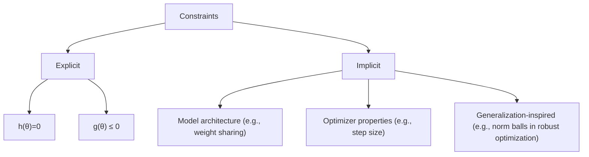
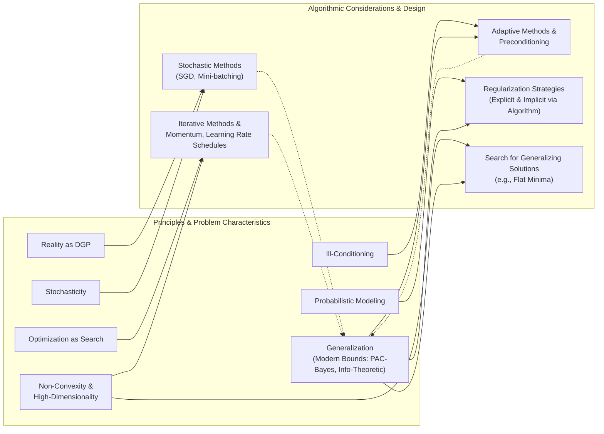

This post explores **problem formalization** in machine learning: the translation of abstract learning tasks into concrete mathematical optimization problems from first principles. This crucial step connects intuitive goals with the analytical machinery required to achieve them, increasingly informed by modern generalization theory.

## 1. Introduction: The Optimization Imperative in Machine Learning

<blockquote class="box-info" markdown="1">

**The Core Idea.** All machine learning is, at its core, optimization.

Machine learning (ML) models learn by minimizing error or maximizing performance on data. Training neural networks, fitting linear regressions, or clustering data all involve adjusting model parameters to better fit observations or achieve desired outcomes. This adjustment is, fundamentally, an optimization task. The fundamental challenge lies in balancing **model expressiveness** with **generalization capability**—the ability to perform well on unseen data.
</blockquote>

### The Need for Formalization

Intuitive learning goals—like "build a good spam filter" or "predict stock prices accurately"—are too vague for computational action. Formalization translates these goals into a precise mathematical language, specifying:

*   The **objective function**: What are we optimizing?
*   The **decision variables**: What parameters can we adjust?
*   The **constraints**: What are the rules or limitations?

### Benefits of Formalization

A clear, mathematical formalization offers several advantages:

*   **Clarity**: It demands explicit articulation of assumptions, objectives, and problem structure.
*   **Rigorous Analysis**: It enables the use of mathematical optimization tools to analyze the learning process, understand its limits, and derive solution properties (e.g., convergence guarantees, generalization bounds).
*   **Principled Design**: It guides the development of new models and algorithms and provides a framework for systematic comparison of approaches.

### Roadmap

This post will:

1.  Explore core principles for translating ML tasks into optimization problems.
2.  Identify key components: loss functions, risk, parameter spaces, constraints, and the crucial role of generalization.
3.  Discuss inherent challenges in typical ML optimization, viewed through the lens of modern theory.
4.  Present a unified framework for expressing ML optimization problems that acknowledges these considerations.

## 2. Core Principles Guiding Formalization

Transforming a real-world learning problem into a mathematical optimization problem relies on a few fundamental principles.

### Principle 1: Reality as a Data-Generating Process (DGP)

We assume observed data (e.g., emails, images) are manifestations of an underlying, possibly complex, **Data-Generating Process (DGP)**. This process dictates the data's statistical properties and structure.

Formally, a data instance $$z$$ is drawn from an unknown true data distribution $$\mathcal{D}$$, denoted $$z \sim \mathcal{D}$$.

*   **Example (Spam Detection):** Emails ($$z$$) arise from complex user behaviors, communication patterns, and attacker strategies ($$\mathcal{D}$$).
*   **Example (Image Recognition):** Images ($$z$$) result from light interacting with objects, captured by sensors, and influenced by factors like perspective and illumination ($$\mathcal{D}$$).

### Principle 2: Probabilistic Modeling of Uncertainty and Structure

Since the true DGP ($$\mathcal{D}$$) is usually unknown and too complex to model perfectly, we employ probabilistic models to capture its essential structure and represent our uncertainty. The aim is to find a model that can "explain" or "generate" data similar to observations.

Key elements include:

*   A **parametric model family**: Denoted by $$\{p_\theta(z)\}_{\theta \in \Theta}$$ or a predictive function $$h(x; \theta)$$, where $$x$$ is an input part of $$z$$. The model parameters $$\theta$$, from a parameter space $$\Theta$$, are what we "learn."
*   A **loss function** $$\ell(\theta; z)$$: This measures the discrepancy between our model's prediction (or likelihood assessment) for data instance $$z$$ using parameters $$\theta$$ and the actual observed data. A common choice is the **Negative Log-Likelihood (NLL)**:

    $$
    \ell(\theta; z) = -\log p_\theta(z)
    $$

    Minimizing the NLL is equivalent to **Maximum Likelihood Estimation (MLE)**—finding parameters $$\theta$$ that make the observed data $$z$$ most probable under model $$p_\theta$$.

### Principle 3: Optimization as Inference and Search

The learning process is framed as a search for the "best" parameters $$\theta$$ within the chosen model family, where "best" means minimizing the loss function over the data. This search is an optimization problem. Learning as optimization can be viewed from different statistical standpoints:

<blockquote class="box-proposition" markdown="1">

**Frequentist Perspective.** Goal: Minimize (True) Expected Loss

We seek parameters $$\theta^\ast$$ that minimize the **expected loss** (or risk) over the true, unknown data distribution $$\mathcal{D}$$. The objective is strong generalization to new, unseen data from $$\mathcal{D}$$.

$$
\theta^\ast  = \arg\min_{\theta \in \Theta} \mathbb{E}_{z \sim \mathcal{D}}[\ell(\theta; z)]
$$

This expected loss is the ideal quantity we wish to minimize.
</blockquote>

<blockquote class="box-proposition" markdown="1">

**Bayesian Perspective.** Goal: Maximize Posterior Probability

We aim for parameters that are most probable given observed data and prior beliefs $$P(\theta)$$. This typically leads to **Maximum A Posteriori (MAP)** estimation. Using Bayes' theorem, the posterior probability is:

$$
P(\theta \vert  \text{data}) \propto P(\text{data} \vert  \theta) P(\theta)
$$

Maximizing this posterior is equivalent to maximizing its logarithm, $$\log P(\text{data} \vert  \theta) + \log P(\theta)$$. For i.i.d. data $$z_i$$, where the likelihood is $$P(\text{data}\vert \theta) = \prod_i p_\theta(z_i)$$, this objective becomes minimizing the sum of Negative Log-Likelihoods plus a term from the log-prior:

$$
\sum_i (-\log p_\theta(z_i)) - \log P(\theta)
$$

This formulation naturally incorporates regularization through the prior term, which, as we'll see, plays a role in generalization.
</blockquote>

## 3. From Principles to Building Blocks: Constructing the Optimization Problem

These principles help identify the core components of an ML optimization problem.

### Defining Performance: The Loss Function $$\ell(\theta; z)$$

The loss function quantifies the cost or error of model parameters $$\theta$$ for a single data instance $$z$$. Its choice is task-dependent and critical.

<blockquote class="box-example" markdown="1">

**Examples.** Common Loss Functions

*   **Squared Error (Regression):** For predicting a continuous value $$y$$ from input $$x$$ (where $$z=(x,y)$$) using model $$h(x;\theta)$$:

    $$
    \ell(\theta; (x,y)) = (h(x;\theta) - y)^2
    $$

*   **Cross-Entropy / Negative Log-Likelihood (Classification):** For classifying input $$x$$ into one of $$K$$ classes, where $$y$$ is the true class (often one-hot encoded) and $$p_\theta(y\vert x)$$ is the model's predicted probability distribution:

    $$
    \ell(\theta; (x,y)) = -\sum_{k=1}^K y_k \log p_\theta(y_k\vert x)
    $$

</blockquote>

### The Ideal Objective: Expected Risk ($$R_{\text{exp}}(\theta)$$)

The ultimate goal is finding parameters $$\theta$$ that perform well on *any* data from the true distribution $$\mathcal{D}$$. This is captured by the expected risk.

<blockquote class="box-definition" markdown="1">

**Definition.** Expected Risk

The expected risk $$R_{\text{exp}}(\theta)$$ of a model with parameters $$\theta$$ is the expectation of the loss function $$\ell(\theta; z)$$ over the true data-generating distribution $$\mathcal{D}$$:

$$
R_{\text{exp}}(\theta) = \mathbb{E}_{z \sim \mathcal{D}}[\ell(\theta; z)]
$$

</blockquote>

**Significance:** Minimizing $$R_{\text{exp}}(\theta)$$ implies good generalization.

**Challenge:** $$R_{\text{exp}}(\theta)$$ is **uncomputable** in practice because $$\mathcal{D}$$ is unknown; we only have a finite data sample.

### The Practical Proxy: Empirical Risk ($$R_{\text{emp}}(\theta)$$)

Since expected risk is uncomputable, we approximate it using available data (the training set).
Given a training set $$S = \{z_1, \dots, z_N\}$$ of $$N$$ instances drawn i.i.d. from $$\mathcal{D}$$, we define empirical risk.

<blockquote class="box-definition" markdown="1">

**Definition.** Empirical Risk

The empirical risk $$R_{\text{emp}}(\theta)$$ is the average loss over the training set $$S$$:

$$
R_{\text{emp}}(\theta) = \frac{1}{N} \sum_{i=1}^N \ell(\theta; z_i)
$$

</blockquote>

The **Empirical Risk Minimization (ERM)** principle dictates choosing parameters $$\theta$$ that minimize $$R_{\text{emp}}(\theta)$$. This is the objective function optimized in most ML settings:

$$
\hat{\theta}_{\text{ERM}} = \arg\min_{\theta \in \Theta} R_{\text{emp}}(\theta)
$$

### Bridging the Gap: The Crucial Role of Generalization

A model minimizing empirical risk perfectly might not perform well on new, unseen data—a phenomenon called **overfitting**. The **generalization gap** measures the difference between training and unseen data performance: $$\vert R_{\text{exp}}(\theta) - R_{\text{emp}}(\theta) \vert$$. We hope minimizing $$R_{\text{emp}}(\theta)$$ also yields a small $$R_{\text{exp}}(\theta)$$.

Factors influencing this gap include:

*   **Model Complexity:** More complex models (e.g., deep networks with many parameters) can fit training data more closely, potentially increasing the generalization gap.
*   **Training data size ($$N$$):** As $$N$$ increases, $$R_{\text{emp}}(\theta)$$ better approximates $$R_{\text{exp}}(\theta)$$, typically shrinking the gap.

<blockquote class="box-theorem" markdown="1">

**Conceptual Theorem.** Generalization Bounds

Modern generalization theory provides tools to understand and bound this gap. Conceptually, many such bounds aim to show that with high probability (e.g., $$1-\delta$$):

$$
R_{\text{exp}}(\theta) \le R_{\text{emp}}(\theta) + \text{ComplexityTerm}(N, \text{model}, \text{algorithm}, \text{data}, \delta)
$$

The goal of optimization then becomes not just minimizing $$R_{\text{emp}}(\theta)$$ but also managing the ComplexityTerm. This term can take various forms, relating to VC dimension, Rademacher complexity, or, in more contemporary theories, PAC-Bayesian quantities (like KL divergence between prior and posterior parameter distributions) or information-theoretic measures (like the mutual information between the learned parameters and the training data).
</blockquote>

### Regularization

To combat overfitting and improve generalization, a penalty term $$\Omega(\theta)$$ is often added to the empirical risk, discouraging overly complex models or solutions with undesirable properties:

$$
\min_{\theta \in \Theta} R_{\text{emp}}(\theta) + \lambda \Omega(\theta)
$$

Here, $$\lambda > 0$$ controls regularization strength. Common choices include L2 norm ($$\Omega(\theta) = \Vert\theta\Vert_2^2$$) or L1 norm ($$\Omega(\theta) = \Vert\theta\Vert_1$$). Regularization can be seen as incorporating prior beliefs about $$\theta$$ (e.g., L2 regularization corresponds to a Gaussian prior in MAP estimation) or as a way to implicitly control the "ComplexityTerm" in generalization bounds.

### Defining the Search Space: Parameters and Constraints

Optimization occurs over parameters $$\theta$$, usually in a space $$\Theta \subseteq \mathbb{R}^d$$. The search might be subject to various types of constraints:

*   **Explicit Constraints:** Directly imposed on parameters (e.g., $$\theta_j \ge 0$$, $$\Vert\theta\Vert_1 \le C$$), defining a feasible region $$\mathcal{C} \subseteq \Theta$$.
*   **Implicit Constraints:** Arise from model architecture, choice of algorithm, or regularization terms (which act as "soft" constraints influencing the solution towards regions favored by the generalization theory).

### Characterizing the Problem's Terrain: The Loss Landscape

The function being minimized (typically regularized empirical risk) defines a surface over the parameter space $$\Theta$$, known as the **loss landscape**. Its geometry dictates optimization difficulty. Key characteristics determining this terrain's nature include:

<blockquote class="box-info" markdown="1">

**Characteristic.** Convexity

A function $$f(\theta)$$ is convex if for any $$\theta_1, \theta_2 \in \Theta$$ and any $$\alpha \in [0,1]$$, $$f(\alpha \theta_1 + (1-\alpha)\theta_2) \le \alpha f(\theta_1) + (1-\alpha)f(\theta_2)$$.
**Significance:** Any local minimum is also a global minimum. Classical ML models often yield convex problems; deep neural networks typically do not.
</blockquote>

<blockquote class="box-info" markdown="1">

**Characteristic.** Non-Convexity

Features multiple local minima, plateaus, and saddle points. Finding a global minimum is generally NP-hard. In deep learning, the goal is often a "good" local minimum that generalizes well.
</blockquote>

<blockquote class="box-info" markdown="1">

**Characteristic.** Smoothness (Differentiability)

The existence and continuity of derivatives are vital for gradient-based methods.
*   **Gradient ($$\nabla_\theta R(\theta)$$)**: Vector of first-order partial derivatives.
*   **Hessian ($$\nabla^2_\theta R(\theta)$$)**: Matrix of second-order partial derivatives, describes local curvature.
Smoothness assumptions (e.g., Lipschitz continuity of the gradient) are key for convergence rate proofs.
</blockquote>

<blockquote class="box-info" markdown="1">

**Characteristic.** Critical Points

Critical points are where $$\nabla_\theta R_{\text{emp}}(\theta) = 0$$. The Hessian helps classify them:

| Type of Critical Point      | Hessian Eigenvalues                           | ML Interpretation / Significance                                  | Generalization Impact (Heuristic)   |
| :-------------------------- | :-------------------------------------------- | :---------------------------------------------------------------- | :---------------------------------- |
| Local Minimum               | All strictly positive ($$\succ 0$$)           | Desirable stopping point.                                         | Sharp minima may generalize poorly. |
| Flat Minimum                | All non-negative ($$\ge 0$$), some small/zero | Often preferred in DL. Less sensitive to parameter perturbations. | Often generalize better.            |
| Local Maximum               | All strictly negative ($$\prec 0$$)           | Undesirable; algorithms typically avoid these.                    | N/A (avoided)                       |
| Saddle Point                | Mix of positive and negative                  | Common in high-dim non-convex problems; can slow optimization.    | Neutral to potentially unhelpful.   |
| Degenerate Saddles/Plateaus | Some zero eigenvalues                         | Create flat regions, hindering progress if not a flat minimum.    | Variable.                           |

*Note: "Flatness" is an active research area, and its precise relation to generalization is nuanced.*
</blockquote>

<blockquote class="box-info" markdown="1">

**Characteristic.** (Ill-)Conditioning

Refers to how much the curvature of the loss landscape varies across different directions. Related to the **condition number** of the Hessian matrix $$\kappa(H) = \frac{\lambda_{\text{max}}(H)}{\lambda_{\text{min}}(H)}$$.
A **high condition number** (ill-conditioned) means the landscape is much steeper in some directions than others.
**Impact:** Simple gradient descent methods can converge very slowly, oscillating.
</blockquote>

## 4. Fundamental Challenges in ML Optimization (Viewed Through the Lens of Generalization Theory)

Formulating an ML problem as optimization is the first step; solving it efficiently while ensuring good generalization presents several challenges.

### The Data-Reality Gap: Decomposition of Error

The goal is to minimize true risk $$R_{\text{exp}}(\theta)$$, but we optimize an approximation, $$R_{\text{emp}}(\theta)$$. The total error can be decomposed:

<blockquote class="box-definition" markdown="1">

**Error Component.** Approximation Error (Bias)

Arises from limitations of the model family $$\mathcal{H}_\Theta$$. Even the best model in $$\mathcal{H}_\Theta$$ might not capture the true function.

$$
\mathcal{E}_{\text{approx}} = \left( \min_{\theta \in \Theta} R_{\text{exp}}(\theta) \right) - \left( \min_{h \in \text{AllFunctions}} R_{\text{exp}}(h) \right)
$$

</blockquote>

<blockquote class="box-definition" markdown="1">

**Error Component.** Estimation Error (Variance)

Results from using a finite sample $$S$$ to approximate $$\mathcal{D}$$. It's the difference between the expected risk of the ERM solution $$\hat{\theta}_{\text{ERM}}$$ and the best possible expected risk within $$\mathcal{H}_\Theta$$.

$$
\mathcal{E}_{\text{est}} = R_{\text{exp}}(\hat{\theta}_{\text{ERM}}) - \left( \min_{\theta \in \Theta} R_{\text{exp}}(\theta) \right)
$$

This error is directly related to the "ComplexityTerm" in generalization bounds. Larger datasets and "simpler" (in some theoretical sense) models/algorithms tend to reduce it.
</blockquote>

<blockquote class="box-definition" markdown="1">

**Error Component.** Optimization Error

Occurs because algorithms may not find the true minimizer of $$R_{\text{emp}}(\theta)$$, especially for non-convex problems or finite computation.

$$
\mathcal{E}_{\text{opt_emp}} = R_{\text{emp}}(\hat{\theta}_{\text{algo}}) - R_{\text{emp}}(\hat{\theta}_{\text{ERM}})
$$

The true concern is how this translates to $$R_{\text{exp}}(\hat{\theta}_{\text{algo}}) - R_{\text{exp}}(\hat{\theta}_{\text{ERM}})$$.
</blockquote>

### Curse of Dimensionality

High-dimensional parameter spaces ($$d \gg 1$$) pose unique challenges:
*   Volume concentration phenomena and counter-intuitive geometry.
*   Prevalence of saddle points over local minima.
*   Computational costs.
While classical generalization bounds can become vacuous (uninformative) in high dimensions, modern theory explores concepts like *compressed parameterization bounds* or effective dimension, suggesting that the "true" complexity might be smaller than $$d$$ for some models/algorithms.

### Non-Convexity of Loss Landscapes

Loss landscapes for deep NNs are highly non-convex:
*   Gradient descent can get trapped or slowed. No global minimum guarantee.
*   Focus shifts to finding "good enough" local minima that generalize well. Modern theory suggests that for very large NNs, many local minima might offer similar quality, and properties like "flatness" of minima are actively investigated for their link to generalization.

### Stochasticity in Gradients

For large datasets, computing the full gradient $$\nabla_\theta R_{\text{emp}}(\theta)$$ is costly.
**Source:** Mini-batches $$B$$ are used to estimate the gradient: $$\nabla \hat{R}_{\text{emp}}(\theta; B) = \frac{1}{\vert B \vert} \sum_{z_i \in B} \nabla_\theta \ell(\theta; z_i)$$.
This is an unbiased estimate: $$\mathbb{E}_B[\nabla \hat{R}_{\text{emp}}(\theta; B)] = \nabla_\theta R_{\text{emp}}(\theta)$$.
**Trade-off & Impact:**
*   Faster iterations vs. noisy gradients.
*   Optimization path becomes erratic. Noise can help escape sharp minima/saddles.
*   The interaction between algorithmic stability (how much the output $$\theta$$ changes with small changes in data) and this noise is crucial for generalization, a topic explored by information-theoretic bounds.

### Ill-Conditioning of the Landscape

Many loss landscapes are ill-conditioned.
**Consequence & Need:**
*   Slow convergence for simple gradient descent.
*   Motivates preconditioning and adaptive learning rates. Ill-conditioning not only affects convergence speed but can also impact the stability of the learning process. Optimizer choices that improve conditioning can sometimes be shown to lead to solutions that generalize better, for example, by leading to more stable solutions which might have lower mutual information $$I(W;S)$$ with the training set $$S$$.

### The Optimization-Computation-Generalization Tradeoff

An inherent tension exists between optimization quality, computational resources, and generalization performance. Choices in model architecture, regularization, and optimizer design involve balancing these factors. Modern generalization theories aim to provide a more principled way to navigate these tradeoffs rather than relying purely on heuristics.

## 5. The Unified Optimization Framework & The Modern Perspective

Most ML tasks can be cast into a general optimization framework.

### Formal Problem Statement

A common form for an ML optimization problem is:

$$
\min_{\theta \in \Theta} \quad \underbrace{R_{\text{emp}}(\theta)}_{\text{Empirical Risk}} + \underbrace{\lambda \Omega(\theta)}_{\text{Regularization}}
$$

$$
\text{subject to} \quad g_j(\theta) \le 0, \quad h_k(\theta) = 0 \quad \text{(explicit constraints, if any)}
$$

### The Modern Perspective on this Formulation

We solve the formulation above. The underlying hope is that by carefully choosing the loss $$\ell$$, the regularizer $$\Omega$$, its strength $$\lambda$$, and crucially, *the optimization algorithm itself*, we are implicitly encouraging solutions that not only minimize empirical risk but also possess properties conducive to good generalization.

Modern generalization theories (like PAC-Bayes or information-theoretic approaches) reinforce this by showing that:
*   The complexity term in generalization bounds (e.g., $$KL(Q\Vert P)$$ in PAC-Bayes, or $$I(W;S)$$) often depends on the relationship between the learned parameters and some prior, or on the stability/information content of the learning algorithm.
*   Thus, optimization algorithms that lead to "simpler" solutions in this theoretical sense (e.g., solutions in flatter regions of the loss landscape, or solutions less sensitive to individual data points) are often preferred.

The choice of optimizer and its hyperparameters (learning rate, momentum, adaptivity) is therefore not just about reaching *a* minimum quickly, but about reaching a minimum that likely generalizes well.

*Solid arrows indicate influence/motivation. Dotted arrows indicate that algorithmic choices impact generalization.*

## 6. Conclusion: The Formalized View and What's Next

### Summary: The Fundamental Equation of ML Optimization Revisited

Problem formalization allows expressing the learning task via a "fundamental equation" balancing data fit with complexity control (explicitly via regularization, and implicitly via algorithmic choice), within a defined search space:

$$
\min_\theta \underbrace{\left(\frac{1}{N}\sum_{i=1}^N \ell(\theta;z_i)\right)}_{\substack{\text{Data Fit / Empirical Risk}}} + \underbrace{\lambda\Omega(\theta)}_{\substack{\text{Explicit Complexity Control / Prior}}} \quad \text{s.t.} \quad \underbrace{\theta \in \mathcal{C}}_{\substack{\text{Feasible Search Space}}}
$$

Modern perspectives enrich this view by emphasizing that the *process* of finding $$\theta$$ is as important as the solution itself, often framing optimization as a form of **constrained information transmission**—we aim to extract useful information from data to minimize empirical risk, while carefully controlling the amount or type of information to ensure generalization.

### Why This Formalization Matters

1.  **Reveals Structure and Limits:** It uncovers learning's underlying mathematical structure, highlighting assumptions and inherent trade-offs (approximation-estimation-optimization, and the optimization-generalization interplay).
2.  **Enables Rigorous Design and Analysis:** It provides the language to design algorithms, analyze convergence, study behavior on loss landscapes, and understand how algorithmic choices impact generalization.
3.  **Provides a Common Language:** It offers a unified way to discuss and compare diverse ML models and learning strategies.

Having established *what* mathematical problem we are typically solving in machine learning and *why* generalization is a central consideration in this formalization, the next question is *how* to solve it. Subsequent posts will explore algorithms for this purpose, starting with Gradient Descent and its continuous-time analogue, Gradient Flow. We will examine how these methods navigate the complex loss landscapes described, and how their design choices (e.g., step sizes, momentum, adaptivity) influence not only the speed of convergence but, critically, the generalization performance of the learned model.
